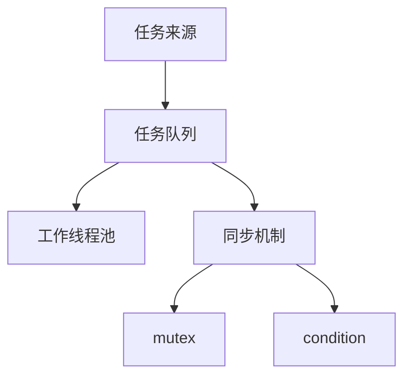

# README

使用typora的笔记仓库

obsidian AI 仓库

```
D:\git\obsidian\AI
```

> 把今天讨论的内容归档到 D:\git\obsidian\AI，按 CLAUDE.md 规则操作


阿里云：

```
8.138.35.212
```


>  [!note]
>
> 提醒


> [!tip]
>
> 建议


> [!IMPORTANT]
>
> 重要


> [!WARNING]
>
> 警告


> [!CAUTION]
>
> 注意





### 图片


| 效果       | 代码                                                      |
| :--------- | :-------------------------------------------------------- |
| 固定宽度   | ``                           |
| 百分比宽度 | ``                           |
| 等比缩放   | ``                 |
| 居中显示   | `<div align="center"></div>` |
|红色字体|<p style="color: red;">红色文字</p>|
