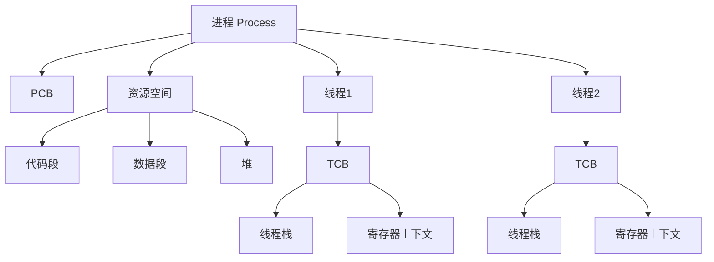

# **线程基本API**

[toc]

## **线程基本API**




### **1. 线程概念**

线程实际上是应用层的概念，在Linux内核中，所有的调度实体都被称为任务（task），他们之间的区别是：有些任务自己拥有一套完整的资源，而有些任务彼此之间共享一套资源，如下图所示。


<center>
    进程中的线程
</center>
线程是CPU调度的单位，而且线程是存在于进程内部的资源，依赖于进程而存在。通常也把线程称为 “轻量级的进程”。

上图中：

- 左边是一个含有单个线程的进程，它拥有自己的一套完整的资源。
- 右边是一个含有两条线程的进程，线程彼此间共享进程内的资源。

由此可见，线程是一种轻量级进程，提供一种高效的任务处理方式。


**线程资源**

在Linux系统中，当使用pthread_create函数创建一条子线程时，系统主要为该子线程申请以下资源：

线程栈（Stack）：每个线程都有自己独立的栈空间，用于存储局部变量、函数调用等信息。栈的大小可以在创建线程时通过线程属性（pthread_attr_t）进行设置，但如果没有特别指定，通常会使用默认的栈大小。

线程控制块（Thread Control Block, TCB）：TCB是操作系统用于描述和管理线程状态的数据结构，它包含了线程的标识符（ID）、状态、优先级、寄存器信息、信号屏蔽字等。TCB是线程存在的核心数据结构。

寄存器信息：每个线程都有自己的寄存器上下文，包括程序计数器（PC）、栈指针（SP）、帧指针（FP）等。当线程切换时，系统会保存当前线程的寄存器信息，并恢复新线程的寄存器信息，以实现线程的正确执行。

线程ID（Thread ID）：每个线程都有一个唯一的标识符，用于在系统中区分不同的线程。这个ID在创建线程时由系统分配，并可以通过pthread_self函数获取。

其他资源：虽然大多数资源是由线程所属的进程共享的（如代码段、数据段、堆空间、打开的文件等），但线程也可能需要一些额外的资源，如信号处理器、线程局部存储（TLS）等。这些资源通常是根据线程的需求动态分配的。

需要注意的是，虽然线程共享了进程的大部分资源，但线程之间仍然保持了一定的独立性。例如，每个线程都有自己的栈空间和寄存器上下文，这使得线程可以在不同的位置独立地执行代码。同时，线程也有自己的调度优先级和状态，操作系统可以根据这些信息来调度和管理线程的执行。

**总结来说，Linux系统在创建子线程时主要为其分配了线程栈、线程控制块、寄存器信息、线程ID等资源，以确保线程能够正确地执行和管理。**

 

pthread线程库提供了各项线程操作

POSIX（Portable Operating System Interface，可移植操作系统接口）是操作系统接口标准；process 解决“程序隔离和资源管理”，pthread 解决“同一个程序内部高效并发”。

| \        | 进程 Process | 线程 pthread |
| -------- | ------------ | ------------ |
| 资源分配 | 基本单位     | 共享进程资源 |
| CPU调度  | 调度单位     | 调度单位     |
| 地址空间 | 独立         | 共享         |
| 通信     | IPC          | 共享内存     |
| 创建成本 | 高           | 低           |
| 隔离性   | 强           | 弱           |
| 适合     | 独立程序     | 程序内部并发 |


### **2. 基本接口**

#### **2.1 线程的创建**

创建一条POSIX线程非常简单，只需指定线程的执行函数即可，但函数接口看起来比较复杂，细节如下：

```C
#include <pthread.h>

int pthread_create(pthread_t *thread, const pthread_attr_t *attr, void *(*start_routine) (void *), void *arg);
```

参数说明：

- thread：新线程的TID
- attr：线程属性，若创建标准线程则该参数可设置为NULL
- start_routine：线程函数
- arg：线程函数的参数

start_routine是一个函数指针，指向线程的执行函数，其参数和返回值都是 void *，使用示例代码如下：

```C
// simpleThread.c
#include <pthread.h>

void *doSomething(void *arg) {
    // ...
}

int main()
{
    // 创建一条线程，并让其执行函数 doSomething()
    pthread_t tid;
    pthread_create(&tid, NULL, doSomething, NULL);

    // ...
}
```


线程的各种接口单独放在线程库中，因此在编译带线程的代码时，必须要指定链接线程库`phread`，如下：

```
gec@ubuntu:~$ gcc simpleThread.c -o simpleThread -lpthread 
```


**并发性**
线程最重要的特性是**并发**，线程函数 `doSomething()` 会与主线程 `main()` 同时运行，这是它与普通函数调用的根本区别。需要特别提醒的是，由于线程函数的并发性，在线程中访问共享资源需要特别小心，因为这些共享资源会被多个线程争抢，形成“竞态”。最典型的共享资源是全局变量，比如以下代码：

```C
// concurrency.c
#include <pthread.h>

int global = 100;

void *isPrime(void *arg) {
    while(1) {
        // 一段朴素的代码
        if(global%2 == 0)
            printf("%d是偶数\n", global);
    }
}

int main()
{
    pthread_t tid;
    pthread_create(&tid, NULL, isPrime, NULL);

    // 一条人畜无害的赋值语句
    while(1)
        global = rand() % 5000;
}
```


运行结果如下：

```
gec@ubuntu:~$ ./concurrency
4383是偶数
2777是偶数
492是偶数
492是偶数
2362是偶数
3690是偶数
59是偶数
3926是偶数
540是偶数
3426是偶数
4172是偶数
211是偶数
368是偶数
2567是偶数
1530是偶数
1530是偶数
2862是偶数
4067是偶数
...
gec@ubuntu:~$ 
```


可以看到结果**错漏百出**，原因就是因为线程之间的并发的，global随时都会被争抢，像这种多线程或多进程同时访问共享资源的情形，必须使用互斥锁、读写锁、条件量等同步互斥机制加以约束方可正常运行。

#### **2.2 线程的退出**

与进程类似，当一条线程执行完毕其任务时，可以使用如下接口来退出：

```C
#include <pthread.h>

void pthread_exit(void *retval);
```


其中，参数retval是线程的返回值，对应线程执行函数的返回值。若线程没有数据可返回则可写成NULL。

注意此函数与exit的区别：

- pthread_exit(): 退出当前线程
- exit(): 退出当前进程（即退出进程中的所有线程）

一个进程中各个线程是平行并发运行的，运行主函数main()的线程被称为主线程，主线程是可以比其他线程先退出的，比如：

```C
#include <pthread.h>

void *count(void *arg) {
    // 循环数数
    for(int i=0; ;i++) {
        printf("%d\n", i);
        usleep(200*1000);
    }
}

int main()
{
    pthread_t tid;
    pthread_create(&tid, NULL, count, NULL);

    // 主线程先退出
    pthread_exit(NULL);
}
```


主线程退出后，其余线程可以继续运行，但请注意，上述代码中如果主线程不调用 pthread_exit() 的话，那么相当于退出了整个进程，则子线程也会被迫退出。

#### **2.3 线程的接合**

> [!note]
>
> pthread_join叫“线程接合”，是因为它表达的是一个线程等待另一个线程结束，并在结束点汇合、获取结果、完成资源回收的过程。

与进程类似，线程退出之后不会立即释放其所占有的系统资源，而会成为一个僵尸线程。其他线程可使用 pthread_join() 来释放僵尸线程的资源，并可获得其退出时返回的退出值，该接口函数被称为线程的接合函数：

```C
#include <pthread.h>

int pthread_join(pthread_t tid, void **val);
```


接口说明：

- 若指定tid的线程尚未退出，那么该函数将持续阻塞。
- 若只想阻塞等待指定线程tid退出，而不想要其退出值，那么val可置为NULL。
- 若指定tid的线程处于分离状态，或不存在，则该函数会出错返回。

需要注意的是，包括主线程在内，所有线程的地位是平等的，任何线程都可以先退出，任何线程也可以接合另外一条线程。以下是接合函数的简单应用示例：

```C
#include <pthread.h>

void *routine(void *arg) {
    pthread_exit("abcd");
}

int main()
{
    pthread_t tid;
    pthread_create(&tid, NULL, routine, NULL);

    // 试图接合子线程，并获取其退出值
    void *val;
    pthread_join(tid, &val);

    printf("%d\n", (char *)val);
}
```


#### **获取线程ID号**

如下接口可以获取线程的ID号：

```c
#include <pthread.h>
 
pthread_t pthread_self(void);
```

以上接口类似进程管理中的 getpid()，需要注意的是，进程的PID是系统全局资源，而线程的TID仅限于进程内部的线程间有效。当我们要对某条线程执行诸如发送信号、取消、阻塞接合等操作时，需要用到线程的ID。

#### **线程的取消**

可以使用以下接口取消指定的线程


```C
#include <pthread.h>
int pthread_cancel(pthread_t thread);
```

一个线程是否允许被取消可以设置


```C
#include <pthread.h>
int pthread_setcancelstate(int state, int *oldstate);
参数：
    state - 是否允许被取消
         PTHREAD_CANCEL_ENABLE：允许(默认)
         PTHREAD_CANCEL_DISABLE：不允许
    oldstate - 传出参数,传出之前的设置      
```

 

#### **进程与线程的区别**

1. 定义与概念：

    - 进程：进程是执行中的一段程序。一旦程序被载入到内存中并准备执行，就变成了一个进程。进程是表示资源分配的基本概念，又是调度运行的基本单位，是系统中的并发执行的单位。


    - 线程：线程是进程中的一个执行流，是进程中执行运算的最小单位。单个进程中执行的每个任务就是一个线程。

2. 资源占用与共享：

- 进程：每个进程都有自己独立的进程地址空间和独立的页表，意味着进程之间在运行时具有独立性。进程间通信需要通过特定的机制，如管道、信号、消息队列、共享内存等。


- 线程：线程没有自己的地址空间，而是包含在进程的地址空间中。线程上下文只包含一个堆栈、一个寄存器和一个优先权。所有的线程共享进程的内存和资源，如代码段、数据段、扩展段（堆存储）等。线程间的通信更加直接，可以通过读写进程变量进行。

3. 创建与开销：

    - 进程：创建进程通常需要多个步骤，包括申请PCB（进程控制块）、分配资源等，因此开销相对较大。


    - 线程：线程是轻量级的进程，与进程相比，线程给操作系统带来的创建、维护和管理的负担要轻，意味着线程的代价或者开销比较小。


4. 控制关系：

    - 进程：子进程不对任何子进程进行控制，进程的线程可以对同一进程的其他子进程加以控制。子进程不能对父进程施加控制，但进程中所有线程都可以对主线程施加控制。


    - 线程：线程是进程中的一个执行流，它们之间的控制关系更加紧密。线程之间的级别相同，无论哪个线程创建了哪个线程，进程内的任何线程都可以销毁、挂起、恢复和更改其他线程的优先权。


5. 状态与调度：
    - 进程：进程的状态包括就绪态、执行态、阻塞状态、创建状态和结束状态。进程的调度由操作系统内核负责，根据调度算法分配CPU资源。
        - 线程：线程作为进程的一部分，其状态与进程紧密相关。线程的调度更加灵活，因为多个线程可以在同一个进程地址空间内并发执行。


6. 总结：

    - 进程是系统资源分配的基本单位，每个进程拥有独立的地址空间和资源，进程间通信需要通过特定的机制。


    - 线程是CPU调度的基本单位，多个线程共享同一个进程的地址空间和资源，线程间通信更加直接。线程的开销较小，适合处理并发任务。


通过合理地使用进程和线程，可以有效地提高系统的并发性能和资源利用率。


## 线程属性

### **1. 线程的属性**

#### **1.1 查看线程属性**

线程有许多属性，可以在终端中查看跟线程属性相关的函数：

```
# 敲入如下命令后连续按两下tab键
gec@ubuntu:~$ man pthread_attr_
pthread_attr_destroy          pthread_attr_getschedpolicy   pthread_attr_setaffinity_np   pthread_attr_setscope
pthread_attr_getaffinity_np   pthread_attr_getscope         pthread_attr_setdetachstate   pthread_attr_setstack
pthread_attr_getdetachstate   pthread_attr_getstack         pthread_attr_setguardsize     pthread_attr_setstackaddr
pthread_attr_getguardsize     pthread_attr_getstackaddr     pthread_attr_setinheritsched  pthread_attr_setstacksize
pthread_attr_getinheritsched  pthread_attr_getstacksize     pthread_attr_setschedparam    
pthread_attr_getschedparam    pthread_attr_init             pthread_attr_setschedpolicy   
gec@ubuntu:~$ 
```


可见，线程的属性多种多样，可以归总为如下表格：

| 获取属性API                     |        功能        | 设置属性API                     | 功能                 |
| ------------------------------- | :----------------: | ------------------------------- | -------------------- |
| pthread_attr_getdetachstate( )  |    获取分离属性    | pthread_attr_setdetachstate( )  | 设置分离属性         |
| pthread_attr_getguardsize( )    |  获取栈警戒区大小  | pthread_attr_setguardsize( )    | 设置栈警戒区大小     |
| pthread_attr_getinheritsched( ) |    获取继承策略    | pthread_attr_setinheritsched( ) | 设置继承策略         |
| pthread_attr_getschedpolicy( )  |    获取调度策略    | pthread_attr_setschedpolicy( )  | 设置调度策略         |
| pthread_attr_getschedparam( )   |    获取调度参数    | pthread_attr_setschedparam( )   | 设置调度参数         |
| pthread_attr_getscope( )        |    获取竞争范围    | pthread_attr_setscope( )        | 设置竞争范围         |
| pthread_attr_getaffinity_np( )  |   获取CPU亲和度    | pthread_attr_setaffinity_np( )  | 设置CPU亲和度        |
| pthread_attr_getstack( )        | 获取栈指针和栈大小 | pthread_attr_setstack( )        | 设置栈的位置和栈大小 |
| pthread_attr_getstacksize( )    |     获取栈大小     | pthread_attr_setstacksize( )    | 设置栈大小           |

这些属性可以在创建线程的时候，通过属性变量统一设置，有少部分可以在线程运行之后再进行设置（比如分离属性），下面介绍属性变量如何使用。

#### **1.2 属性变量的使用**

由于线程属性众多，因此需要的时候不直接设置，而是先将它们置入一个统一的属性变量中，然后再以此创建线程。属性变量是一种内置数据类型，需要用如下函数接口专门进行初始化和销毁：

```C
#include <pthread.h>

int pthread_attr_init(pthread_attr_t *attr);
int pthread_attr_destroy(pthread_attr_t *attr);
```


线程属性的一般使用步骤：

- 定义且初始化属性变量 `attr`
- 将所需的属性，加入 `attr` 中
- 使用 `attr` 启动线程
- 销毁 `attr`

示例代码：

```C
#include <stdio.h>
#include <pthread.h>
#include <unistd.h>
#include <errno.h>
#include <string.h>

#include <pthread.h>

void *routine(void *arg __attribute__((unused)))
{
    sleep(1);
}

int main()
{
    // 初始化属性变量，并将分离属性添加进去
    pthread_attr_t attr;
    pthread_attr_init(&attr);
    pthread_attr_setdetachstate(&attr, PTHREAD_CREATE_DETACHED);

    // 以分离属性启动线程
    pthread_t tid;
    pthread_create(&tid, &attr, routine, NULL);

    // 分离的线程无法接合
    if((errno=pthread_join(tid, NULL)) != 0)
        perror("接合线程失败");

    pthread_exit(NULL);
}
```


### **2. 分离属性**

#### **2.1 僵尸线程**

默认情况下，线程启动后处于可接合状态（即未分离），此时的线程可以在退出时让其他线程接合以便释放资源，但若其他线程未及时调用 `pthread_join()` 去接合它，它将成为**僵尸线程**，浪费系统资源。

僵尸线程

因此，若线程退出时无需汇报其退出值，则一般要设置为分离状态，处于分离状态下的线程在退出之后，会自动释放其占用的系统资源。

将线程设置为分离状态有两种方式：

- 在线程启动前，使用分离属性启动线程
- 在线程启动后，使用 `pthread_detach()` 强制分离


#### **2.2 分离与接合**

1. 在线程启动前，使用分离属性启动线程做法如下：

```C
#include <pthread.h>

void *routine(void *arg)
{
    // ...
}

int main()
{
    // 初始化属性变量，并将分离属性添加进去
    pthread_attr_t attr;
    pthread_attr_init(&attr);
    pthread_attr_setdetachstate(&attr, PTHREAD_CREATE_DETACHED);

    // 以分离属性启动线程
    pthread_t tid;
    pthread_create(&tid, &attr, routine, NULL);

    // ...
}
```


**注意：**
分离状态下的线程是无法被接合的。

1. 在线程启动后，使用 `pthread_detach()` 强制分离的做法如下：

```C
#include <pthread.h>

void *routine(void *arg) {
    // 强制将自身设置为分离状态
    pthread_detach(pthread_self());

    // ...
}

int main() {
    // 启动标准线程
    pthread_t tid;
    pthread_create(&tid, NULL, routine, NULL);

    // ...
}
```


## 线程取消

#### **概述**

线程的取消指的是当某条子线程在运行过程中，其它线程可以给这条线程发送终止退出命令（取消请求）。这条线程收到取消请求之后，退出线程。

#### **接口**

一般主线程不用于去处理任务，只是控制子线程状态，例如取消，接合..   -> pthread_cancel() -> man 3 pthread_cancel

主线程  -> 取消请求  -> 子线程


```C
#include <pthread.h> 
int pthread_cancel(pthread_t thread);
```

函数作用：

发送一个取消请求给子线程。

参数：

thread：需要取消的线程的ID号。

返回值：

成功：0

失败：非0错误码

 

注意：线程收到取消请求，就等价于提前退出。

pthread_exit()  -> 是线程主动退出  -> 退出值   -> pthread_join()

主线程给子线程发送取消请求---》子线程收到取消请求    -> 线程被迫退出   -> 没有退出值

 

**3.示例**

例题： 尝试使用pthread_cancel去取消一个线程。

```C
#include<stdio.h>
#include<pthread.h>
#include <unistd.h>
int pthread_status = 10;
 
//线程例程，创建一条线程之后，去执行这个函数
void* start_routine(void *arg)
{
    int cnt=30;
    while(cnt--) {
        sleep(1);
        printf("[%lu]start_routine cnt:%d\n",pthread_self(),cnt); //pthread_self 打印自己的线程ID号
    }
 
    pthread_exit(&pthread_status);
} 
 
int main()
{
    //创建一条子线程
    pthread_t thread;
    pthread_create(&thread,NULL,start_routine,NULL);
    
    sleep(5);
    //给子线程发送一个取消请求
    pthread_cancel(thread);
    
    //等待子线程退出
    void *p = NULL;
    pthread_join(thread,&p); // p = (void*)&pthread_status
    
    return 0;
}
```


#### **设置线程响应取消的状态**

设置线程响应取消的状态。  -> pthread_setcancelstate()  -> man 3 pthread_setcancelstate


```C
#include <pthread.h> 
int pthread_setcancelstate(int state, int *oldstate);
```

参数：

state：

PTHREAD_CANCEL_ENABLE  -> 能响应   -> 线程默认属性

-> 是马上响应，还是延迟响应  -> 取决于type。

PTHREAD_CANCEL_DISABLE  -> 不能响应

oldstate：保留之前的状态，如果不关心，则填NULL。

返回值：

成功：0

失败：非0错误码。

```
If  a  thread  has  disabled cancellation, then a cancellation request remains queued until the thread enables cancellation. 
//如果一个线程不能响应取消的，那么在这个过程中收到了取消请求，那么这个请求会直到这个线程能响应取消请求为止才会被响应。 
 
If a cancellation request is received, it is blocked until cancelability is enabled. 
//如果收到取消请求，那么就会阻塞到这个线程能响应为止。 
```

 

```C
#include<stdio.h>
#include<pthread.h>
#include <unistd.h>
 
int pthread_status = 20;
 
//线程例程，创建一条线程之后，去执行这个函数
void* start_routine(void *arg)
{
    //子线程设置 不响应 取消请求 
    pthread_setcancelstate(PTHREAD_CANCEL_DISABLE, NULL);
    
    int cnt=0;
    while(1) {
        sleep(1);
        printf("start_routine:%lu cnt:%d\n",pthread_self(),cnt++); //pthread_self 打印自己的线程ID号
        
        if(cnt == 10) {
            //子线程设置 取消请求能响应 
            pthread_setcancelstate(PTHREAD_CANCEL_ENABLE  , NULL);
        }
    }
} 
 
int main()
{
    //创建一条子线程
    pthread_t thread;
    pthread_create(&thread,NULL,start_routine,NULL);
    
    sleep(2);
    //给子线程发送一个取消请求
    pthread_cancel(thread);
 
    //等待子线程退出
    pthread_join(thread,NULL);
    
    return 0;
}
```


#### **设置线程响应取消的类型**

设置线程响应取消的类型。  -> pthread_setcanceltype()  -> man 3 pthread_setcanceltype

```
#include <pthread.h> 
int pthread_setcanceltype(int type, int *oldtype);
```

参数：

type：

PTHREAD_CANCEL_DEFERRED   -> 延迟响应   -> 遇到一个取消点函数才会响应取消请求-> 线程默认属性

PTHREAD_CANCEL_ASYNCHRONOUS  -> 立即响应

oldtype：保存之前的状态，如果不关心，则填NULL。

注意： 线程是遇到取消点函数之后才会响应取消的


```
取消点函数有哪些呢？ -> man 7 pthreads
 
fprintf()
fputc()
fputs()
sleep()
printf()
usleep()
```

例子1：线程延迟取消，遇到取消点才会取消


```C
#include<stdio.h>
#include<pthread.h>
 
//线程例程，创建一条线程之后，去执行这个函数
void* start_routine(void *arg)
{   
    while(1) {
        //printf("start_routine\n");//取消点函数
        //sleep(1); //取消点函数
    }
} 
 
int main()
{
    //创建一条子线程
    pthread_t thread;
    pthread_create(&thread,NULL,start_routine,NULL);
    
    //给子线程发送一个取消请求
    pthread_cancel(thread);
 
    //等待子线程退出
    pthread_join(thread,NULL);
    
    return 0;
}
```

现象：主线程给子线程 发送线程取消 ，但是子线程在执行过程中没有遇到取消点函数，所以不能响应 取消请求。

例子2：给子线程设置 立即响应取消请求，收到主线程发来的取消请求，立即响应

```C
#include<stdio.h>
#include<pthread.h>
 
//线程例程，创建一条线程之后，去执行这个函数
void* start_routine(void *arg)
{   
    //当线程收到取消请求之后，立即响应,不需要遇到取消点
    pthread_setcanceltype(PTHREAD_CANCEL_ASYNCHRONOUS,NULL);
    while(1) {
        //printf("start_routine\n");//取消点函数
        //sleep(1); //取消点函数
    }
} 
 
int main()
{
    //创建一条子线程
    pthread_t thread;
    pthread_create(&thread,NULL,start_routine,NULL);
    
    //给子线程发送一个取消请求
    pthread_cancel(thread);
 
    //等待子线程退出
    pthread_join(thread,NULL);
    
    return 0;
}
```

现象： 子线程收到主线程的取消请求后，立即响应 退出线程


也可以在线程中手动设置取消点，当线程中没有调用有取消点函数时可以使用

```
#include <pthread.h>
void pthread_testcancel(void);
```

 

#### **线程退出处理函数**

1、什么是线程取消例程函数

当线程收到取消请求时，先不要响应取消请求，而是执行一个例程函数先，执行完这个函数再响应取消。

2、为什么要使用取消例程函数

为了防止线程带着一些公共资源而被取消掉，如果带着资源来退出，那么其他线程无法再次使用该资源。

3、如何实现

1）压栈线程的取消例程函数-> pthread_cleanup_push()

```C
#include <pthread.h> 
void pthread_cleanup_push(void (*routine)(void *),void *arg);
```

参数：

routine： 线程的取消例程函数   -> 必须是： void fun(void *arg)

arg：传递给取消例程函数的参数

 

2）弹栈线程的取消例程函数  --> pthread_cleanup_pop()

```C
#include <pthread.h> 
void pthread_cleanup_pop(int execute);
```

参数：

execute： 0  -> 删除时，直接删除。

​			非0 -> 删除时，会先执行一遍例程函数，再删除。

```C
模型：
void* fun(void *arg) 
{ 
 pthread_cleanup_push(xxxx);  -> 将来收到取消请求，就会执行xxxx这个函数。
 .....;	
 .....;   <-- 收到取消请求
 .....; 
	
 pthread_cleanup_pop(0); 
}
```

注意：

1、子线程 收到取消请求 之后，就会执行线程取消例程函数，然后执行完就响应取消请求 直接退出，不会再往下面执行了 。

2、如果子线程没有收到取消请求，而且程序执行到 pthread_cleanup_pop该函数时，此函数才会执行，并且根据参数决定是否执行 线程取消例程函数 再退出 子线程。

3、这两个函数都必须是成对出现的，如果只写一个直接编译会报错

例子：

```C
#include<stdio.h>
#include<pthread.h>
#include <unistd.h>
void routine(void *arg) {
    printf("线程取消例程\n");
}
 
//线程例程，创建一条线程之后，去执行这个函数
void* start_routine(void *arg) {
    //压栈
    pthread_cleanup_push(routine,NULL);
    
    while(1) {
        printf("start_routine\n");
        sleep(1);
    }
    //弹栈
    pthread_cleanup_pop(0);
} 
 
int main()
{
    //创建一条子线程
    pthread_t thread;
    pthread_create(&thread,NULL,start_routine,NULL);
    
    sleep(5);
    //给子线程发送一个取消请求
    pthread_cancel(thread);
 
    //等待子线程退出
    pthread_join(thread,NULL);
    
    return 0;
}
```


## QA

【1】问：下面的代码为什么有时成功，有时失败？

```C
#include <pthread.h>

void *routine(void *arg) {
    // 将自身强制分离，然后退出
    pthread_detach(pthread_self());
    pthread_exit("abcd");
}

int main()
{
    pthread_t tid;
    pthread_create(&tid, NULL, routine, NULL);

    char *s;
    if((errno=pthread_join(tid, (void *)&s)) != 0)
        perror("接合线程失败");
    else
        printf("接合线程成功:%s\n", s);

    pthread_exit(NULL);
}
```


【1】答：线程是并发的，并且是无序的。上述代码中接合线程的成功与否取决于 `pthread_detach()` 和 `pthread_join()` 谁先被执行，而这原则上是不确定的，因此程序的结果也是不确定的。

