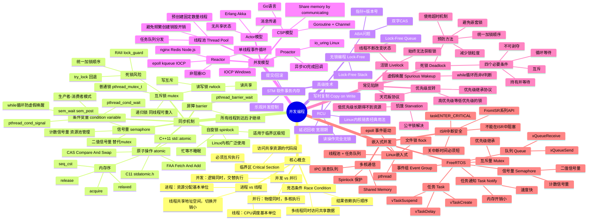
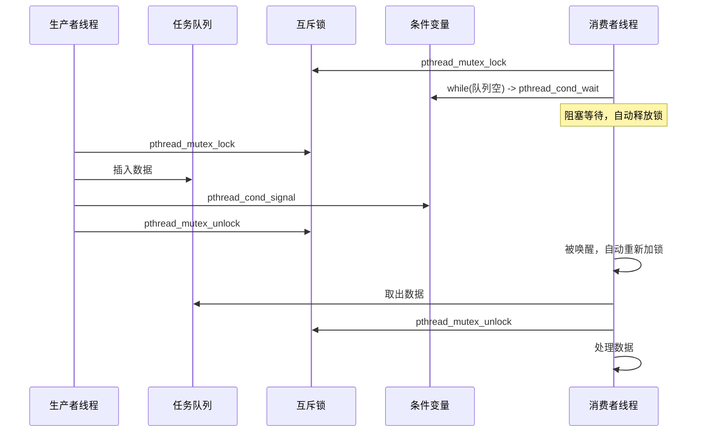
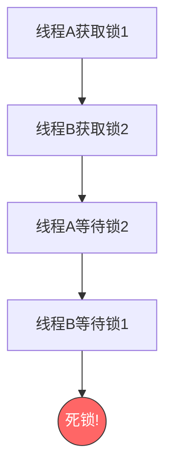
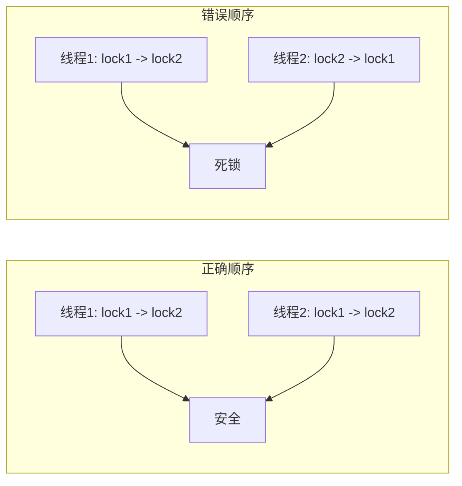

# 并发编程知识图谱

```mermaid
mindmap
  root((并发编程))
    核心概念
      并发 vs 并行
        并发：逻辑同时，交替执行
        并行：物理同时，多核执行
      进程 vs 线程
        进程：资源分配基本单位
        线程：CPU调度基本单位
        线程共享地址空间，切换开销小
      竞态条件 Race Condition
        多线程同时访问共享数据
        结果依赖执行顺序
      临界区 Critical Section
        访问共享资源的代码段
        必须互斥执行
    同步机制
      互斥锁 mutex
        普通锁 pthread_mutex_t
        递归锁 同线程可重入
        读写锁 rwlock
          读共享
          写互斥
        死锁风险
          统一加锁顺序
          try_lock 回退
          RAII lock_guard
      自旋锁 spinlock
        忙等不睡眠
        适用于临界区极短
        Linux内核广泛使用
      条件变量 condition variable
        pthread_cond_wait
        pthread_cond_signal
        生产者-消费者模式
        while循环防虚假唤醒
      信号量 semaphore
        二值信号量 替代mutex
        计数信号量 资源池管理
        sem_wait sem_post
      屏障 barrier
        pthread_barrier_wait
        所有线程到达后才继续
      原子操作 atomic
        C11 stdatomic.h
        C++11 std::atomic
        CAS Compare And Swap
        FAA Fetch And Add
        内存序
          relaxed
          acquire
          release
          seq_cst
    高级技术
      无锁编程 Lock-Free
        Lock-Free Queue
        Lock-Free Stack
        ABA问题
          指针+版本号
          双字CAS
      RCU
        读操作完全无锁
        写时复制 Copy on Write
        延迟回收 宽限期
        Linux内核链表经典用法
      STM 软件事务内存
        乐观并发控制
        提交/回滚
    并发模型
      线程池 Thread Pool
        预创建固定数量线程
        任务队列分发
        避免频繁创建销毁开销
      Reactor
        epoll kqueue IOCP
        单线程事件循环
        非阻塞IO
        nginx Redis Node.js
      Proactor
        异步IO完成回调
        io_uring Linux
        IOCP Windows
      Actor模型
        消息传递
        无共享状态
        Erlang Akka
      CSP模型
        Goroutine + Channel
        Share memory by communicating
        Go语言
    常见陷阱
      死锁 Deadlock
        四个必要条件
          互斥
          持有并等待
          不可剥夺
          循环等待
        预防方法
          统一加锁顺序
          减少锁粒度
          避免嵌套锁
          使用超时机制
      活锁 Livelock
        线程不断改变状态
        始终无法获取锁
      饥饿 Starvation
        低优先级长期得不到资源
        公平锁解决
      优先级反转
        高优先级等低优先级的锁
        优先级继承协议
        天花板协议
      虚假唤醒 Spurious Wakeup
        while循环而非if判断
    嵌入式并发
      FreeRTOS
        任务 Task
          vTaskCreate
          vTaskDelay
          vTaskSuspend
        队列 Queue
          xQueueSend
          xQueueReceive
        互斥量 Mutex
          优先级继承
        信号量 Semaphore
          二值信号量
          计数信号量
        事件组 Event Group
        任务通知 Task Notify
          速度快
          内存开销小
      ISR中断安全
        FromISR系列API
        taskENTER_CRITICAL
        关中断时间必须短
        不能在ISR中阻塞
      多核通信
        Shared Memory
        IPC 消息队列
        Spinlock 保护
      Linux嵌入式
        pthread
        epoll 事件驱动
        文件锁 flock
        线程池 + 任务队列
```

## 生产者-消费者时序

```mermaid
sequenceDiagram
    participant P as 生产者线程
    participant Q as 任务队列
    participant L as 互斥锁
    participant CV as 条件变量
    participant C as 消费者线程

    C->>L: pthread_mutex_lock
    C->>CV: while(队列空) -> pthread_cond_wait
    Note over C: 阻塞等待，自动释放锁

    P->>L: pthread_mutex_lock
    P->>Q: 插入数据
    P->>CV: pthread_cond_signal
    P->>L: pthread_mutex_unlock

    C->>C: 被唤醒，自动重新加锁
    C->>Q: 取出数据
    C->>L: pthread_mutex_unlock
    C->>C: 处理数据
```

## 死锁形成

```mermaid
graph TD
    A[线程A获取锁1] --> B[线程B获取锁2]
    B --> C[线程A等待锁2]
    C --> D[线程B等待锁1]
    D --> E((死锁!))
    style E fill:#f66,stroke:#333,color:#fff
```

## 加锁顺序对比

```mermaid
graph LR
    subgraph 正确顺序
        T1[线程1: lock1 -> lock2] --> OK1[安全]
        T2[线程2: lock1 -> lock2] --> OK1
    end
    subgraph 错误顺序
        T3[线程1: lock1 -> lock2] --> DL[死锁]
        T4[线程2: lock2 -> lock1] --> DL
    end
```