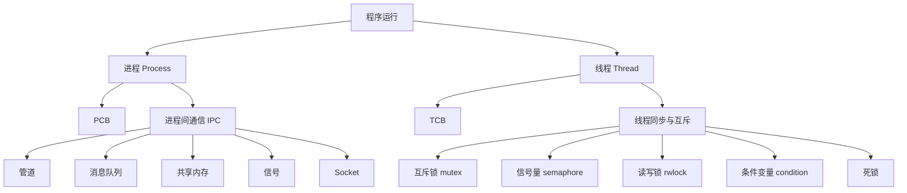
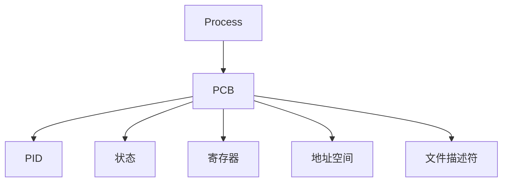
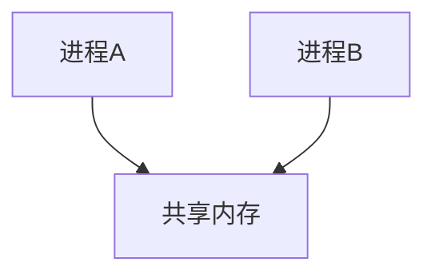
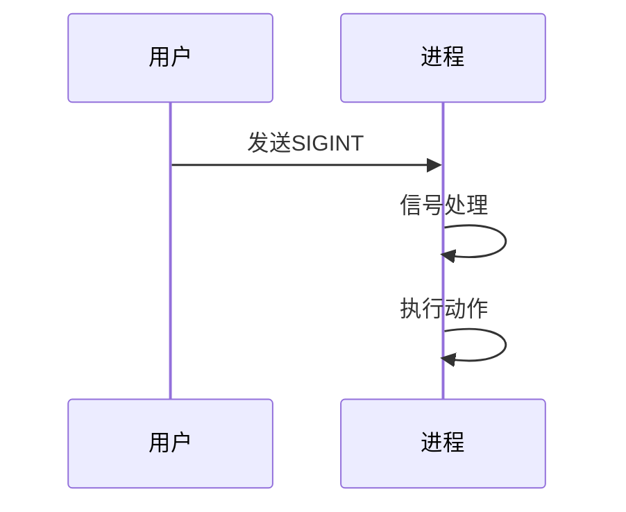
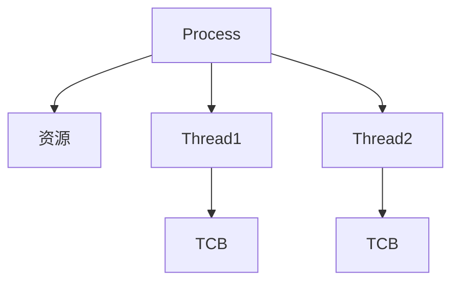
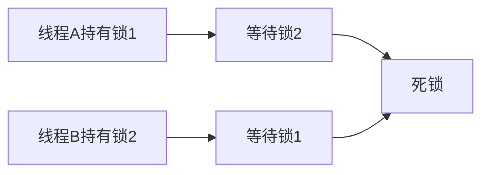
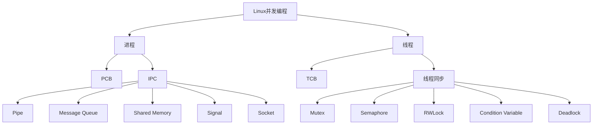

# Linux **并发编程知识总览**

[toc]



------

## 一、进程 Process

### 1. 本质

进程：

> 操作系统进行资源分配和管理的基本单位。

可以理解：

```text
程序
 ↓
运行起来
 ↓
进程
```

---

### 2. PCB（Process Control Block）

操作系统通过 PCB 描述进程。

包含：

```
- PID
- 状态
- 优先级
- 程序计数器
- 寄存器
- 内存管理信息
- 文件描述符表
- 信号相关信息
```

模型：



------

### 3. 进程状态

常见：

```text
创建
 ↓
就绪
 ↓
运行
 ↓
阻塞
 ↓
退出
```

Linux：

```text
R 运行/就绪
S 可中断睡眠
D 不可中断睡眠
Z 僵尸
T 停止
```

------

## 二、进程间通信 IPC

为什么需要 IPC？

因为：

> 进程之间地址空间隔离。

模型：


------

## IPC方式

### 1. 管道 Pipe

特点：

- 半双工
- 字节流
- 通常父子进程使用

模型：


本质：

> 内核缓冲区。

------

### 2. 消息队列

特点：

- 按消息传递
- 内核维护消息链表

模型：


------

### 3. 共享内存

速度最快。

原因：

直接共享一块内存。

模型：



但是：

需要同步。

否则：

```text
同时修改
 ↓
数据错误
```

------

### 4. 信号 Signal

信号：

> 软件层面的通知机制。

例如：

```text
Ctrl+C

↓

SIGINT

↓

进程收到

↓

执行处理函数
```

模型：



------

### 5. Socket

最强大的 IPC。

特点：

- 跨机器
- 网络通信

模型：


------

## 三、线程 Thread

### 1. 本质

线程：

> CPU调度的基本单位。

进程：

负责资源。

线程：

负责执行。

模型：



------

### 2. 线程特点

共享：

- 代码段
- 数据段
- 堆
- 文件描述符

独立：

- 栈
- 寄存器
- 程序计数器

------

## 四、线程同步与互斥

为什么需要？

因为：

> 多个线程共享资源。

问题：

### 竞态条件

例如：

```c
count++;
```

实际：

```text
读取

修改

写回
```

多个线程同时执行：

导致错误。

------

## 五、同步机制

### 1. Mutex 互斥锁

目的：

> 同一时间只有一个线程访问。

模型：

```text
lock

临界区

unlock
```

适合：

- 修改共享数据
- 保护临界区

------

### 2. Semaphore 信号量

目的：

> 控制资源数量。

例如：

5个连接：

```text
sem=5
```

最多5个线程使用。

核心：

```
wait()
资源--
 
post()
资源++
```

------

### 3. 读写锁 rwlock

目的：

优化读多写少。

规则：

```
读 + 读
允许

读 + 写
禁止

写 + 写
禁止
```

------

### 4. 条件变量

目的：

> 等待某个条件发生。

例如：

```
没有任务

线程睡眠

有任务

唤醒
```

通常：

```
mutex + condition
```

------

## 六、死锁

同步机制的问题。

定义：

> 多个线程互相等待资源，全部无法继续。

四个条件：

```
四个必要条件
1.Mutual Exclusion  互斥条件
2.Hold and Wait  请求与保持
3.No Preemption  不可剥夺
4.Circular Wait  循环等待

避免死锁
1.由于预防死锁的方法会严重损坏系统性能，可以使用较弱的限制来避免死锁
2.在避免死锁的策略中，实现预先分析此次资源分配是否可能导致不安全状态，如果此次分配可能导致不安全，则等待
3.常见的避免死锁的算法有银行家算法

检测死锁
1.可以为任务和资源指定编号，在此基础上为任务和资源建立一个有向图
2.检测有向图中是否有环，有环则发生死锁

解决死锁
发现任务进入死锁，将任务从死锁状态解脱出来
	剥夺资源
	撤销任务
```

模型：



------

## 七、整体知识关系

最终形成：



------

## 最核心的系统模型

以后遇到并发问题，不要先想 API。

按照这个顺序：

```text
1. 有几个执行实体？
   ↓
   进程？线程？

2. 是否共享资源？
   ↓
   内存？文件？设备？

3. 是否需要通信？
   ↓
   IPC

4. 是否存在竞争？
   ↓
   同步互斥

5. 谁创建？
   谁等待？
   谁释放？
   生命周期如何？
```

------

搭 Linux 用户态系统编程的骨架：

```text
进程
 ↓
IPC
 ↓
线程
 ↓
同步
 ↓
并发模型
 ↓
服务器设计
```

后面的网络编程、线程池、驱动里的等待队列，本质都是在这个模型上继续扩展。


