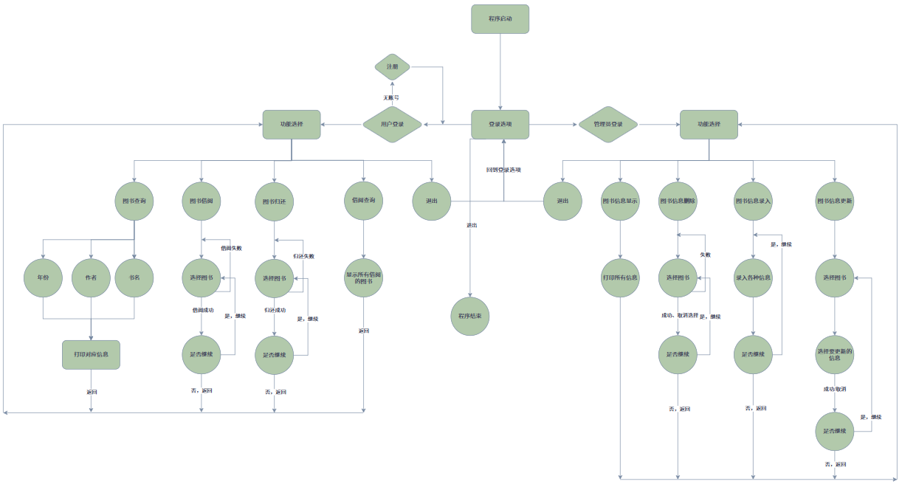

[toc]




系统分为用户和管理员两个模块

## **1.用户功能**

1. **图书查询**

允许用户根据不同的条件查询图书信息：书名、作者、出版社、出版年份、库存数量

```
提示：

系统提示用户输入要查询的条件

系统在图书链表或其他数据结构中查找该条件对应的图书节点。

如果找到，将该图书的详细信息（书名、作者、出版社、出版年份、库存数量等）显示给用户；如果未找到，向用户显示相应的错误信息。
```


1. **图书借阅**

允许用户借阅图书。

```
提示：

用户选择借阅图书的选项。

系统提示用户输入要借阅的图书的书名或图书编号。

系统在图书数据结构中查找相应的图书节点。

如果找到，检查该图书的库存数量是否大于 0。如果库存数量大于 0，将该图书的库存数量减 1，同时记录用户的借阅信息（如用户姓名、借阅日期等），并向用户显示借阅成功信息。如果库存数量为 0，向用户显示借阅失败信息，提示该图书已无库存。如果未找到，向用户显示相应的错误信息。
```


1. **图书归还**

允许用户归还已借阅的图书。

```
用户选择归还图书的选项。

系统提示用户输入要归还的图书的书名或图书编号。

系统在图书数据结构中查找相应的图书节点。

如果找到，将该图书的库存数量加 1，并更新用户的借阅信息（标记该图书已归还），向用户显示归还成功信息。如果未找到，向用户显示相应的错误信息。
```


1. **借阅查询**

允许用户查询已借阅的图书的信息。

```
用户选择查询借阅图书的选项。

将该用户的所有已借阅的图书的所有信息显示出来
```


## **2.管理员功能**

1. 管理员登录
2. 图书信息录入

允许管理员输入新图书的详细信息，包括书名、作者、出版社、出版年份和库存数量，并将该图书信息存储到系统中。

提示：

```
管理员选择录入图书信息的选项。

系统提示管理员输入书名（字符串）。

系统提示管理员输入作者（字符串）。

系统提示管理员输入出版社（字符串）。

系统提示管理员输入出版年份（整数/字符串）。

系统提示管理员输入库存数量（整数）。

系统将输入的信息存储为一个图书节点，并添加到图书数据结构中。
```


3. 图书信息删除

允许管理员根据图书编号或书名删除图书信息。

```
提示：

管理员选择删除图书信息的选项。

系统提示管理员输入要删除的图书的编号或书名。

系统在图书数据结构中查找该图书对应的图书节点。

如果找到，将该图书节点从数据结构中移除，并释放相应的内存；如果未找到，向用户显示相应的错误信息。
```


4. 图书信息更新

允许管理员根据图书编号或书名更新图书的信息，包括书名、作者、出版社、出版年份和库存数量。

```
管理员选择更新图书信息的选项。

系统提示管理员输入要更新的图书的编号或书名。

系统在图书数据结构中查找该图书对应的图书节点。

如果找到，系统提示管理员更新相应的信息（书名、作者、出版社、出版年份、库存数量等），并将更新后的信息存储到相应的图书节点中；如果未找到，向用户显示相应的错误信息。
```


5. 图书信息显示

将系统中存储的所有图书信息以列表形式展示给管理员。

```
管理员选择显示图书信息的选项。

系统遍历图书数据结构，将每本图书的书名、作者、出版社、出版年份和库存数量依次显示出来。

对于空数据结构，向管理员显示相应的提示信息。
```


## **3.其他**

允许管理员管理用户信息，包括添加新用户、删除用户、更新用户信息和查看用户列表。

允许用户和管理员安全地退出系统。

## **4.拓展功能**

### **1.系统统计与报表生成**

为了管理员方便查看图书的情况，请添加功能：按不同的条件进行升序/降序排序。

管理员可以查看系统的统计信息，如不同类别图书的数量（武侠，历史，地理，养生。。。）、最受欢迎的图书、借阅频率等，并生成相应的报表。

提示：

```
管理员选择系统统计的选项。

系统根据存储的图书和用户借阅信息进行统计，生成统计信息，如不同类别图书的数量、最受欢迎的图书（根据借阅次数）、用户借阅频率等。

管理员可以选择将统计信息以报表的形式打印输出。
```


### **2.借阅时间**

为了让更多用户能够借阅到图书，请为系统设定一个借阅时间和归还日期，并提示用户记得到点归还图书，如多次超时则拉入借阅黑名单，禁止借阅图书。

### **3.模糊搜索**

为了让用户和管理员能更好的根据自己的需求找到想要的图书，请设置一个模糊搜索。根据图书的出版时间段搜索图书

```
输入出版时间：1999.6

搜索输出出版时间范围为：1999.2~1999.10
```


## GPT

而且：

> “重构旧项目”比“继续写新demo”更能提升工程能力。


因为真正的软件开发，大部分时间其实不是：

```Plain text
从零开始写
```

而是：

```Plain text
维护
扩展
重构
```


---

### 一、你现在这个图书管理系统，非常适合做“工程化训练”

因为它天然包含：

- 数据结构
- 文件IO
- 数据持久化
- 模块划分
- 状态管理
- 配置管理


这些非常核心的东西。

而且复杂度刚好。


---

### 二、先回答你最关键的问题

> “到底用数据库还是文件？”


对于你现在这个阶段：

> 我更建议先用“文件持久化”。


原因非常重要。


---

### 三、为什么现在更推荐文件，而不是数据库

因为你当前真正缺的不是：

```Plain text
SQL能力
```

而是：

```Plain text
对“数据持久化本质”的理解
```


---

数据库其实帮你隐藏了很多东西：

- 文件组织
- 缓冲
- 索引
- 数据格式
- 持久化


如果现在直接全交给MySQL：

你会：

```Plain text
功能实现了
但不知道系统怎么工作
```


---

### 四、你现在最适合学习的是：

> “自己管理数据”。


这是文件IO最核心的训练。


---

### 五、你应该怎么做（非常关键）

你这个项目应该分阶段重构。

不要一次搞太复杂。


---

### 六、推荐结构（重要）


---

#### 第一阶段：纯内存版（你应该已经有）

例如：

```c
typedef struct
{
    int id;
    char name[32];
} Book;
```

链表管理。

先保持。


---

#### 第二阶段：文件持久化（核心阶段）

这是你现在最应该做的。


---

目标

程序退出后：

```
数据不会丢
```


---

这时候你会真正理解：

- 文件IO
- 序列化
- 数据格式
- 持久化


---

### 七、这里有两个路线


---

#### 方案1：文本文件（推荐先做）

例如：

```Plain text
1,C语言
2,Linux
3,数据结构
```

优点：

- 能直接看
- 好调试
- 简单


你会练习：

- fgets
- fprintf
- strtok


---

#### 方案2：二进制文件（后面再做）

例如：

```c
fwrite(&book, sizeof(Book), 1, fp);
```

这个更接近底层。

但调试困难。

建议第二阶段后再做。


---

### 八、然后你会碰到一个巨大问题

例如：

```Plain text
程序启动时怎么加载？
```

于是：

你会自然开始理解：

```Plain text
初始化流程
```


---

### 九、接下来你会进入：

> “模块化”


你应该开始拆：


---

##### book.h / book.c

管理图书数据。


---

##### storage.h / storage.c

负责文件保存加载。

例如：

```c
save_books();
load_books();
```


---

##### ui.c

用户菜单。


---

##### config.c

配置。


---

### 十、然后你会自然碰到：

> “配置管理”


这非常好。

例如：


---

##### config.txt

```Plain text
data_path=books.txt
max_books=100
```


---

程序启动：

```Plain text
读取配置
```


---

这时候：

你已经开始真正接触：

```Plain text
工程化
```

了。


---

十一、你会逐渐发现

原来：

- Linux
- Nginx
- MySQL
- MQTT


都有：

```Plain text
配置文件
日志文件
数据文件
```

因为：

> 文件IO是整个Linux世界的基础之一。


---

### 十二、你现在非常适合加入：

日志系统（强烈推荐）

例如：

```Plain text
[INFO] add book success
[ERROR] file open failed
```

写入：

```Plain text
log.txt
```

你会练到：

- append
- flush
- 时间戳
- 调试思维


---

### 十三、什么时候再引入数据库？

当你开始发现：

```Plain text
文件越来越难管理
```

时。

例如：


---

你开始需要：

- 查询
- 排序
- 模糊搜索
- 多条件筛选


---

或：

```Plain text
数据量变大
```


---

这时候：

你会自然意识到：

> “数据库是在解决文件管理困难。”


这才是真正理解数据库。

而不是：

```
会写SQL
```


---

### 十四、你现在真正要练的东西

不是：

技术栈数量

而是：


---

### 十五、软件结构能力

你应该重点练：


---

1. 模块边界

谁负责什么？


---

2. 数据结构

数据如何组织？


---

3. 数据流

数据怎么走？


---

4. 持久化

数据如何保存？


---

5. 配置化

避免写死。


---

6. 错误处理

例如：

if(fp == NULL)


---

7. 可扩展性

以后怎么加功能？


---

### 十六、你现在非常适合做的一件事

画架构图。

例如：

```Plain text
用户
 ↓
UI模块
 ↓
Book模块
 ↓
Storage模块
 ↓
文件
```


---

### 十七、最后一个很重要的建议

不要追求：

```
一次写出“高级架构”
```

因为工程能力不是：

```
看架构文章
```

获得的。

而是：

```
代码开始混乱
↓
你感到痛苦
↓
开始重构
↓
逐渐理解为什么需要抽象
```

这个过程中长出来的。

你现在其实已经进入这个阶段了。