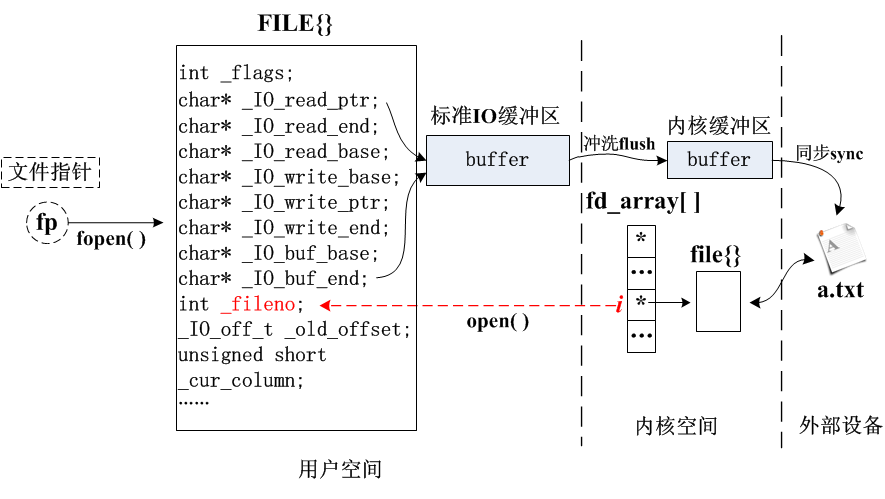
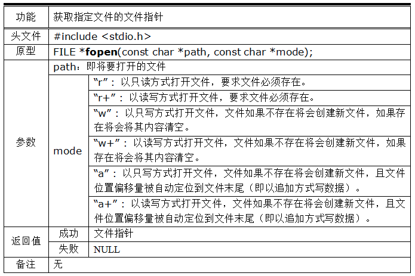
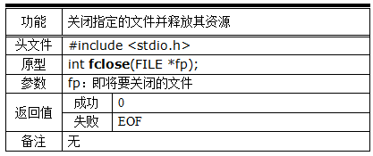
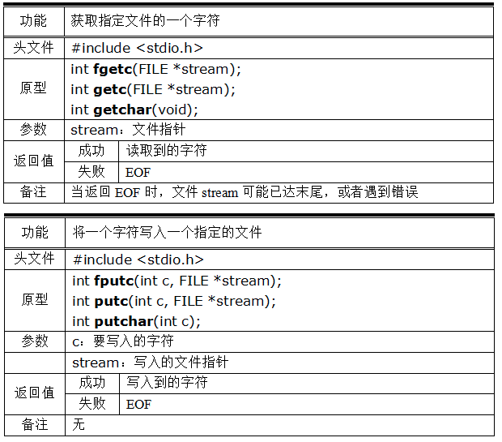
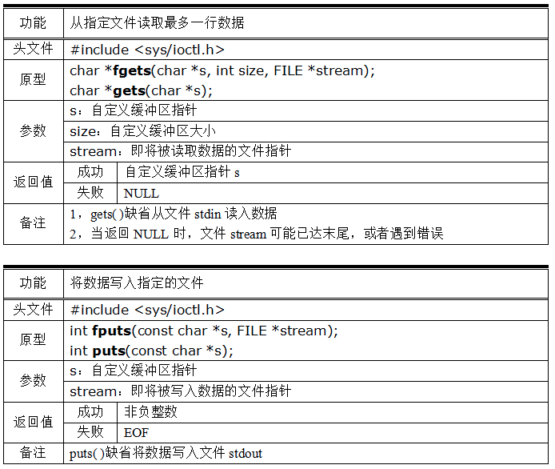
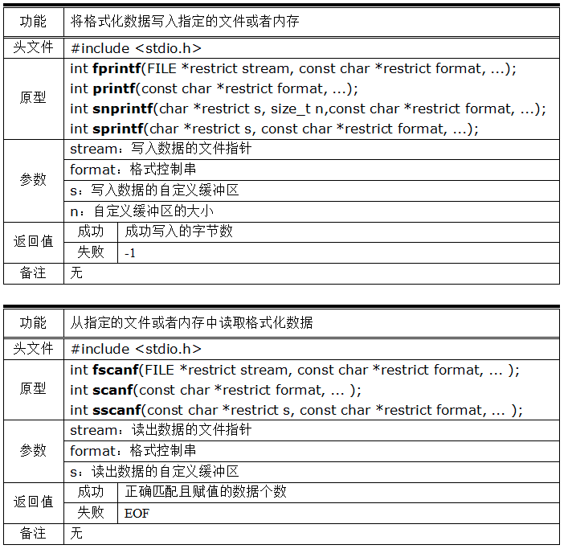
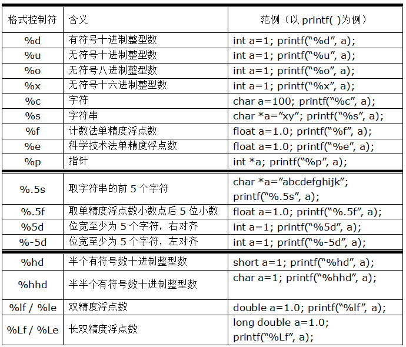
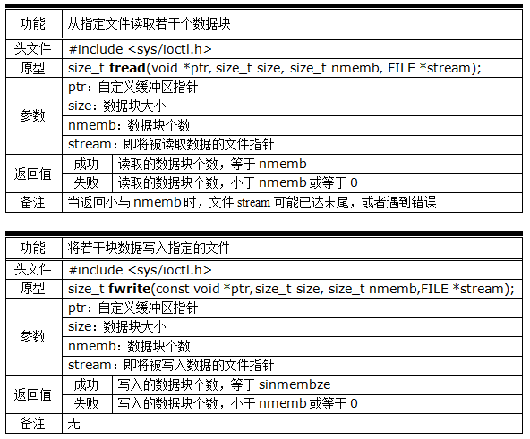
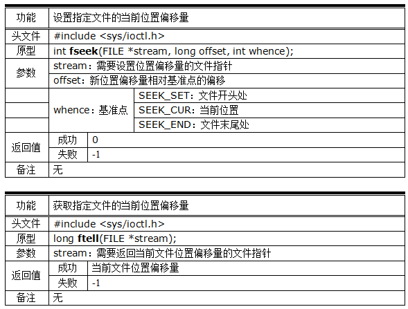
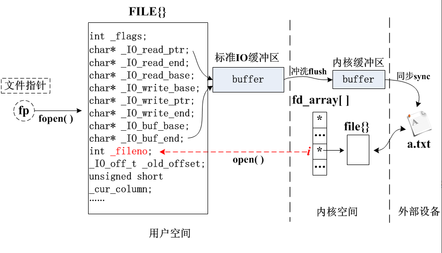

# 标准IO

[toc]


## 标准IO基本API

> 有缓冲IO
>
> 1.执行系统调用read和write次数比较少
>
> 2.不依赖系统内核，可移植性qiang

### **1. 文件的打开与关闭**

不管用系统IO函数还是标准IO函数，操作文件的第一步，都是“打开（open/fopen）”文件，需要注意：

- 系统IO：打开文件得到的是一个整数，称为文件描述符(fd: file descriptor)。
- 标准IO：打开文件得到的是一个指针，称为文件指针(FILE \*)。

文件指针指向结构体 FILE，该结构体内部包含了文件描述符，如下图：



<center>
    文件指针的本质内涵
</center>
#### fopen

标准IO打开文件：



注意：

- 总共有6中打开模式，不能自创别的模式，比如 “rw” 是非法的。


#### fclose

标准IO关闭文件：



注意：

- fclose函数涉及内存释放，不可对同一个文件多次关闭。
- 示例代码：

```c
int main()
{
    // 以可读可写的方式打开文件，且要求文件必须存在
    FILE *fp = fopen("a.txt", "r+");
    if(fp == NULL)
    {
        perror("fopen失败");
        return 1;
    }

    // 关闭文件指针，并释放文件所关联的缓冲区内存
    fclose(fp);
    return 0;
}
```

> [!error]+ segmentation fault
>
> fp = NULL时
>
> 对 `NULL` 执行关闭操作 → 直接段错误 Segmentation fault

> [quesion]\-
>
> 为社么open和fopen在读写一个不存在的文件时，用strerror(errno)打印报错信息时，都是 No such file or directory
> 这个directory不是目录/文件夹的意思吗？open和fopen可以打开目录？


### **2. 文件内容的读写操作**

> notice:
>
> stdin	stdout也是文件

标准IO跟系统IO不同的地方在于，标准IO的读写操作提供了很多不同的函数接口，以满足不同的需求：

#### （一）按字节读写文本文件：



- 关键点：
    - fgetc()与getc()功能完全一样，区别是fgetc是函数，而getc是宏。
    - fputc()与putc()功能完全一样，区别是fputc是函数，而putc是宏。
    - getchar()和putchar()只能针对键盘输入和屏幕输出，不能指定别的文件。

> getchar() === fgetc(stdin)
>
> putchar() === fputc(stdout)
>
> ==> fputc(fgetc(stdin), stdout);

#### （二）按行读写文本文件：



- 关键点：
    - 对于读操作而言，返回 EOF 意味着读操作失败，这有两种情况：
        1. 如果 feof(fp) 为真，此时意味着读到了文件末尾，没有数据可读了。
        2. 如果 ferror(fp) 为真，此时意味着遇到了错误。
    - 读操作函数接口的返回值是 int ，而不是 char ，原因是当读操作失败是返回的 EOF 的数值是 -1，而 char 型数据可能无法表达 -1。
- 对于读操作失败而返回的 EOF，一般由以下函数进一步加以判断：

```c
if((ch=fgetc(fp)) == EOF)
{
    if(feof(fp))
        printf("文件内容已读完.\n");

    if(ferror(fp))
        printf("读操作遇到错误.\n");
}
```


fgets() 和 gets() 都是按行读取文件数据，他们的区别是：

- fgets() 可以读取指定的任意文件，而 gets() 只能从键盘读取。
- fgets() 有内存边界判断，而 gets() 没有，因此后者是不安全的，不建议使用。
- fgets() 在任何情形下都按原样读取数据，但 gets() 会自动去除数据末尾的 ‘\n’

fputs() 和 puts() 都是按行将数据写入文件，他们的区别是：

- fputs() 可以将数据写入指定的任意文件，而 puts() 只能将数据输出到屏幕。
- fputs() 在任何情形下都按原样写入数据，但 puts() 会自动给写入数据的末尾加上 ‘\n’

示例代码：

```c
int main()
{
    char buf[100];

    // 以可读可写方式打开文件（且要求文件已存在）
    FILE *fp = fopen("a.txt", "r+");

    // 从文件 a.txt 读取最多不超过99个字节的一行数据
    // 读取的数据按原样存储在 buf 中。
    fgets(buf, 100, fp);

    // 从键盘读取一行数据（可能发生内存越界，此函数不安全）
    // 读取的数据如果有换行符'\n'，会被自动清除掉。
    gets(buf);


    // 将"abcd"按原样写入到文件 a.txt 中
    fputs("abcd", fp);

    // 将 "abcd\n" 输出到屏幕
    puts("abcd");
}
```

> fputs(fgets(buf, 100, stdin), stdout)


#### （三）按指定格式读写文本文件：



> 带 f 的 → 操作 文件 FILE
>
> 不带 f 的 → 操作 屏幕 / 键盘 (stdout/stdin)
>
> 带 s 的 → 操作 内存字符串 (char \*)

- 注意：

1. fprintf( )不仅可以像printf( )一样向标准输出设备输出信息，也可以向由stream指定的任何有相应权限的文件写入数据。
2. sprintf()和snprintf()都是向一块自定义缓冲区写入数据，不同的是后者第二个参数提供了这块缓冲区的大小，避免缓冲区溢出，因此应尽量使用后者，放弃使用前者。
3. fscanf( )不仅可以像scanf( )一样从标准输入设备读入信息，也可以从由stream指定的任何有相应权限的文件读入数据。
4. sscanf( )从一块由s指定的自定义缓冲区中读入数据。
5. 这些函数的读写都是带格式的，格式由下表规定：



- 按格式控制符输出数据，示例代码：

```c
int main(void)
{
    // 将数据按格式输出到文件指针 fp 所指定的文件中去
    fprintf(fp, "%d%f%s", 100, 3.14, "abc");

    // 将数据按格式输出到屏幕（即文件指针stdout所指向的文件）
    // 以下两条语句是等价的
     printf(        "%d%f%s", 100, 3.14, "abc");
    fprintf(stdout, "%d%f%s", 100, 3.14, "abc");

    // 将数据按格式输出到指定的内存 buf 中
    // 由于内存的容量是有限的，因此一般使用 snprintf() 来保证不发生内存越界
    char buf[5];
     sprintf(buf,    "%d%f%s", 100, 3.14, "abc"); // 不安全版本
    snprintf(buf, 5, "%d%f%s", 100, 3.14, "abc"); // 安全版本
}
```


- 按格式控制符读入数据，示例代码：

```c
int main(void)
{
    // 从文件 fp 按格式读入到指定变量 i 中
    // 以下两条语句是等价的
    int i;
     scanf(    "%d", &i);
    fscanf(fp, "%d", &i);

    // 从内存buf中按格式读入到指定变量 i 中
    char buf[] = "100";
    sscanf(buf, "%d", &i);
```

> >  summarize : f 管文件，s 管字符串，啥也不带管屏幕！
>
> **f 开头：操作文件**（`fprintf/fscanf/fgets/fputs/fgetc/fputc`）
>
> **不带 f：操作屏幕 / 键盘**（`printf/scanf/gets/puts/getchar/putchar`）
>
> **s 开头：操作内存字符串**（`snprintf/sprintf/sscanf`）


#### （四）按数据块读写文件：



注意：

- 以上两个函数既能处理文本，也能处理二进制文件。
- 返回值均是成功读写的“块”数，而非字节数

示例代码：

```c
// 从文件 fp 中读取5块连续的数据，每块20个字节
// 返回值 n 代表成功读取到的块数
int n = fread(buf, 20, 5, fp);

// 1. 成功读取到所需的数据块
if(n == 5)
    ...

// 2. 成功读取到的数据块小于指定的块数：
//    这可能出错了，也可能是读到文件尾了
if(n < 5)
{
    if(ferror(fp)) // 出错了
        ...
    if(feof(fp)) // 到文件尾了
        ...
}
```


> getchar -> fgetc(stdin)
>
> putchar -> fputc(stdout)
>
> printf -> fprintf(stdout, )
>
> scanf -> sscanf(stdin)


### **3. 文件位置的获取与设定**

与系统IO接口类似，标准IO也可以设置文件的读写位置、获取读写位置，只不过对于标准IO而言，这两个功能是分开实现的：



关键点：

- 设置和获取的文件位置都是long类型。
- 可以将文件位置设置到已有数据范围之外，形成“空洞”。

示例代码：

```c
int main(void)
{
    // 假设文件 a.txt 只有一行
    // 内容如下：
    //
    // 1234567890abcde 
    //

    FILE *fp = fopen("a.txt", "r+");

    // 读取前面10个阿拉伯数字:
    char buf[10];
    fread(buf, 10, 1, fp);

    // 将文件位置调整到'c'
    fseek(fp, 2, SEEK_CUR);

    // 将文件位置调整到'1'
    fseek(fd, 0, SEEK_SET);

    // 将文件位置调整到'a'
    fseek(fd, -5, SEEK_END);
}
```

> 内部调用lseek


## 标准IO缓冲区


标准IO实际上是系统IO的封装，这种封装体现如下图所示，fopen()函数将调用open()得到的文件描述符填入结构体 FILE 中，并为文件分配缓冲区、设置缓冲区类型，最后给用户返回指向 FILE 的指针 fp，称为文件指针：



如上图所示，每当使用标准IO的写操作函数，试图将数据写入文件 a.txt 时，数据都会流过缓冲区，然后再在适当的时刻冲洗（或称刷新，flush）到内核，最后才真正写入设备文件。

按照缓冲区按照什么时候冲洗数据到内核，可以将缓冲区分成以下三类：

- 不缓冲类型：
    - 一旦有数据，立刻将数据冲洗到文件
- 全缓冲类型：
    - 一旦填满缓冲区，立刻将数据冲洗到文件
    - 程序正常退出时，立刻将数据冲洗到文件
    - 遇到 fflush() 强制冲洗时，立刻将数据冲洗到文件
    - 关闭文件时，立刻将数据冲洗到文件
    - 读取文件内容时，立刻将数据冲洗到文件
    - 改变缓冲区类型时，立刻将数据冲洗到文件
- 行缓冲类型：
    - 同全缓冲类型
    - 一旦遇到‘\n’时，立刻将数据冲洗到文件

关键点：

1. 缓冲(buffer)都是针对写操作而言的，缓冲的存在是为了提高写效率。

2. 对于标准输出而言，默认是行缓冲的；

    对于标准出错而言，默认是不缓冲的；

    对于普通文件而言，默认都是全缓冲类型。

3. 滞留在缓冲区中的数据有时被称为脏数据（dirty data），脏数据的存在代表程序操作的结果与文件真实状态不一致，若未正常冲洗这些脏数据就退出程序则有可能会造成数据丢失。

4. 这三种缓冲类型，可以通过函数 setbuf()/setbuf() 来修改。

示例代码1：

```c
int main(void)
{
    // 由于标准输出默认是行缓冲，而以下数据不满足数据冲洗的任一条件
    // 因此下面的语句执行完毕之后， "abcd"将滞留缓冲区不会被显示到屏幕
    fprintf(stdout, "abcd");

    // 由于标准出错默认是不缓冲
    // 因此下面的语句执行完毕之后， "1234"将立即被显示到屏幕上
    fprintf(stderr, "1234");
}
```


执行结果：（后面执行的代码反而先显示出来）

```
gec@ubuntu:~$ ./a.out
1234abcd
```


示例代码2：

```c
int main(void)
{
    FILE *fp = fopen("a.txt", "w+");

    // 由于普通文件默认是全缓冲，而以下数据不满足数据冲洗的任一条件
    // 因此下面的语句执行完毕之后， "abcd"将滞留缓冲区不会被冲洗到a.txt
    fputs("abcd\n", fp);

    // 中断程序
    // 此时由于程序无法正常结束，因此滞留缓冲区的数据无法冲洗，数据丢失
    abort();
}
```


示例代码3：

```c
int main(void)
{
    FILE *fp = fopen("a.txt", "w+");

    // 将文件的缓冲区类型修改为行缓冲
    char a[100];
    setvbuf(fp, a, _IOLBF, 100);

    // 由于该文件行缓冲，且以下数据带有'\n'，数据将被直接冲洗到a.txt
    fputs("abcd\n", fp);

    // 中断程序
    // 此时虽然程序也被强制中断，但数据已经保存到文件中，数据不丢失
    abort();
}
```


*注意：在非Linux实验环境中，结果可能会不同。*


## 编码


程序把数据发送到显示(stdout)，显示按照当前设置的编码表去解析数据


```
// utf-8
chcp 65001

// gbk2312
chcp 936
```


### 查看编码

```
// windows
chcp

// linux LANG=en_US.UTF-8
locale // echo $LANG
```


### utf-8

UTF-8 是**前缀识别编码**，每个字符开头就说明长度：

- `0xxxxxxx` → 单字节（ASCII）
- `110xxxxx` → 双字节
- `1110xxxx` → 三字节（中文大多是这个）
- `11110xxx` → 四字节（emoji 大多是这个）

 

### gbk

GBK 更简单粗暴：

- 字节最高位是 `0` → 英文（1 字节）
- 字节最高位是 `1` → 中文（**固定 2 字节**）


