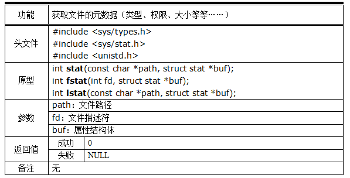
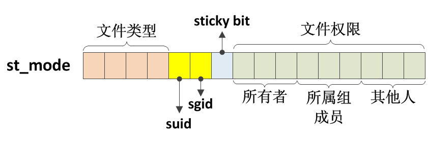
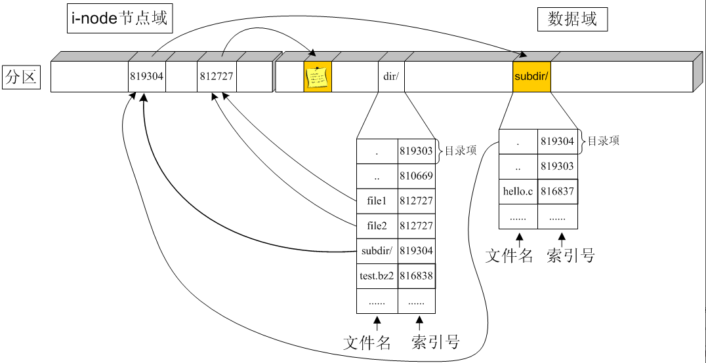
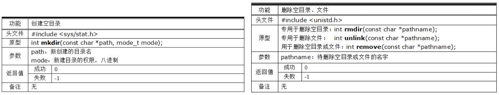
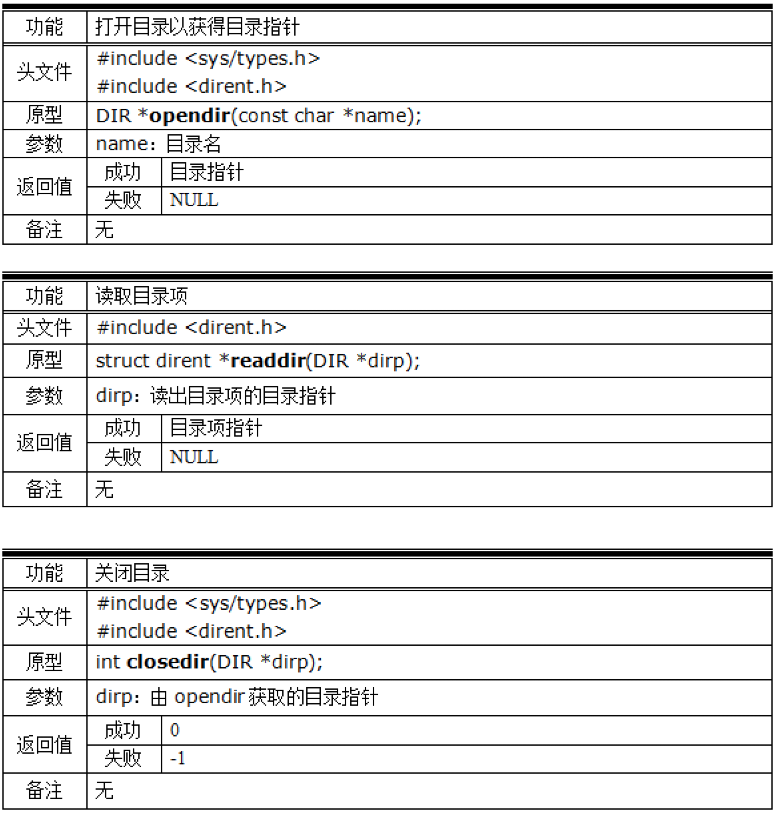

# 文件属性与目录操作

[toc]


## 文件属性

在应用开发中，经常要获取文件的属性，例如：文件的类型、大小、权限、设备号、最近修改时间等等，比如网络传输文件时，一般都需要先传递文件的属性，等准备妥善了再开始传输文件的真实内容。因此，熟悉文件属性的细节，并熟练获取这些信息的方式至关重要。


### **1. 获取文件属性信息的函数接口**

如下函数可以获取指定文件的属性：



- 注意：

1. 以上三个函数的功能一样，区别如下：
    - stat针对文件名获取其信息。
    - fstat针对文件描述符获取其信息。
    - lstat可以获取软连接文件本身的属性。
2. 这几个函数获取了文件的属性之后，会将这些信息存入一个称为stat的结构体中（与函数同名），该结构体的细节如下：

```c
struct stat {
     dev_t     st_dev;    // 本文件所在的设备的设备号，适用于非设备文件
     ino_t     st_ino;    // i节点号，相当于身份证号码
     mode_t    st_mode;   // 文件类型 + 文件权限
     nlink_t   st_nlink;  // 文件的别名的数目
     uid_t     st_uid;    // 文件所有者ID
     gid_t     st_gid;    // 文件所在组ID
     dev_t     st_rdev;   // 本文件的设备号，适用于特殊设备文件   
     off_t     st_size;   // 文件大小
     blksize_t st_blksize;   
     blkcnt_t  st_blocks;   
 
     // 文件时间戳
     struct timespec st_atim;  // 最近访问时间，比如打开看一下文件的时间
     struct timespec st_mtim;  // 最近修改时间，比如打开并改一下的时间
     struct timespec st_ctim;  // 最近状态改变时间，比如修改了文件的权限的时间
 };
 
// 其中，时间戳结构体的细节是：
struct timespec {
     long    tv_sec;   /* 秒 */
     long    tv_nsec;  /* 纳秒 */
};
```


下面对较复杂的成员做详细介绍：

### **2. 文件的设备号**

```c
struct stat {
     dev_t     st_dev;    // 本文件所在的设备的设备号，适用于非设备文件
     ...
     dev_t     st_rdev;   // 本文件的设备号，适用于特殊设备文件
     ...
     ...
 };
```


Linux系统为了方便管理，为每一种设备分配了主次设备号，主设备号用来规范设备的类型；次设备号用来规范该种设备在本系统中的序号。设备号是系统资源，在设备被加载的时候分配完毕。

- 以下两个函数，常用来获取主次设备号：

```c
 unsigned int major(dev_t dev);  // 从 dev 中获取主设备号
 unsigned int minor(dev_t dev);  // 从 dev 中获取次设备号
```


- 注意，在结构体stat中有两个类型为 dev_t 的成员。他们分别代表：
    - 本文件所在设备的设备号，适用于非设备文件。
    - 本文件的设备号，适用于特殊设备文件。
    - 特殊设备文件只有设备号的属性，没有文件大小的属性，即st_size是无效的。
- 解析：
    - 非设备文件是没有设备号的，此时该文件的 st_rdev 成员是无效的。
    - 非设备文件一定是存储某个存储器上的，此时该文件的 st_dev 代表的是其所在存储器的设备号，比如某个硬盘。
    - 特殊设备文件指的是类型为字符设备或块设备的文件，比如键盘、鼠标、硬盘、显示器等。
    - 特殊设备文件的 st_dev 成员是无效的，只有 st_rdev 有效。
- 示例代码：

```c
int main(int argc, char **argv) {
     // 获取指定文件的属性信息
     struct stat info;
     stat(argv[1], &info); 

     // 是特定的设备文件，那么 st_rdev 有效且 st_size 无效
     if(S_ISCHR(info.st_mode) || S_ISBLK(info.st_mode)) {
          printf("该文件的主次设备号分别是：%d,%d\n", major(info.st_rdev), minor(info.st_rdev));
     }
     // 不是设备文件，那么 st_dev 有效且 st_size 也有效
     else {
          printf("文件大小是：%d", info.st_size);
          printf("文件所在设备的主次设备号分别是：%d,%d\n", major(info.st_dev), minor(info.st_dev));
     }
}
```


### **3. 类型与权限**

```c
struct stat {
     mode_t    st_mode;   // 文件类型 + 文件权 
     ...
     ...
 };
```


在结构体 stat 中，文件的类型和权限并没有分开存储，而是被统一存储到同一个成员 st_mode 中，该成员的内部结构如下所示：



- 关键点：
    - st_mode是一个16位的 short 短整型数据。
    - 前4位表达文件的类型，由于Linux文件类型总共7种，足够。
    - 中间三位分别是 setuid、setgid 和 stickyBit。
    - 后9位表达文件的权限，与三组权限一一对应。
- 判断文件的类型可以用如下宏即可：

```c
S_ISREG(st_mode)  is it a regular file?
S_ISDIR(st_mode)  directory?
S_ISCHR(st_mode)  character device?
S_ISBLK(st_mode)  block device?
S_ISFIFO(st_mode) FIFO (named pipe)?
S_ISLNK(st_mode)  symbolic link?  (Not in POSIX.1-1996.)
S_ISSOCK(st_mode) socket?  (Not in POSIX.1-1996.)
```


- setuid、setgid(只对普通文件有效) 与 stickyBit(只针对目录有效)
- 作用解析：
    - setuid：使得文件的使用者获得文件所有者的临时授权。
    - setgid：使得文件的使用者获得文件所在目录的所属组的临时授权。
    - stickyBit：使得用户只能增加和删除属于自身的文件，不能删除别的用户的文件。
- 修改文件setID示例：

```shell
gec@ubuntu:~$ ls -l
-rwxr-xr-x 1 gec gec  8520 Dec 18 00:27 a.out
gec@ubuntu:~$
gec@ubuntu:~$ chmod 04755 a.out
gec@ubuntu:~$ ls -l
-rwsr-xr-x 1 gec gec  8520 Dec 18 00:27 a.out
```


以上示例中，通过 04755 给程序 a.out 添加了 setuid，这意味着：以后不管哪个用户来执行该程序，其执行期间都会获得该程序所有者 gec 的临时授权，简单讲就是会临时变成用户 gec：

1. 如果程序 a.out 创建了新文件，那么这些新文件将属于 gec。
2. 如果程序 a.out 触发了权限检查，那么系统会检查 gec 的权限。
3. 同样的道理，适用于 setgid。

使用 setID 解决实际问题的一个典型例子，就是系统中用于修改密码的命令：

```c
gec@ubuntu:~$ ls -l /usr/bin/passwd 
-rwsr-xr-x 1 root root 59640 Mar 23  2019 /usr/bin/passwd
```


程序命令 passwd 是属于根用户 root 的，但由于它被设置了setuid，因此以后不管是谁来执行这个程序，在其执行期间都会临时获得 root 的临时授权，这么做是因为修改密码的本质上修改文件 /etc/passwd 的内容，而该文件只有管理员 root 才能修改，设置了 setuid 之后，普通用户既可以通过命令 passwd 来修改此文件，也避免了索取管理员密码的步骤，非常实用。

- 修改目录stickyBit示例：

```c
gec@ubuntu:~$ ls -l
drwxrwxrwx  2 gec gec 4096 Dec 20 18:13 dir/
gec@ubuntu:~$
gec@ubuntu:~$ chmod 01777 dir/
gec@ubuntu:~$ ls -l
drwxrwxrwt  2 gec gec 4096 Dec 20 18:13 dir/
```


目录 dir/ 的权限是 0777，表示任何用户都可以在该目录下可以增删任意的文件，但加了 stickyBit 限制之后，某用户只能删除自己创建的文件，而不能删除别的用户创建的文件，这个过程仿佛是自己创建的文件才“黏住”自己一样，因此这个功能被称为黏住位（stickyBit）


在 st_mode 中的末9位是文件的权限信息，标准IO库定义了如下宏来方便我们的操作：

```c
S_IRWXU 00700，二进制：111 000 000（本权限位掩码）
S_IRUSR 00400，二进制：100 000 000
S_IWUSR 00200，二进制：010 000 000
S_IXUSR 00100，二进制：001 000 000

S_IRWXG 00070，二进制：000 111 000（本权限位掩码）
S_IRGRP 00040，二进制：000 100 000
S_IWGRP 00020，二进制：000 010 000
S_IXGRP 00010，二进制：000 001 000

S_IRWXO 00007，二进制：000 000 111（本权限位掩码）
S_IROTH 00004，二进制：000 000 100
S_IWOTH 00002，二进制：000 000 010
S_IXOTH 00001，二进制：000 000 001
```

示例代码：

```c
int main(int argc, char **argv) {
     // 获取指定文件的属性信息
     struct stat info;
     stat(argv[1], &info); 

     char mod[10];
     bzero(mod, 10);

     char rwx[3] = {'r', 'w', 'x'};
     for(int i=0; i<9; i++)
          mod[i] = info.st_mode&(0400>>i) ? rwx[i%3] : '-';

     printf("文件权限：%s\n", mod);
}
```


- 注意：
    - 八进制数0400等价于二进制: 100 000 000


### **4. 其他简单文件信息**

- 文件的所有者与所属组：

```c
struct stat {
     uid_t  st_uid;  // 文件所有者ID
     gid_t  st_gid;  // 文件所在组ID
     ...
};
```


从结构体 stat 中获取的文件所有者和所属组信息中，只有它们的ID号，而没有切确的名称，可以通过以下函数来获取切确的名称：

```c
struct passwd *getpwuid(uid_t uid);
struct group *getgrgid(gid_t gid);
```


- 文件的尺寸相关信息：

```c
struct stat {
     nlink_t   st_nlink;   // 文件的别名的数目
     off_t     st_size;    // 文件大小
     blksize_t st_blksize; // 标准IO建议的数据块大小  
     blkcnt_t  st_blocks;  // 文件占用的数据块个数
     ...
};
```


- 关键点：
    1. 文件别名数目也称为硬链接数目，亦即索引个数，文件系统正是以此来判断某个文件是否可以彻底删除的标记。
    2. 文件大小就是执行命令 “ls -l” 时所展示大小，包含文件空洞的大小。


## 目录操作

### **1. 基本概念**

> 目录本身也是数据

目录也是一种文件，因此操作流程与普通文件类似，有诸如打开、关闭、定位等概念，但目录是一种特殊的文件，目录存储的数据的最小单位并不是字符，而是目录项。这使得目录跟普通文件又有区别。

在Linux文件系统的经典结构中，目录不同于文件夹，目录的本质是索引，文件夹的本质是容器。在Linux中，目录有几个要点：

- 整个分区被分成两部分，一部分称为i节点域，另一部分称为数据域
    - i节点域记录的是整个分区的基本信息，包括分区可用空间和已用空间的管理信息
    - 数据域存储文件实际内容数据
- 每一个文件（包括目录本身）拥有一个唯一的标识，称为i节点号，分区使用i节点号管理并索引所有的文件，注意i节点号是分区内部的信息，就像美国的公民ID是美国内部管理信息一样，在中国是无效的，i节点号不能跨分区，这也是为什么使用命令 ln 创建文件别名不能跨分区的原因。
- 目录所存储的数据单元是目录项，目录项指的是结构体`struct dirent{}`，其内部保存的是文件的名称、i节点号等基本信息，不包含文件具体内容。
- 任何一个目录至少包含两个目录项：`.`和 `..`
    - `.`代表当前目录，`..`代表上一级目录
    - 如果本目录就是根目录，那么`..`也代表本级目录



<center>
    文件与目录
</center>


### **2. 创建、删除目录**




示例代码：

```c
int main(void) {
    // 在家目录下创建一个空目录
    mkdir("/home/gec/a", 0755);

    // 将空目录删除（以下两条语句等价）
    rmdir("/home/gec/a");
    remove("/home/gec/a");
}
```


### **3. 打开、读取、关闭目录**

提示：打开目录并不意味着进入目录，而获取目录里面的文件的信息必须要先进入目录，可以用函数 chdir() 进入目录。

与文件操作类似，要操作目录，首先是打开目录获取代表目录的“目录指针”，然后读取目录的基本单元“目录项”，最后关闭目录指针释放资源。操作函数如下：



关键点：

1. 与文件指针类似，目录指针并不指向目录中的数据，它仅仅是代表了目录，可以作为后续操作的所谓句柄。
2. 打开目录并不是进入目录，实际上进入目录的函数是：chdir()。
3. 读取目录获得的不是一个个的字节，而是一个个“目录项”，如下所示：

```c
// 目录项结构体
struct dirent {
    ino_t  d_ino;       /* i-node节点号 */
    char   d_name[256]; /* 文件名 */
};
```


示例代码：

```c
int main(void) {
    // 打开目录，获取目录指针
    DIR *dp = opendir("a");

    // 读取每个目录项，并输出各个文件的名称
    struct dirent *ep;
    while(1) {
        ep = readdir(dp);

        // 读完了
        if(ep == NULL) {
            break;
        }

        printf("%s\n", ep->d_name);
    }
}
```


## 常见问题

【1】问：为什么有时候打开一个目录之后，可以读到文件名，但是取不到文件的属性信息？代码是这样的：

```c
DIR *dp = opendir("dir");
struct dirent *ep = readdir(dp);
if(ep != NULL) {
    // 获取文件属性
    struct stat info;
    bero(&info, sizeof(info));
    stat(ep->d_name, &info); // 失败
}
```


【1】答：这是因为你只是打开了目录，获取了目录指针，并没有进入目录里面，因此上述的stat函数注定是失败的。要想让程序正常运行，只需要在打开目录之后，再进入即可，代码如下所示：

```c
DIR *dp = opendir("dir"); // 1. 打开目录
chdir("dir");             // 2. 进入目录
```


另外还需要注意一点，进入了某个目录之后，就意味着改变了当前进程的路径了，如果还要想回到原来的地方，就必须在改变路径之前，先保留原先的路径：

```c
// 保留当前的路径
char *path = calloc(1, 100);
getcwd(path, 100);

// 切换到另一个目录
chdir("dir");

// 再切换回到原先的路径
chdir(path);
```


