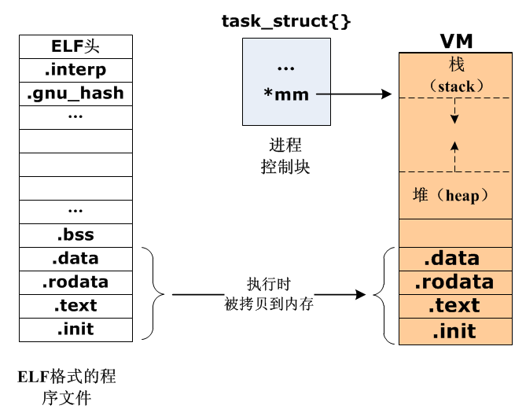
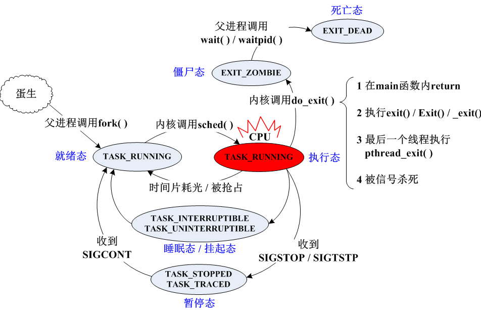

# 进程基本API

[toc]

## 进程与程序

### **1. 基本概念**

- 程序：编译后产生的，格式为ELF的，存储于硬盘的文件
- 进程：程序中的代码和数据，被加载到内存中运行的过程
- 程序是静态的概念，进程是动态的概念



<center>
    ELF格式程序与进程
</center>

在Linux中，程序文件的格式都是ELF，这些文件在被执行的瞬间，就被载入内存，所谓的载入内存，如上图所示，就是将数据段、代码段这些运行时必要的资源拷贝到内存，另外系统会再分配相应的栈、堆等内存空间给这个进程，使之成为一个动态的实体。

### **2. 进程的组织方式**

在Linux系统中，除了系统的初始进程之外，其余所有进程都是通过从一个父进程（parent）复刻（fork）而来的，有点像人类社会，每个个体都是由亲代父母繁衍而来。

因此，在整个Linux系统中，所有的进程都起源于相同的初始进程，它们之间形成一棵倒置的进程树，就像家族族谱，可以使用命令pstree查看这些进程的关系：

```shell
gec@ubuntu:~$ 
gec@ubuntu:~$ pstree
systemd─┬─ModemManager───2*[{ModemManager}]
        ├─VGAuthService
        ├─accounts-daemon───2*[{accounts-daemon}]
        ├─acpid
        ├─avahi-daemon───avahi-daemon
        ├─bluetoothd
        ├─boltd───2*[{boltd}]
        ├─colord───2*[{colord}]
        ├─cron
        ├─cups-browsed───2*[{cups-browsed}]
        ├─cupsd
        ├─2*[dbus-daemon]
        ├─fcitx
        ├─fcitx-dbus-watc
        ├─firefox─┬─Privileged Cont───18*[{Privileged Cont}]
        │         ├─Web Content───15*[{Web Content}]
        │         ├─Web Content───14*[{Web Content}]
        │         ├─WebExtensions───16*[{WebExtensions}]
        │         └─58*[{firefox}]
        ├─fwupd───4*[{fwupd}]
        ├─gdm3─┬─gdm-session-wor─┬─gdm-x-session─┬─Xorg───{Xorg}
        │      │                 │               ├─gnome-session-b
        │      │                 │               └─2*[{gdm-x-session}]
        │      │                 └─2*[{gdm-session-wor}]
        │      └─2*[{gdm3}]
        ├─gnome-keyring-d───3*[{gnome-keyring-d}]
        ├─gsd-printer───2*[{gsd-printer}]
        ├─ibus-x11───2*[{ibus-x11}]
        ├─irqbalance───{irqbalance}
        ├─2*[kerneloops]
        ├─mosquitto
        ├─networkd-dispat───{networkd-dispat}
        ├─packagekitd───2*[{packagekitd}]
        ├─polkitd───2*[{polkitd}]
        ├─pulseaudio───2*[{pulseaudio}]
        ├─python3───2*[{python3}]
        ├─rsyslogd───3*[{rsyslogd}]
        ├─rtkit-daemon───2*[{rtkit-daemon}]
        ├─snapd───14*[{snapd}]
        ├─sogoupinyinServ───4*[{sogoupinyinServ}]
        ├─sogoupinyinServ───8*[{sogoupinyinServ}]
        ├─sshd
        ├─systemd─┬─(sd-pam)
        │         ├─at-spi-bus-laun─┬─dbus-daemon
        │         │                 └─3*[{at-spi-bus-laun}]
        │         ├─at-spi2-registr───2*[{at-spi2-registr}]
        │         ├─dbus-daemon
        │         ├─dconf-service───2*[{dconf-service}]
        │         ├─evolution-addre─┬─evolution-addre───5*[{evolution-addre}]
        │         │                 └─4*[{evolution-addre}]
        │         ├─evolution-calen─┬─evolution-calen───8*[{evolution-calen}]
        │         │                 └─4*[{evolution-calen}]
        │         ├─evolution-sourc───3*[{evolution-sourc}]
        │         ├─gnome-shell-cal───5*[{gnome-shell-cal}]
        │         ├─gnome-terminal-─┬─bash───pstree
        │         │                 └─3*[{gnome-terminal-}]
        │         ├─goa-daemon───3*[{goa-daemon}]
        │         ├─goa-identity-se───3*[{goa-identity-se}]
        │         ├─gvfs-afc-volume───3*[{gvfs-afc-volume}]
        │         ├─gvfs-goa-volume───2*[{gvfs-goa-volume}]
        │         ├─gvfs-gphoto2-vo───2*[{gvfs-gphoto2-vo}]
        │         ├─gvfs-mtp-volume───2*[{gvfs-mtp-volume}]
        │         ├─gvfs-udisks2-vo───2*[{gvfs-udisks2-vo}]
        │         ├─gvfsd─┬─gvfsd-http───2*[{gvfsd-http}]
        │         │       ├─gvfsd-trash───2*[{gvfsd-trash}]
        │         │       └─2*[{gvfsd}]
        │         ├─gvfsd-fuse───5*[{gvfsd-fuse}]
        │         └─ibus-portal───2*[{ibus-portal}]
        ├─systemd-journal
        ├─systemd-logind
        ├─systemd-resolve
        ├─systemd-timesyn───{systemd-timesyn}
        ├─systemd-udevd
        ├─udisksd───4*[{udisksd}]
        ├─upowerd───2*[{upowerd}]
        ├─vmhgfs-fuse───3*[{vmhgfs-fuse}]
        ├─vmtoolsd
        ├─vmtoolsd───{vmtoolsd}
        ├─vmware-vmblock-───2*[{vmware-vmblock-}]
        ├─whoopsie───2*[{whoopsie}]
        └─wpa_supplicant
```


可以看到，最开始的系统进程叫systemd，这个进程的诞生比较特别，其身份信息在系统启动前就已经存在于系统分区之中，在系统启动时直接复制到内存。而其余的进程，从上述pstree命令的执行效果可见，都是系统初始进程的直接或间接的后代进程。

### **3. 进程的复刻（fork）**

- 除了系统的初始化进程之外，其他的所有进程都是通过 fork() 复刻而来的。这个所谓的复刻的过程，可以类比细胞分裂：


- 一个进程复刻一个子进程的时候，会将自身几乎所有的资源复制一份，具体如下：
    - 父子进程的以下属性在创建之初完全一样：
        A) 实际UID和GID，以及有效UID和GID。
        B) 所有环境变量。(environment variable)
        C) 进程组ID和会话ID。session ID
        D) 当前工作路径。
        E) 打开的文件。
        F) 信号响应函数。
        G) 整个内存空间，包括栈、堆、数据段、代码段、标准IO的缓冲区等等。
    - 而以下属性，父子进程是不一样的：
        A) 进程号PID。PID是身份证号码，哪怕亲如父子，也要区分开。
        B) 记录锁。父进程对某文件加了把锁，子进程不会继承这把锁。
        C) 挂起的信号。这是所谓“悬而未决”的信号，等待着进程的响应，子进程不会继承这些信号。

### **3. 进程的状态**

进程是动态的活动的实体，因此会有很多种运行状态：一会儿睡眠、一会儿暂停、一会儿又继续执行。下图给出Linux进程从被创建（生）到被回收（死）的全部状态，以及这些状态发生转换时的条件：



- 解析：
    - 所有进程（除了系统初始进程systemd之外），都有一个父进程。
    - 父进程通过调用fork()函数，将自身复制一份形成一个子进程。
    - 新创建的子进程拥有与父进程一样的执行代码、内存空间（父子进程的内存空间的内容是一致的，但分属不同的区域各自独立）等信息，并处于就绪态（TASK_RUNNING）。
    - 当进程退出时（不管是主动退出还是被动退出），进入僵尸态（EXIT_ZOMBIE），僵尸态下的进程无法运行，也无法被调度，但其所占据的系统资源未被释放。僵尸态是进程的必经状态，编程过程中不能避免僵尸态，但要避免进程长时间处于僵尸态。
    - 僵尸态进程要等待其父进程对其资源进程回收后，才能变成死亡态（EXIT_DEAD），死亡态的进程所有占据的系统资源可以被系统随时回收。


## 进程基本API

### **1. 进程的创建**

```c
#include <sys/types.h>
#include <unistd.h>

pid_t fork(void);
```


- 主要功能：
    - 将当前的进程复制一份，然后这两个进程同时从本函数的下一语句开始执行。
- 接口解析：
    - 所有的代码、变量都会复制成两份。
    - 该函数会返回两次，一次返回父进程，值是子进程的PID，一次返回子进程，值固定为0。
    - 父子进程是并发执行的，没有先后次序，若要控制次序，要依赖于信号量、互斥锁、条件量等其他条件。
- 示例代码：

```c
1	#include <stdio.h> 
2	#include <unistd.h> 
3	
4	int main()
5	{
6	    printf("[]fork之前\n");
7	
8	    pid_t pid = fork();
9	    // 以上函数执行成功后
10	    // 父子进程都将从下面的语句开始执行，不分先后
11	
12	    // 以下语句会被执行两遍
13	    // 在父进程中，pid将是子进程的PID
14	    // 在子进程中，pid将是0
	    printf("[%d]: pid=%d\n", getpid(), pid);
}
```


以上程序执行结果是：

```shell
gec@ubuntu:$ ./a.out
[5140]: fork之前
[5140]: pid=5141
gec@ubuntu:$ [5141]: pid=0
```


对以上程序的输出结果，有几点需要做出说明：

- 在执行fork()函数之前，第6行代码只执行一遍，并且是父进程[5140]在执行它。
- 在执行fork()函数之后，进程确实分裂成两个，因此第15行代码被执行了两遍。
- 函数 getpid() 的功能是获取自身进程的PID，在程序第15行，父进程和子进程分别输出了自己的PID，一个是5140，一个是5141。
- 在5140那边，输出的pid是5141，于是我们得知5140必然是父进程，因为只有父进程才能获取一个大于零的子进程的PID。
- 在5141那边，输出的pid是0，于是我们得知5141必然是子进程，因为只有子进程才会从fork()的返回值中获取一个0。
- 在父进程5140输出后，bash立即输出了命令行提示符"gec@ubuntu:$"，把子进程的输出信息挤到了后面，这是因为在bash中只要判断其子进程5140退出了，它就立即输出命令行提示符，而不管它是否还有孙子进程还在运行。从中我们也知道，bash是本程序中父进程的父进程，这三个进程的关系实际上是祖孙关系：

```shell
bash-┬ (终端shell进程)
     │    
    a.out-┬ (程序中的父进程，是bash的子进程)
          │ 
        a.out (程序中的子进程，是bash的孙子进程)
```


- 在上述层级关系中，中间的那个a.out一旦退出，bash就认为它所创建的进程结束了，此时不管有没有孙子进程，bash都立即输出 “gec@ubuntu:$” 的信息，这就是为什么进程[5141]的输出信息被挤到后面的原因。


### **2. 进程的回收**

```c
#include <sys/types.h>
#include <sys/wait.h>

pid_t wait(int *wstatus);
```


- 主要功能：
    - 阻塞当前进程。
    - 等待其子进程退出并回收其系统资源；
- 接口解析：
    - 如果当前进程没有子进程，则该函数立即返回。
    - 如果当前进程有不止1个子进程，则该函数会回收第一个变成僵尸态的子进程的系统资源。
    - 子进程的退出状态（包括退出值、终止信号等）将被放入wstatus所指示的内存中，若wstatus指针为NULL，则代表当前进程放弃其子进程的退出状态。
- 示例代码：

```
#include <stdio.h> 
#include <stdlib.h> 
#include <unistd.h> 
#include <sys/wait.h> 

int main()
{
    if(fork() == 0)
    {
        printf("[%d]: 我将在3秒后正常退出，退出值是88\n", getpid());

        for(int i=3; i>=0; i--)
        {
            fprintf(stderr, " ======= %d =======%c", i, i==0?'\n':'\r');
            sleep(1);
        }

        exit(88);
    }

    else
    {
        printf("[%d]: 我正在试图回收子进程的资源...\n", getpid());

        int status;
        wait(&status);

        if(WIFEXITED(status))
        {
            printf("[%d]: 子进程正常退出了，其退出值是：%d\n", getpid(), WEXITSTATUS(status));
        }
    }
}
```


执行结果是：

```
gec@ubuntu:$ ./a.out
[3611]: 我正在试图回收子进程的资源...
[3612]: 我将在3秒后正常退出，退出值是88
 ======= 0 =======
[3611]: 子进程正常退出了，其退出值是：88
gec@ubuntu:$ 
```


上述代码中，status 用来存放子进程的退出状态，注意status包含了子进程退出的诸多信息，而不仅仅是退出值，因此父进程如果要获取这些信息，需要用以下宏对status进程解析：

|         宏          | 功能                         |
| :-----------------: | ---------------------------- |
|  WIFEXITED(status)  | 判断子进程是否正常退出       |
| WEXITSTATUS(status) | 获取正常退出的子进程的退出值 |
| WIFSIGNALED(status) | 判断子进程是否被信号杀死     |
|  WTERMSIG(status)   | 获取杀死子进程的信号的值     |

回收僵尸子进程资源除了可以使用上述接口之外，以下函数接口也经常被用到：

```
#include <sys/types.h>
#include <sys/wait.h>

pid_t waitpid(pid_t pid, int *wstatus, int options);
```


- 与wait()的区别：
    - 可以通过参数 pid 用来指定想要回收的子进程。
    - 可以通过 options 来指定非阻塞等待。

pid 和 options 这两个参数的取值和作用详见下表：

| pid  | 作用                                            |  options   | 作用                                      |
| :--: | ----------------------------------------------- | :--------: | ----------------------------------------- |
| <-1  | 等待组ID等于pid绝对值的进程组中的任意一个子进程 |     0      | 阻塞等待子进程的退出                      |
|  -1  | 等待任意一个子进程                              |  WNOHANG   | 若没有僵尸子进程，则函数立即返回          |
|  0   | 等待本进程所在的进程组中的任意一个子进程        | WUNTRACED  | 当子进程暂停时函数返回                    |
|  >0  | 等待指定pid的子进程                             | WCONTINUED | 当子进程收到信号SIGCONT继续运行时函数返回 |


**注意：**
options的取值，可以是0，也可以是上表中各个不同的宏的位或运算取值。

### **3. 加载并执行指定程序**

```
#include <unistd.h>

extern char **environ;

int execl(const char *path, const char *arg, ...);
int execlp(const char *file, const char *arg, ...);
int execle(const char *path, const char *arg, ...);

int execv(const char *path, char *const argv[]);
int execvp(const char *file, char *const argv[]);
int execvpe(const char *file, char *const argv[], char *const envp[]);
```


- 主要功能：
    - 给进程加载指定的程序，如果成功，进程的整个内存空间都被覆盖。
- 接口解析：
    - 执行指定程序之后，会自动获取原来的进程的环境变量。
    - 各个后缀字母的含义：
        - l : list 以列表的方式来组织指定程序的参数
        - v: vector 矢量、数组，以数组的方式来组织指定程序的参数
        - e: environment 环境变量，执行指定程序前顺便设置环境变量
        - p: 专指PATH环境变量，这意味着执行程序时可自动搜索环境变量PATH的路径
    - 这组函数只是改变了进程的内存空间里面的代码和数据，但并未改变本进程的其他属性。

**注意：**

以 `execl(const char *path, const char *arg, ...)` 为例，参数path是需要加载的指定程序，而arg则是该程序运行是的命令行参数，值得注意的是，命令行参数包括程序名本身，并且全部是字符串。例如

```
gec@ubuntu:$ ./a.out 123 abc
```


上述命令用execl来指定则是：

```
execl("./a.out", "./a.out", "123", "abc", NULL);
```


这其中：

1. 第一个./a.out是程序本身，第二个./a.out是第一个参数。
2. 参数列表以NULL结尾。

- 示例代码：

```
// child.c

#include <stdio.h> 
#include <stdlib.h> 
#include <unistd.h> 
#include <sys/wait.h> 

int main(int argc, char **argv)
{
    // 倒数 n 秒
    for(int i=atoi(argv[1]); i>0; i--)
    {
        printf("%d\n", i);
        sleep(1);
    }

    // 程序退出，返回 n
    exit(atoi(argv[1]));
}
```


```
// main.c

#include <stdio.h> 
#include <unistd.h> 
#include <sys/wait.h> 

int main()
{
    // 子进程
    if(fork() == 0)
    {
        printf("加载新程序之前的代码\n");

        // 加载新程序，并传递参数3
        execl("./child", "./child", "3", NULL);

        printf("加载新程序之后的代码\n");
    }

    // 父进程
    else
    {
        // 等待子进程的退出
        int status;
        int ret = waitpid(-1, &status, 0);

        if(ret > 0)
        {
            if(WIFEXITED(status))
                printf("[%d]: 子进程[%d]的退出值是:%d\n",
                        getpid(), ret, WEXITSTATUS(status));
        }
        else
        {
            printf("暂无僵尸子进程\n");
        }
    }
}
```


程序运行结果：

```
gec@ubuntu:$ gcc child.c -o child
gec@ubuntu:$ gcc main.c -o main
gec@ubuntu:$ ./main
加载新程序之前的代码
3
2
1
[5634]: 子进程[5635]的退出值是:3
gec@ubuntu:$ 
```


- 程序解析
    - 子进程中加载新程序之后的代码无法运行，因为已经被覆盖了。
    - waitpid()中指定了options的值为0，意味着阻塞等待子进程，效果跟直接调用wait()相当。


