## 基本概念

### **文件的概念**

在Linux系统语境下，文件（file）一般有两个基本含义：

- 狭义：指普通的文本文件，或二进制文件。包括日常所见的源代码、word文档、压缩包、图片、视频文件等等。

- 广义：除了狭义上的文件外，几乎所有可操作的设备或接口都可视为文件。包括键盘、鼠标、硬盘、串口、触摸屏、显示器等，也包括网络通讯端口、进程间通讯管道等抽象概念。


### **Linux系统中文件的分类**

在Linux中，文件总共被分成了7种，他们分别是：

1. 普通文件：存在于外部存储器中，用于存储普通数据。
2. 目录文件：用于存放目录项，是文件系统管理的重要文件类型。
3. 管道文件：一种用于进程间通信的特殊文件，也称为命名管道FIFO。
4. 套接字文件：一种用于网络间通信的特殊文件。
5. 链接文件：用于间接访问另外一个目标文件，相当于Windows快捷方式。
6. 字符设备文件：字符设备在应用层的访问接口。
7. 块设备文件：块设备在应用层的访问接口。


```shell
gec@ubuntu:~$ ls -l
-rw-r--r-- 1 gec gec  345  Sep  12:38 a.zip
drwxr-xr-x 2 gec gec 1024  Sep  12:38 dir/
prw-r--r-- 1 gec gec    0  Sep  12:38 pipe 
srw-r--r-- 1 gec gec    0  Sep  12:38 socket
lrw-r--r-- 1 gec gec    4  Sep  12:38 link -> a.zip
crw-r--r-- 1 gec gec 1, 3  Sep  12:38 character
brw-r--r-- 1 gec gec 5, 1  Sep  12:38 block
```

注意到，每个文件信息的最左边一栏，是各种文件类型的缩写，从上到下依次是：

- -（regular）普通文件
- d（directory）目录文件
- p（pipe）管道文件（命名管道）
- s（socket）套接字文件（Unix域/本地域套接字）
- l（link）链接文件（软链接）
- c（character）字符设备文件
- b（block）块设备文件


### **系统IO与标准IO**

对文件的操作，基本上就是输入输出，因此也一般称为IO接口。在操作系统的层面上，这一组专门针对文件的IO接口就被称为系统IO；在标准库的层面上，这一组专门针对文件的IO接口就被称为标准IO，如下图所示

<div align="center">
    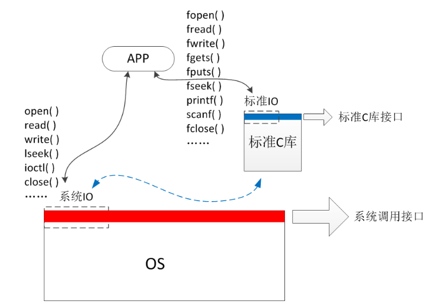
</div>


- 系统IO：是众多系统调用当中专用于文件操作的一部分接口。
- 标准IO：是众多标准函数当中专用于文件操作的一部分接口。

从图中还能看到，标准IO实际上是对系统IO的封装，系统IO是更接近底层的接口。如果把系统IO比喻为菜市场，提供各式肉蛋菜果蔬，那么标准IO就是对这些基本原来的进一步封装，是品类和功能更加丰富的各类酒庄饭店。


### <span style="color:red;">如何选择系统IO与标准IO</span>

- 系统IO
    - 由操作系统直接提供的函数接口，特点是简洁，功能单一
    - 没有提供缓冲区，因此对海量数据的操作效率较低
    - 套接字Socket、设备文件的访问只能使用系统IO
- 标准IO
    - 由标准C库提供的函数接口，特点是功能丰富
    - 有提供缓冲区，因此对海量数据的操作效率高
    - 编程开发中尽量选择标准IO，但许多场合只能用系统IO

总的来讲，这两组函数接口在实际编程开发中都经常会用到，都是基本开发技能。

系统IO在第二本手册，标准IO在第三本手册


## 系统IO基本API

文件描述符（File Descriptor）：是用户进程视角的非负整数索引，本质是进程内指向「文件描述符表」的指针，通过它间接访问内核中的文件资源，避免用户态直接操作内核数据结构。

文件描述符表（是数组），内部都是指针指向对应的打开文件表项（元素），文件描述符就是数组对应的下标。（一般情况下文件描述符时1023）

打开文件表：在表中的每个元素都是一个结构体：记录文件的当前状态（偏移量、打开标志）以及指向inode的指针，注意一个文件可对应

### **1. 文件的打开与关闭**

- 打开文件：

<div align="center">
    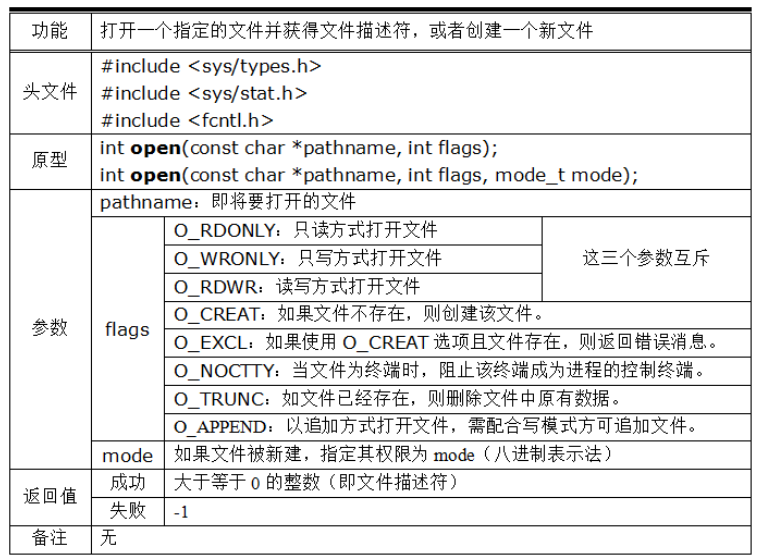
</div>

- 关键点：

    - open函数有两个版本，一个有两个参数，一个有三个参数。
    - 当打开一个已存在的文件时，指定两个参数即可。
    - 当创建一个新文件时，需要用第三个参数指定新文件的权限，否则新文件的权限是随机值。
    - 模式flags，可以使用位或的方式，来同时指定多个模式。
    - 模式flags中，O_NOCTTY主要用在后台精灵进程，阻止这些精灵进程拥有控制终端。

    

当设置O_CREAT 这个flag时，open就要设置第三个参数八进制mode，表示文件权限

权限会受限于umask，默认的umask值：0002，临时修改umask值 `umask 0000`

文件的实际权限 = 原始权限 & (~umask)

​							=	原始权限	^ umask(用户文件的创建文件掩码)


```c
int main(void)
{
    int fd;

    // 以下三种打开方式，都要求文件已存在，否则失败返回
    fd = open("a.txt", O_RDWR);   // 以可读可写方式打开
    fd = open("a.txt", O_RDONLY); // 以只读方式打开
    fd = open("a.txt", O_WRONLY); // 以只写方式打开

    // 1. 如果文件不存在，则创建该文件，并设置其权限为0644
    // 2. 如果文件已存在，则失败返回
    fd = open("a.txt", O_RDWR|O_CREAT|O_EXCL, 0644);   // 以可读可写方式打开
    fd = open("a.txt", O_RDONLY|O_CREAT|O_EXCL, 0644); // 以只读方式打开
    fd = open("a.txt", O_WRONLY|O_CREAT|O_EXCL, 0644); // 以只写方式打开

    // 1. 如果文件不存在，则创建该文件，并设置其权限为0644
    // 2. 如果文件已存在，则清空该文件的原有内容
    fd = open("a.txt", O_RDWR|O_CREAT|O_TRUNC, 0644);   // 以可读可写方式打开
    fd = open("a.txt", O_RDONLY|O_CREAT|O_TRUNC, 0644); // 以只读方式打开
    fd = open("a.txt", O_WRONLY|O_CREAT|O_TRUNC, 0644); // 以只写方式打开

    // 以下三种打开方式，都要求文件已存在，否则失败返回
    fd = open("a.txt", O_RDWR|O_APPEND, 0644);   // 以可读可写方式追加文件内容
    fd = open("a.txt", O_WRONLY|O_APPEND, 0644); // 以只写方式追加文件内容
}
```


- 关闭文件：

<div align="center">
    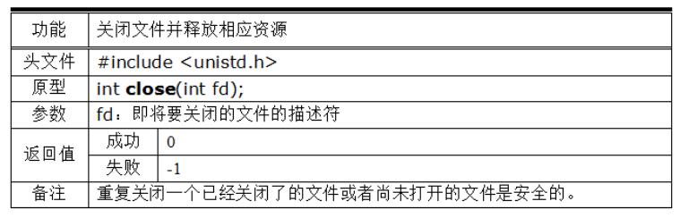
</div>


- 关键点
    - 当不再使用一个文件时，应当关闭该文件，防止系统资源浪费。
    - 对同一文件重复执行关闭操作会失败返回，不会有其他副作用。


### **2. 标准库函数的错误处理**

在所有的库函数中，如果调用过程出错了，那么该函数除了会返回一个特定的数据来告诉用户调用失效之外，还都会去修改一个大家共同的全局错误码errno，我们可以通过这个错误码，来进一步确认究竟是什么错误。


```c
#include <stdio.h>
#include <fcntl.h>
#include <sys/stat.h>
#include <sys/types.h>

#include <errno.h> // 全局错误码声明所在的头文件

int main()
{
    int fd = open("a.txt", O_RDWR);
    if(fd == -1)
    {
        // 以下两条语句效果完全一致：输出函数出错的原因
        perror("打开a.txt失败");
        printf("打开a.txt失败:%s\n", strerror(errno));
    }
    return 0;
}
```

- 关键点：
    - 如果库函数、系统调用出错了，全局错误码 errno 会随之改变
    - 如果库函数、系统调用没出错，全局错误码 errno 不会改变
    - 一个库函数、系统调用出错后，若未及时处理错误码，则错误码可能会被随后的其他函数修改

提取错误码信息的两种办法：

```c
// 1. 使用perror()，直接输出用户信息和错误信息：
if(open("a.txt", O_RDWR) == -1)
{
    perror("打开a.txt失败");
}

// 2. 使用strerror()，返回错误信息交给用户自行处理：
if(open("a.txt", O_RDWR) == -1)
{
    printf("打开a.txt失败:%s\n", strerror(errno));
}
```


以上代码输出的结果是完全一样的：

```c
gec@ubuntu:~$ ./a.out
打开a.txt失败: No such file or directory
打开a.txt失败: No such file or directory
```


一般而言，perror()用起来更加方便，但有时候需要使用strerror()来输出一些更加灵活的信息，比如以上代码，如果打开文件的名字不是固定a.txt，而是取决于外部参数，那么就应该写错：

```c
if(open("a.txt", O_RDWR) == -1)
{
    printf("打开%s失败:%s\n", argv[1], strerror(errno));
}
```


以上代码输出的结果是：

```bash
gec@ubuntu:~$ ./a.out a.txt
打开a.txt失败: No such file or directory
gec@ubuntu:~$ 
gec@ubuntu:~$ ./a.out ELF-V4.tar.gz
打开ELF-V4.tar.gz失败: No such file or directory
```


### **标准输入/输出/出错**

访问文件时，发现fd从3开始分配，说明0/1/2已经被占用，究竟是谁使用了呢？其实在程序执行的时候，就会默认打开3个文件，分别是"标准输入"、"标准输出"、"标准出错"，他们其实是一个宏定义来的，是被定义在一个头文件中，头文件路径：/usr/include/unistd.h

```c
/* Standard file descriptors.  */ 
#define    STDIN_FILENO    0    //标准输入设备文件    -> 对象：键盘设备文件 
#define    STDOUT_FILENO    1    //标准输出设备文件    -> 对象：屏幕终端文件
#define    STDERR_FILENO    2    //标准出错设备文件    -> 对象：屏幕终端文件
```


可以理解：  程序刚开始执行的时候，0=open("标准输入");


### **3. 文件描述符本质**

函数 open() 的返回值，是一个整型 int 数据。这个整型数据，实际上是内核中的一个称为 fd_array 的数组的下标：

<div align="center">
    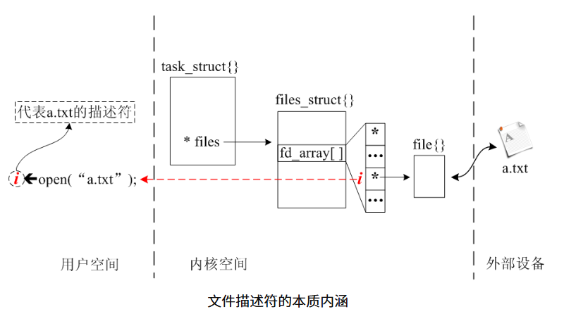
</div>


打开文件时，内核产生一个指向 file{} 的指针，并将该指针放入一个位于 file_struct{} 中的数组 fd_array[] 中，而该指针所在数组的下标，就被 open() 返回给用户，用户把这个数组下标称为文件描述符，如上图所示。


结论：

- 文件描述符从0开始，每打开一个文件，就产生一个新的文件描述符。
- 可以重复打开同一个文件，每次打开文件都会使内核产生系列结构体，并得到不同的文件描述符
- 由于系统在每个进程开始运行时，都默认打开了一次键盘、两次屏幕，因此0、1、2描述符分别代表标准输入、标准输出和标准出错三个文件（两个硬件）。


<div align="center">
    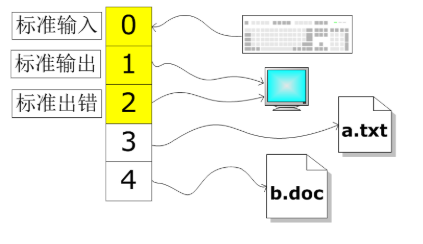
</div>

<p align="center">默认打开的输入输出文件</p>


<span style="color:red;">fd</span>:

查看某个进程的所有 fd（比如自己的 shell 进程）

每个进程的 fd 都存在 `/proc/[PID]/fd` 目录下（虚拟文件系统，实时反映进程 fd 状态）：

```bash
# 查看当前 shell 进程的 PID
echo $$  # 输出比如 4567

# 查看该进程打开的所有 fd
ls -l /proc/$$/fd
```

- fd 是进程级的，使用后必须关闭，避免泄漏。


#### 面试题

//O_NONBLOCK（返回-1） or O_NDELAY（返回0）：不阻塞的打开文件，读写操作的时候不会卡住(普通文件如果是空的，读取数据，不会阻塞。但是设备文件如果没有数据，读取数据，就会阻塞)

- 推荐使用O_NONBLOCK

```c
char buf[1024]={0};
read(STDIN_FILENO,buf,sizeof(buf)-1); //如果没有输入数据，就会阻塞，直到有数据可读
```

注意：文件的权限在共享文件夹目录下是无法验证，就算mode是 0666  ，创建出来的文件还是0777，因为跟权限掩码有关系。可以在家目录下验证，最终文件权限：mode & (~umask)


### **4. 文件的读写操作**

<div align="center">
    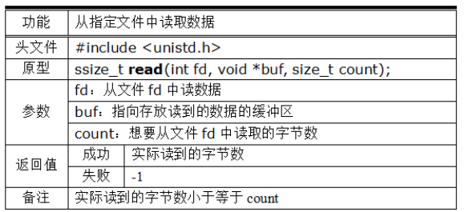
</div>

<div align="center">
    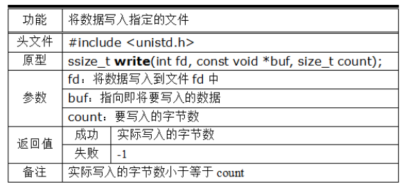
</div>


- 关键点：
    - 参数count是读写字节数的愿望值，实际读写成功的字节数由返回值决定。
    - 读取普通文件时，如果当读到了文件尾，read()会返回0。
    - 读取管道文件时，如果管道中没有数据，read()默认会阻塞。
- 读取文件内容：

```c
// 1. 将文件 a.txt 中的内容读出来，并显示到屏幕上
int fd = open("a.txt", O_RDWR);

char buf[100];
int n;
while(1)
{
    bzero(buf, 100);
    n = read(fd, buf, 100); // 每次最多读取100个字节

    if(n == 0) // 读完退出
        break;

    printf("%s", buf);
}
close(fd);
```


- 写入文件内容：

```c
// 2. 将键盘输入的内容，写入文件 a.txt
int fd = open("a.txt", O_RDWR);

char buf[100];
bzero(buf, 100);

// 从键盘输入数据
fgets(buf, 100, stdin);

// 将输入的数据写入文件
write(fd, buf, strlen(buf));
close(fd);
```


- open的flags参数O_APPEND，在第一次执行 write方法时，会将偏移量移至末尾
- 文本换行符是 \r\n ,占两个字节

- 有多少字节的数据，count就写多少，如果count比真实数据大，那么文本的后面可能有乱码。（文本不够，乱码来凑）


### **5. 文件偏移量**

当我们对文件进行读写操作时，系统会为我们记录操作的位置，以便于下次继续进行读写操作的时候，从适当的地方开始。

有几点需要注意：

- 每当open一个文件，系统就会维护一套包括文件操作位置在内的相关信息。
- 对同一个文件描述符进行读写操作时，使用的同一套文件信息，影响的是同一个位置参数。
- 对同一个文件的多个不同的文件描述符进行读写操作时，使用的是不同的文件信息，影响的是不同的位置参数，彼此互相之间独立，这往往会导致文件信息的错乱。

示例代码1：读写作用于同一个文件位置

```c
#include <stdio.h>
#include <unistd.h>
#include <sys/stat.h>
#include <sys/types.h>
#include <fcntl.h>
#include <strings.h>

int main(int argc, char **argv) // ./main a.txt
{
    int fd = open(argv[1], O_RDWR);
    char buf[100];

    // 读出1个字节，读完后读写操作位置是第2个字节
    bzero(buf, 100);
    read(fd, buf, 1);
    printf("%s\n", buf);

    // 写入2个字节，写完后读写操作位置是第4个字节
    bzero(buf, 100);
    write(fd, "xx", 2);

    // 读出3个字节，读完后读写操作位置是第7个字节
    bzero(buf, 100);
    read(fd, buf, 3);
    printf("%s\n", buf);

    return 0;
}
```


示例代码2：多次打开得到不同的文件描述符，各自读写操作位置独立

```c
#include <stdio.h>
#include <unistd.h>
#include <sys/stat.h>
#include <sys/types.h>
#include <fcntl.h>
#include <strings.h>

int main(int argc, char **argv) // ./main a.txt
{
    // 假设文件中的原始内容是：abcdefghijk
    int fd1 = open(argv[1], O_RDWR);
    int fd2 = open(argv[1], O_RDWR);
    char buf[100];

    // 读出1个字节，读完后读写操作位置是第2个字节
    // 此时影响的是fd1，对fd2没有影响
    bzero(buf, 100);
    read(fd1, buf, 1);
    printf("%s\n", buf); // 输出a

    // 写入2个字节，读完后读写操作位置是第3个字节
    // 与上述读操作没有关系
    bzero(buf, 100);
    write(fd2, "xy", 2); // ab被覆盖，原文件变成xycdefghijk

    // 读出3个字节，读完后读写操作位置是第5个字节
    // 此时影响的是fd1，对fd2没有影响
    bzero(buf, 100);
    read(fd1, buf, 3);
    printf("%s\n", buf); // 输出ycd

    return 0;
}
```


### **6. 文件的读写位置**

对文件进行常规的读写操作的时候，系统会自动调整读写位置，以便于让我们顺利地顺序读写文件，但如果有需要，文件的读写位置是可以任意调整的，调整函数接口如下：

<div align="center">
    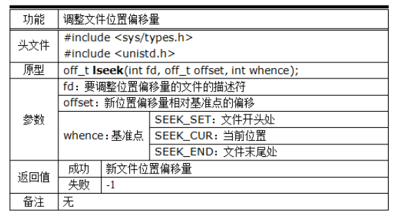
</div>

- 关键点：
    1. lseek函数可以将文件位置调整到任意的位置，可以是已有数据的地方，也可以是未有数据的地方，假设调整到文件末尾之后的某个地方，那么文件将会形成所谓“空洞”。
    2. lseek函数只能对普通文件调整文件位置，不能对管道文件调整。
    3. lseek函数的返回值是调整后的文件位置距离文件开头的偏移量，单位是字节。

示例代码：

```c
int main(void)
{
    // 假设文件 a.txt 只有一行
    // 内容如下：
    //
    // 1234567890abcde 
    //

    int fd = open("a.txt", O_RDWR);

    // 读取前面10个阿拉伯数字:
    char buf[10];
    read(fd, buf, 10);

    // 将文件位置调整到'c'
    lseek(fd, 2, SEEK_CUR);

    // 将文件位置调整到'1'
    lseek(fd, 0, SEEK_SET);

    // 将文件位置调整到'a'
    lseek(fd, -5, SEEK_END);
}
```


-  利用lseek返回值读取文件的大小

```c
int pdf = open("", O_RDONLY);
ssize_t size = leesk(fd, SEEK_END);
```


## 系统IO常用API

### **1. 概述**

对文件的操作，除了最基本的打开、关闭、读、写、定位之外，还有很多特殊的情况，比如用于沟通应用层与底层驱动之间的ioctl、万能工具箱fcntl、内存映射mmap等等，熟练使用这些API，是日常开发的必备技能。


### **2. ioctl()**

该函数是沟通应用层和驱动层的有力武器，底层开发人员在为硬件设备编写驱动的时候，常常将某些操作封装为一个函数，并为这些接口提供一个所谓的命令字，应用层开发者可以通过 ioctl() 函数配合命令字，非常迅捷地绕过操作系统中间层层机构直达驱动层，调用对应的功能。

从这个意义上讲，函数 ioctl() 像是一个通道，只提供函数调用路径，具体的功能由所谓命令字决定，下面是函数的接口规范说明：

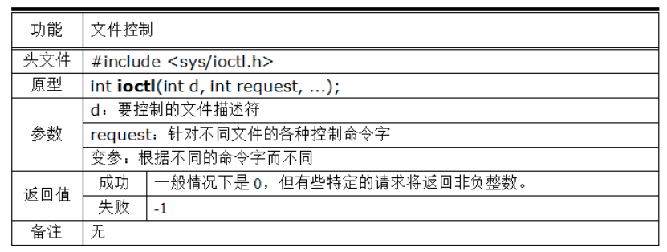

- 关键点：
    - request 就是所谓的命令字。
    - 底层驱动开发者可以自定义命令字。
    - 对于某些常见的硬件设备的常见功能，系统提供了规范的命令字。
- 示例代码：

```c
int main(void)
{
    // 打开一盏LED灯
    int led = open("/dev/Led", O_RDWR);

    // 通过命令字 LEDOP 及其携带的0/1参数，控制LED灯的亮灭
    // 此处，LEDOP 是底层开发者自定义的命令字
    ioctl(led, LEDOP, 1);
    ioctl(led, LEDOP, 0);

    // 打开一个摄像头
    int cam = open("/dev/video0", O_RDWR);

    // 通过命令字 VIDIC_STREAMON 及其携带参数 vtype 启动摄像头
    enum v4l2_buf_type vtype= V4L2_BUF_TYPE_VIDEO_CAPTURE;
    ioctl(cam, VIDIOC_STREAMON, &vtype);
}
```


### **3. dup() 与 dup2()**

- dup 是英语单词 duplicate 的缩写，意即“复制”。
- 这两个函数功能类似，都是用来“复制”[文件描述符](#3. 文件描述符本质)，接口规范如下：

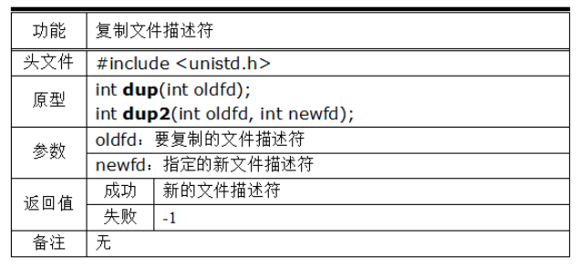

`dup()`会将指定的旧文件描述符 oldfd 复制一份，并返回一个系统当前未用的最小的新文件描述符。注意，此时这新旧两个文件描述符是可以互换的，因为它们本质上指涉的是同一个文件，因此它们共享文件的读写偏移量和文件的状态标签，比如使用lseek()对新文件描述符修改文件偏移量，这个操作会同时影响旧文件描述符oldfd，再如，使用read()对新文件描述符读取文件部分内容后，可以继续对旧文件描述符读取后续内容。

`dup2()`跟`dup()`几乎完全一样，不同的地方在于前者可以指定新文件描述符的具体数值，而不局限于系统当前未用描述符的最小值。这样一来，就可以通过`dup2()`指定一个已用的描述符，来达到重定向文件流的作用。

示例代码：

```c
int main()
{
    // 打开文件 a.txt ，获得其文件描述符 fd1
    // 此处 fd1 就代表了这个文件及其配套的系统资源
    int fd1 = open("a.txt", O_RDWR);

    // 复制文件描述符 fd1，默认得到最小未用的文件描述符
    dup(fd1);

    // 复制文件描述符 fd1，并指派为 100
    dup2(fd1, 100);
}
```


- 解析：
    使用dup函数时，会自动分配当前未用的最小的文件描述符，如上述代码，由于进程默认打开了0、1、2作为标准输入输出，于是 fd1 就是3，新产生的文件描述符就是4，而 dup2 函数可以任意指定文件描述符的数值，如果指定的文件描述符已经有所指代，那么原先指代关系将会被替换。这种情况被称为“重定向”。

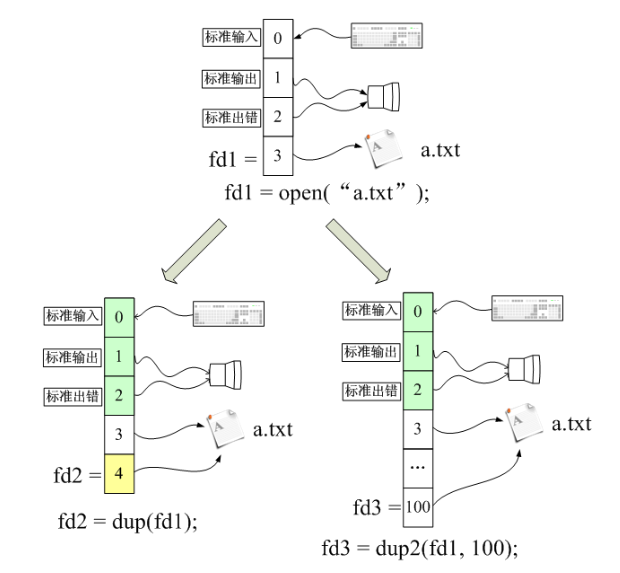

### **4. fcntl()**

该函数的名字是 file control 的缩写，顾名思义，它可以用来“控制”文件，与 ioctl 类似，此处的 “控制” 含义广泛，具体内容由其第二个参数命令字来决定，fcntl 的接口规范如下：

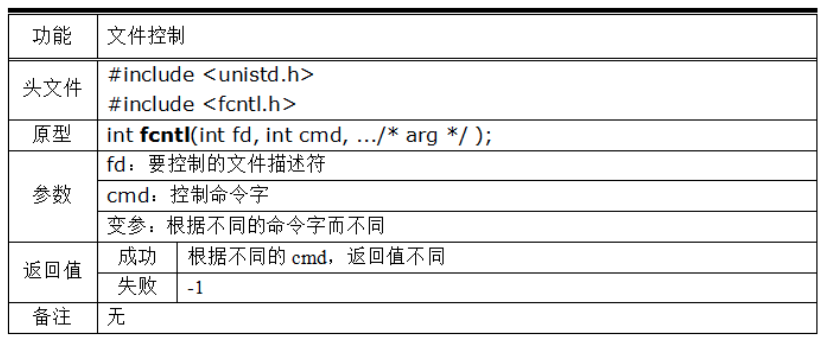

- 关键点：
    - fcntl 是个变参函数，前两个参数是固定的，后续的参数个数和类型取决于 cmd 的具体数值。
    - 第二个参数 cmd，称为命令字。
    - 命令字有很多，常用的如下：

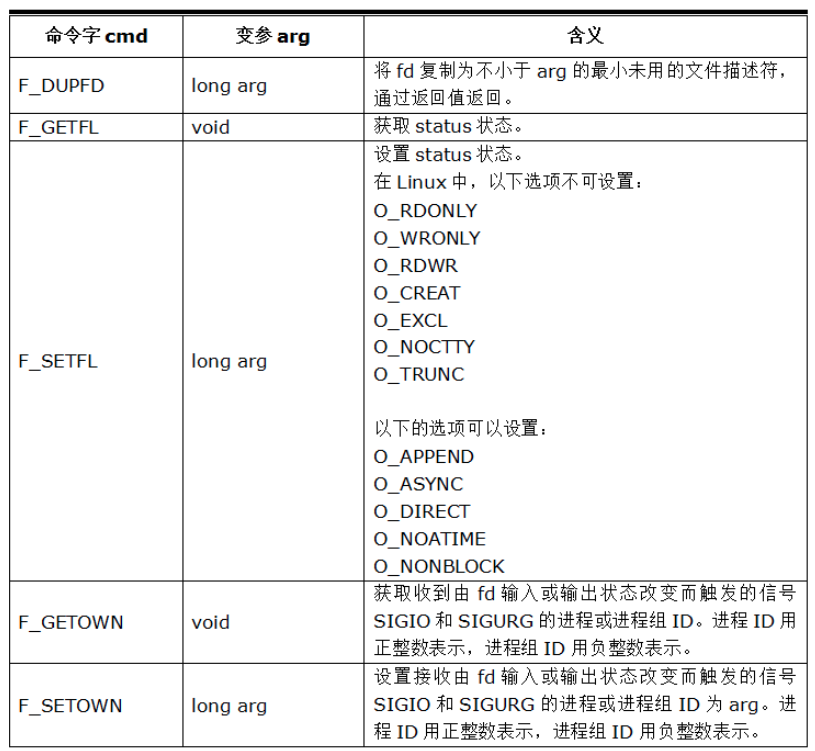

从上表可以看出：

1. F_DUPFD的功能与dup( )/dup2( )类似。
2. 通过F_SETSL/F_GETFL来获取和设置文件status，经常拿来设置文件的阻塞特性。
3. 通过F_SETOWN/F_GETOWN来获取和设置套接字触发的信号的属主，网络编程中常见。

- 示例代码①：

```c
// 获取指定文件fd的标签属性
int flag = fcntl(fd, F_GETFL);

// 在其原有属性上，增添非阻塞属性
flag |= O_NONBLOCK;
fcntl(fd, F_SETFL, flag);
```


- 示例代码②：

```c
// 将套接字sockfd的信号属主设置为本进程
fcntl(sockfd, F_SETOWN, getpid());
```


> 在网络编程中，当一个套接字处于异步通信状态并收到一个远端的数据时，就会使得内核产生一个信号SIGIO，此时我们可以通过上述fcntl()技巧告诉内核这个信号的接收者。一般而言，接收者收到该信号后，就知道套接字上有数据等待处理了。


### **5. mmap()**

该函数全称是 memory map，意为内存映射，即将某个文件与某块内存关联起来，达到通过操作这块内存来间接操作其所对应的文件的效果。


- 关键点：
    - mmap函数的flags参数是有很多的，上表只罗列了最简单的几个，详细信息请使用 man 手册进行查阅。
    - mmap函数理论上可以对任意文件进行内存映射，但通常用来映射一些比较特别的设备文件，比如液晶屏LCD。

**<span style="color:red;">注意</span>：**

在较旧的Linux内核（如2.6内核）中，可以直接使用mmap()来给LCD设备映射内存，但在较新Linux内核（如4.4内核）中，则需要经由DRM统一管理，不可直接mmap映射显存。

示例代码1，映射普通文件：

```
int main()
{
    // 以只读方式打开一个文件
    int fd = open("a.txt", O_RDWR);

    // 申请一块大小为1024字节的映射内存，并将之与文件fd相关联
    char *p = mmap(NULL, 1024, PROT_READ|PROT_WRITE,
                MAP_SHARED, fd, 0);

    // 将该映射内存的内容打印出来（即其相关联文件fd的内容）
    printf("%s\n", p);

    // 通过操作内存，间接修改了文件内容
    p[0] = 'x';
    printf("%s\n", p);
    
    // 解除映射
    munmap(p, 1024);
    return 0;
}
```


注意几点：

1. 使用 mmap 映射内存时，指定的读写权限必须是打开模式的子集。
2. 映射模式为 MAP_SHARED 时，修改的内容会影响文件。
3. 映射模式为 MAP_PRIVATE 时，修改的内容不会影响文件。

示例代码2，映射液晶屏LCD文件（<span style="color:red;">**注意**</span>：只适用于GEC6818及之前开发板）：

```c
int main()
{
    // 打开液晶屏文件
    int lcd = open("/dev/fb0", O_RDWR);

    // 给LCD设备映射一块内存（或称显存）
    char *p = mmap(NULL, 800*480*4, PROT_WRITE,
                   MAP_SHARED, lcd, 0);

    // 通过映射内存，将LCD屏幕的每一个像素点涂成红色
    int red = 0x00FF0000;
    for(int i=0; i<800*480; i++)
        memcpy(p+i*4, &red, 4);

    // 解除映射
    munmap(p, 800*480*4);
    return 0;
}
```


## 常见问题

<span style="color:#008CBA;">【1】问：二进制文件和文本文件有什么区别？</span>
【1】答：

- 首先，任何文件在存储的时候而是以0/1序列存储的，也就是说计算机中的任何数据（包括任何类型的文件），实际存储形式都是二进制的。
- 其次，我们平常说的二进制文件和文本文件，指的不是他们的实际存储形式，而是指这些数据是否是某一种字符编码，比如ASCII码、中文的GB2312编码、UTF编码等等，按此类编码存储的数据，可以被各种编辑器解析并呈现出来。
- 如果某文件的内容不是按照某种字符编码存储，那么编辑器打开的时候就会呈现乱码，因为编译器一定是按照某种字符编码来解释这些数据的。

如下代码可以帮助更好地理解什么叫二进制文件、文本文件：

```c
int main()
{
    int n = 6;

    // 以二进制方式写入文件
    // 将数据00000000 00000000 00000000 00000110直接存入文件，占据4个字节
    // 这样的数据是数字6的直接二进制表示，无法使用文本编辑器显示
    int fd = open("n.bin", O_RDWR|O_CREAT|O_TRUNC, 0777);
    write(fd, &n, sizeof(n));
    close(fd);

    // 以文本方式写入文件
    // 将数据"6"存入文件
    // 此时文件n.txt存放的是字符'6'的ASCII码值：00011011，占据1个字节
    FILE *fp = fopen("n.txt", "w");
    fprintf(fp, "%d", n);
    fclose(fp);
}
```


执行以上程序后，得到：

```bash
gec@ubuntu:$ ./a.out
gec@ubuntu:$ ls -l
-rwxrwxrwx 1 root root   4 Apr 26 22:17 n.bin
-rwxrwxrwx 1 root root   1 Apr 26 22:17 n.txt
```
