## 液晶屏操作

### **1. 液晶屏的基本概念**

- 像素：
    屏幕上显示颜色的最小单位，英文叫 pixel。注意，位图（如jpg、bmp等格式的常见图片）也是由一个个的像素点构成的，跟屏幕的像素点的概念一样。原理上讲，将一张位图显示到屏幕上，就是将图片上的像素点一个个复制到屏幕像素点上。


- 分辨率：
    - 宽、高两个维度上的像素点数目。
    - 分辨率越高，所需要的显存越大。

<div align="center">
    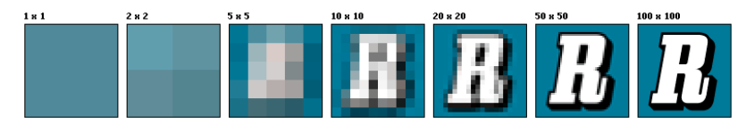
</div>


- 色深：
    - 每个像素所对应的内存字节数，一般有8位、16位、24位或32位
    - GEC6818开发板的屏幕的色深是32位的（800*480，32位色深
    - 32位色深的屏幕一般被称为真彩屏，或1600万色屏。

色深决定了一个像素点所能表达的颜色的丰富程度，色深越大，色彩表现力越强。


### **2. 内存映射基本原理**

虽然LCD设备本质上也可以看作是一个文件，在文件系统中有其对应的设备节点，可以像普通文件一样对其进行读写操作（read/write），但由于对字符设备的读写操作是以字节流的方式进行的，因此除非操作的图像尺寸刚好与屏幕尺寸完全一致，如下图所示，图片的宽高与LCD的宽高完全一致，否则将会画面会乱。

<div align="center">
    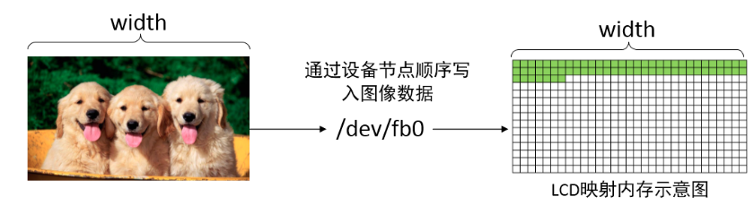
</div>


以下是一段直接写设备节点的“不好”的示例代码：

```c
void bad_display()
{
    // 打开LCD设备
    int lcd = open("/dev/fb0", O_RDWR);

    // 从JPG图片中获取ARGB数据
    char *argbbuf;
    int   argbsize;
    argbsize = jpg2rgb("dogs.jpg", &argbbuf);

    // 将RGB数据直接线性灌入LCD设备节点
    write(lcd, argbbuf, argbsize);

    // ...
}
```


像上述代码这样，直接将数据通过设备节点 /dev/fb0 写入的话，这些数据会自动地从LCD映射内存的入口处（对应LCD屏幕的左上角）开始呈现，并且会以线性的字节流形式逐个字节往后填充，除非图像尺寸与显示器刚好完全一致，否则显示是失败的。

一般而言，图像的尺寸大小是随机的，因此更方便的做法是为LCD做内存映射，将屏幕的每一个像素点跟映射内存一一对应，而映射内存可以是二维数组，因此就可以非常方便地通过操作二维数组中的任意元素，来操作屏幕中的任意像素点了。这里的映射内存，有时被称为显存。

<div align="center">
    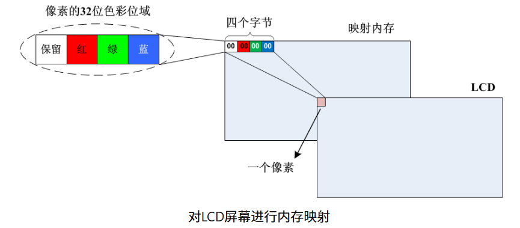
</div>


如上图所示，将一块内存与LCD的像素一一对应：

1. LCD上面显示的图像色彩，由其对应的内存的数据决定
2. 映射内存的大小至少得等于LCD的真实尺寸大小
3. 映射内存的大小可以大于LCD的真实尺寸，有利于优化动态画面（视频）体验

下面是屏幕显示为红色的示例代码：

```c
#include <stdio.h>
#include <sys/mman.h>
#include <string.h>
#include <fcntl.h>

int main()
{
    // 打开液晶屏文件
    int lcd = open("/dev/fb0", O_RDWR);

    // 给LCD设备映射一块内存（或称显存）
    char *p = mmap(NULL, 800*480*4, PROT_WRITE,
                   MAP_SHARED, lcd, 0);

    // 通过映射内存，将LCD屏幕的每一个像素点涂成红色
    int red = 0x00FF0000;
    for(int i=0; i<800*480; i++)
        memcpy(p+i*4, &red, 4);

    // 解除映射
    munmap(p, 800*480*4);
    return 0;
}
```


注意，上述代码存在诸多假设，比如屏幕的尺寸是800×480、屏幕色深是4个字节、每个像素内部的颜色分量是ARGB等等，这些信息都是“生搬硬凑”的，只能适用于某一款特定的LCD屏，如果屏幕的这些参数变了，上述代码就无法正常运行了，要想让程序在其他规格尺寸的屏幕下也能正常工作，就得让程序自动获取这些硬件参数信息。


### **3. 屏幕参数设定**

首先明确，屏幕的硬件参数，都是由硬件驱动工程师，根据硬件数据手册和内核的相关规定，填入某个固定的地方的，然后再由应用开发工程师，使用特定的函数接口，将这些特定的信息读出来。

对于GEC6818开发板而言，上述所谓“某个固定的地方”，指的是如下这些重要的结构体（节选）：

```c
struct fb_fix_screeninfo
{
    char id[16];              /* identification string eg "TT Builtin" */
    unsigned long smem_start; /* Start of frame buffer mem */
                              /* (physical address) */
    __u32 smem_len;           /* Length of frame buffer mem */
    __u32 type;               /* see FB_TYPE_*        */
    __u32 type_aux;           /* Interleave for interleaved Planes */
    __u32 visual;             /* see FB_VISUAL_*        */ 
    __u16 xpanstep;           /* zero if no hardware panning  */
    __u16 ypanstep;           /* zero if no hardware panning  */
    __u16 ywrapstep;          /* zero if no hardware ywrap    */
    __u32 line_length;        /* length of a line in bytes    */
    ...
    ...
};

struct fb_var_screeninfo
{
    __u32 xres;           /* 可见区宽度（单位：像素） */
    __u32 yres;           /* 可见区高度（单位：像素） */
    __u32 xres_virtual;   /* 虚拟区宽度（单位：像素） */
    __u32 yres_virtual;   /* 虚拟区高度（单位：像素） */
    __u32 xoffset;        /* 虚拟区到可见区x轴偏移量 */
    __u32 yoffset;        /* 虚拟区到可见区y轴偏移量 */

    __u32 bits_per_pixel; /* 色深 */

    // 像素内颜色结构
    struct fb_bitfield red;   // 红色  
    struct fb_bitfield green; // 绿色
    struct fb_bitfield blue;  // 蓝色
    struct fb_bitfield transp;// 透明度
    ...
    ...
};

struct fb_bitfield
{
    __u32 offset;   /* 颜色在像素内偏移量 */
    __u32 length;   /* 颜色占用数位长度 */
    ...
    ...
};
```


上述结构体的具体定义在系统的如下路径中：

```c
/usr/include/linux/fb.h
```


<div align="center">
    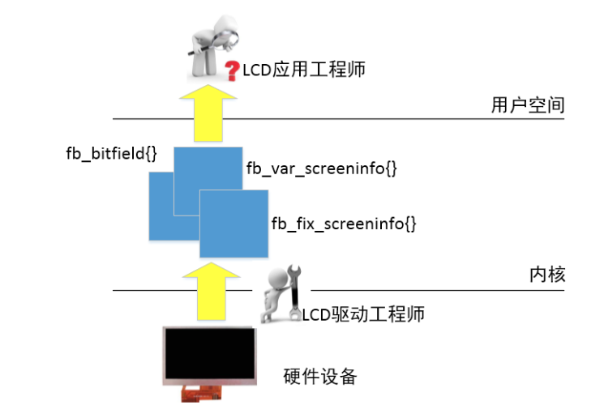
</div>


<div align="center">LCD设备参数信息从底层到应用层的流动</div>


如上图所示，如果板卡已经具备LCD的驱动程序，那么应用程序就可以通过 ioctl() 来检索LCD的硬件参数信息。以粤嵌GEC6818开发板配套的群创AT070TN92-7英寸液晶显示屏为例，具体代码如下：

```c
#include <stdio.h>
#include <stdlib.h>
#include <unistd.h>
#include <stdbool.h>
#include <errno.h>

#include <sys/types.h>
#include <sys/mman.h>
#include <sys/ioctl.h>
#include <linux/fb.h>
#include <fcntl.h>

int lcd;
struct fb_fix_screeninfo fixinfo; // 固定属性
struct fb_var_screeninfo varinfo; // 可变属性

void get_fixinfo()
{
    if(ioctl(lcd, FBIOGET_FSCREENINFO, &fixinfo) != 0)
    {
        perror("获取LCD设备固定属性信息失败");
        return;
    }

}

void get_varinfo()
{
    if(ioctl(lcd, FBIOGET_VSCREENINFO, &varinfo) != 0)
    {
        perror("获取LCD设备可变属性信息失败");
        return;
    }
}

void show_info()
{
    // 获取LCD设备硬件fix属性
    get_fixinfo();
    printf("\n获取LCD设备固定属性信息成功：\n");
    printf("[ID]: %s\n", fixinfo.id);
    printf("[FB类型]: ");
    switch(fixinfo.type)
    {
    case FB_TYPE_PACKED_PIXELS:      printf("组合像素\n");break;
    case FB_TYPE_PLANES:             printf("非交错图层\n");break;
    case FB_TYPE_INTERLEAVED_PLANES: printf("交错图层\n");break;
    case FB_TYPE_TEXT:               printf("文本或属性\n");break;
    case FB_TYPE_VGA_PLANES:         printf("EGA/VGA图层\n");break;
    }
    printf("[FB视觉]: ");
    switch(fixinfo.visual)
    {
    case FB_VISUAL_MONO01:             printf("灰度. 1=黑;0=白\n");break;
    case FB_VISUAL_MONO10:             printf("灰度. 0=黑;1=白\n");break;
    case FB_VISUAL_TRUECOLOR:          printf("真彩色\n");break;
    case FB_VISUAL_PSEUDOCOLOR:        printf("伪彩色\n");break;
    case FB_VISUAL_DIRECTCOLOR:        printf("直接彩色\n");break;
    case FB_VISUAL_STATIC_PSEUDOCOLOR: printf("只读伪彩色\n");break;
    }
    printf("[行宽]: %d 字节\n", fixinfo.line_length);

    // 获取LCD设备硬件var属性
    get_varinfo();
    printf("\n获取LCD设备可变属性信息成功：\n");
    printf("[可见区分辨率]: %d×%d\n", varinfo.xres, varinfo.yres);
    printf("[虚拟区分辨率]: %d×%d\n", varinfo.xres_virtual, varinfo.yres_virtual);
    printf("[从虚拟区到可见区偏移量]: (%d,%d)\n", varinfo.xoffset, varinfo.yoffset);
    printf("[色深]: %d bits\n", varinfo.bits_per_pixel);
    printf("[像素内颜色结构]:\n");
    printf("  [红] 偏移量:%d, 长度:%d bits\n", varinfo.red.offset, varinfo.red.length);
    printf("  [绿] 偏移量:%d, 长度:%d bits\n", varinfo.green.offset, varinfo.green.length);
    printf("  [蓝] 偏移量:%d, 长度:%d bits\n", varinfo.blue.offset, varinfo.blue.length);
    printf("  [透明度] 偏移量:%d, 长度:%d bits\n", varinfo.transp.offset, varinfo.transp.length);
    printf("\n");
}

int main()
{
    lcd = open("/dev/fb0", O_RDWR);
    if(lcd == -1)
    {
        perror("打开 /dev/fb0 失败");
        exit(0);
    }

    // 显示LCD设备属性信息
    show_info();

    return 0;
}
```

### **4. 多缓冲机制**

仔细观察上述显示单色的程序运行效果，会发现屏幕上的颜色不是一瞬间整体显示的，而是有一个很明显的从上到下刷屏的过程，这实际上是由于我们是一个个像素点从左到右，从上到下刷屏导致的，如果不是速度比较快，我们将会看到屏幕上的点是一个个亮起来的，而不是整屏统一更新，这显然不是最佳的体验。

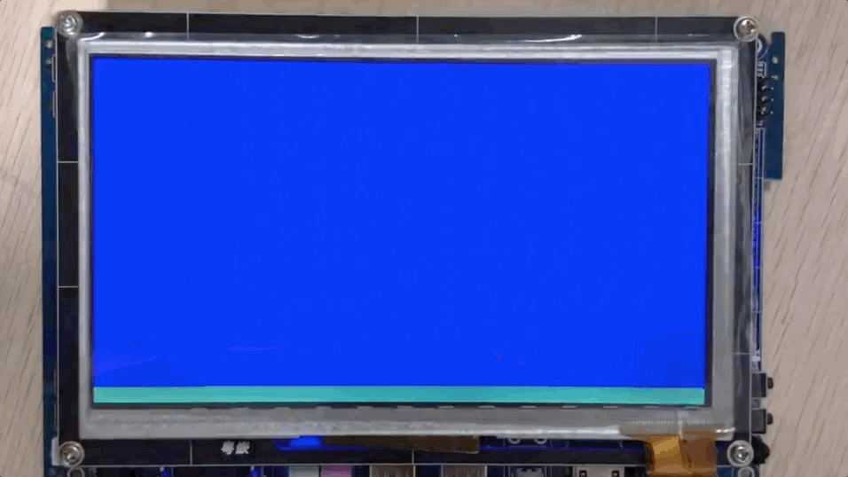

解决这个问题，可以采用多缓冲的办法，首先要搞明白所谓可见区和虚拟区的关系：

1. 可见区、虚拟区都是内存区域，可见区是虚拟区的一部分，因此可见区尺寸至少等于虚拟区。
2. 一般而言，可见区尺寸就是屏幕尺寸，比如800×480；而虚拟区是显示设备能支持的显存大小，比如800×480、800×960等。
3. 为了提高画面体验，一般先在不可见区操作显存数据，然后在调整可见区位置，使得图像“瞬间”呈现，避免闪屏。


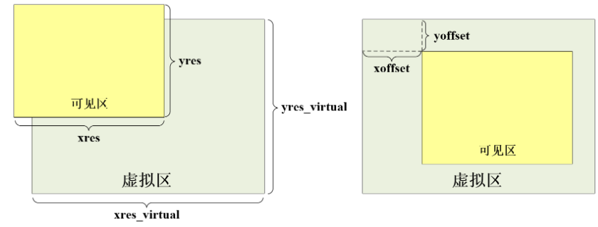

<div align="center">可见区与虚拟区</div>

下面以示例代码的形式，来分析如何使用多缓冲机制提高画面体验。

- **1. 设定虚拟区**

```c
#include <stdio.h>
#include <sys/mman.h>
#include <sys/ioctl.h>
#include <string.h>
#include <fcntl.h>
#include <linux/fb.h>

int main()
{
    // 打开LCD设备
    int lcd = open("/dev/fb0", O_RDWR|O_EXCL);

    struct fb_var_screeninfo vinfo; // 显卡设备的可变属性结构体
    ioctl(lcd, FBIOGET_VSCREENINFO, &vinfo); // 获取可变属性

    // 获得当前显卡所支持的虚拟区显存大小
    unsigned long VWIDTH  = vinfo.xres_virtual;
    unsigned long VHEIGHT = vinfo.yres_virtual;
    unsigned long BPP = vinfo.bits_per_pixel;

    printf("虚拟区显存大小为: %d×%d\n", VWIDTH, VHEIGHT);

    // 申请一块虚拟区大小的映射内存
    char *p = mmap(NULL, VWIDTH * VHEIGHT * BPP/8,
                PROT_READ|PROT_WRITE,
                MAP_SHARED, lcd, 0); 
    if(p != MAP_FAILED)
    {
        printf("申请显存成功\n");
    }
}
```


在开发板运行结果：

```c
[root@GEC6818 ~]#./a.out
虚拟区显存大小为: 800×1440
申请显存成功
[root@GEC6818 ~]#
```


从上述执行结果来看，粤嵌GEC6818开发板配套的群创AT070TN92-7英寸液晶显示屏支持三倍与屏幕尺寸的虚拟显存的设定。当然，在实际设定的时候，不一定要三倍，也可以是两倍大小，比如800×960。

- **2. 显示A区，但在B区作画**

    为了方便讨论，假设设定两倍屏幕尺寸的虚拟区内存，上半部分为A区，下半部分为B区。如下图所示：


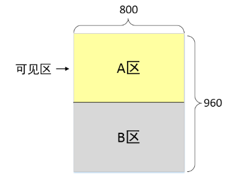

将A区设定为可见区，代码如下：

```c
struct fb_var_screeninfo vinfo; // 显卡设备的可变属性结构体
ioctl(lcd, FBIOGET_VSCREENINFO, &vinfo); // 获取可变属性

// 获得当前显卡所支持的虚拟区显存大小
unsigned long width  = vinfo.xres;
unsigned long height = vinfo.yres;
unsigned long bpp    = vinfo.bits_per_pixel;
unsigned long screen_size = width * height * bpp/8;

// 申请一块两倍与屏幕的映射内存
char *p = mmap(NULL, 2 * screen_size,
            PROT_READ|PROT_WRITE,
            MAP_SHARED, lcd, 0); 

// 将可见区设定为A区
vinfo.xoffset = 0;
vinfo.yoffset = 0;
ioctl(lcd, FBIOPAN_DISPLAY, &vinfo);

// 在B区绘图
int red = 0x00FF0000;
for(int i=0; i<width*height; i++)
    memcpy(p+screen_size+i*4, &red, 4);
```


执行上述代码，会发现虽然在B区已经填充了某些图像数据，但是屏幕上没有出现任何反应。

- **3. 将可见区设定为B区，瞬间出现画面，避免了“闪屏”**

    为了方便讨论，假设设定两倍屏幕尺寸的虚拟区内存，上半部分为A区，下半部分为B区。如下图所示：


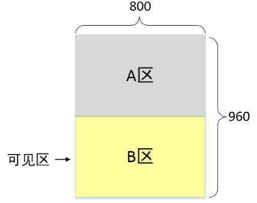

<div align="center">变换可见区</div>

将B区设定为可见区，代码如下：

```c
vinfo.xoffset = 0;
vinfo.yoffset = 480;
ioctl(lcd, FBIOPAN_DISPLAY, &vinfo);
```


容易想到，只要交替地改变可见区，使得填充数据的过程对用户不可见，等到数据填充完毕，再通过以上代码瞬间调整可见区区域，用户就能感受到画面流程呈现的体验，避免尴尬的闪屏。

下面是完整的使用“双缓冲”机制交替呈现红绿蓝的代码及演示效果图。

```c
#include <stdio.h>
#include <unistd.h>
#include <sys/mman.h>
#include <sys/ioctl.h>
#include <string.h>
#include <fcntl.h>
#include <linux/fb.h>

int main()
{
    // 打开LCD设备
    int lcd = open("/dev/fb0", O_RDWR|O_EXCL);

    struct fb_var_screeninfo vinfo; // 显卡设备的可变属性结构体
    ioctl(lcd, FBIOGET_VSCREENINFO, &vinfo); // 获取可变属性

    // 获得当前显卡所支持的虚拟区显存大小
    unsigned long width  = vinfo.xres;
    unsigned long height = vinfo.yres;
    unsigned long bpp    = vinfo.bits_per_pixel;
    unsigned long screen_size = width * height * bpp/8;

    // 申请一块两倍与屏幕的映射内存
    char *p = mmap(NULL, 2 * screen_size,
                PROT_READ|PROT_WRITE,
                MAP_SHARED, lcd, 0); 

    bzero(p, 2*screen_size);

    // 将起始可见区设定为B区
    vinfo.xoffset = 0;
    vinfo.yoffset = 480;
    ioctl(lcd, FBIOPAN_DISPLAY, &vinfo);

    int colors[] = {0x00FF0000, 0x0000FF00, 0x000000FF};
    for(int k=0,n=0;; n++,k++,k%=3)
    {
        for(int i=0; i<width*height; i++)
            memcpy(p+ screen_size*(n%2) +i*4, &colors[k], 4);

        vinfo.xoffset = 0;
        vinfo.yoffset = 480*(n%2);
        ioctl(lcd, FBIOPAN_DISPLAY, &vinfo);

        sleep(1);
    }
}
```


## 液晶屏操作

### **1. DRM概念入门**

**DRM**全称是 Direct Rendering Manager ，即直接渲染管理器。DRM是Linux的一个子系统，专门用来与现代图形显示卡的GPU打交道，在应用层提到DRM的时候一般指的是libdrm所提供的一套API，这套API封装了诸多对内核中DRM底层驱动的接口，极大方便了用户的使用。

下图可以比较直观的展现 DRM 在系统架构中的位置：

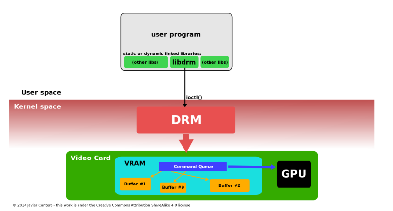

<div align="center">DRM在系统中的位置</div>

**注意**
在旧版Linux中（例如GEC6818开发板搭载的系统），可以直接通过 `mmap()` 给LCD设备映射内存，但在新版Linux中（例如RockX系列开发板搭载的系统），基于安全性和可扩展性的角度考虑，`mmap()` 已无法直接使用，而是必须使用 `DRM` 机制来统一管理。

### **2. 显示屏操作**

#### **2.1 DRMwrap封装库**

系统自带的 `libdrm.so` 库的接口比较繁冗，为了便于操作，基于原始的 `libdrm.so` 库封装了接口更加简洁的 `libDRMwrap.so`，点击链接下载封装库的源码：[DRMwrap.zip](http://edu.yueqian.com.cn/group1/M00/01/38/rBJlJmc3OQSADEMxAAAKmtxDzbI069.zip?token=null&ts=null&filename=DRM.zip)

下载解压之后，将得到如下文件：

```shell
gec@ubuntu:~/DRM $ tree
.
├── CMakeLists.txt
├── DRMwrap.c
├── DRMwrap.h
└── README
0 directories, 4 files
gec@ubuntu:~/DRM $ 
```


在目录中建立一个 `build` 的文件夹，然后在里面执行cmake指令即可，比如：

```shell
gec@ubuntu:~/DRM/build$ cmake ..
gec@ubuntu:~/DRM/build$ make 
```

**注意**
不能在源码目录中直接执行`cmake`


编译成功之后，会得到一个 `libDRMwrap.so` 的动态库，后续在代码中需要用到DRM显示图像时，直接连接这个库就可以了。

#### **2.2 获取液晶屏参数**

要想正常在屏幕上显示图像，至少要获取屏幕尺寸、显存入口、色彩模式等信息。通过对 DRM 和设备操作和 libdrm 接口的封装，可以使用如下代码来获取显示屏的信息：

```c
// lcdinfo.c
#include <sys/stat.h>
#include <sys/types.h>
#include <fcntl.h>
#include "DRMwrap.h"

// DRM设备操作结构体
struct drmHandle drm;

int main()
{
    // 打开 DRM 设备
    int lcd = open("/dev/dri/card0", O_RDWR | O_CLOEXEC);

    // 初始化 DRM 设备，并创建一块显存
    DRMinit(lcd);
    DRMcreateFB(lcd, &drm);

    printf("屏幕尺寸: %d×%d\n", drm.width, drm.height);
    printf("像素色深: %u\n", drm.pitch/drm.width);
    printf("显存入口: %p\n", drm.vaddr);
}
```


以上代码中，函数 `DRMinit()` 与 `DRMcreateFB()` 都是DRMwrap封装库中的接口，上述代码编译语句如下（以RK1808为例）：

**1. 在ubuntu编译**

```shell
gec@ubuntu:~$ aarch64-linux-gnu-gcc lcdinfo.c -o lcdinfo -L/path/to/DRM/build/ -lDRMwrap -I/path/to/DRM -ldrm 
gec@ubuntu:~$
```


**2. 将`lcdinfo`、`libDRMwrap.so`拷贝到开发板**
**3. 在开发板执行**

```shell
# RK1808：
[root@root:~]# ./lcdinfo
显示器尺寸: 1024×600
显存入口: 0x7f92f04000
色深: 4字节
[root@root:~]#
```


#### **2.2 libDRMwrap.so接口简介**

```c
// 初始化 DRM 设备，并获得连接器信息
void DRMinit(int fd);

// 申请一块映射到用户空间的显存，可以申请多次
int  DRMcreateFB(int fd, struct drmHandle *drm);

// 更新画面
int DRMshowUp(int fd, struct drmHandle *drm);

// 释放相关资源
void DRMfreeResources(int fd, struct drmHandle *drm);
```


#### **2.3 示例代码**

以下代码演示了如何使用DRM封装库，在屏幕上显示RGB纯色：

```c
#include <stdio.h>
#include <errno.h>
#include <linux/fb.h>
#include <sys/stat.h>
#include <sys/mman.h>
#include <fcntl.h>

#include "DRMwrap.h"

// DRM设备操作结构体
struct drmHandle drm;

int main()
{
    // 打开 DRM 设备
    int lcd = open("/dev/dri/card0", O_RDWR | O_CLOEXEC);

    // 初始化 DRM 设备
    DRMinit(lcd);

    // 为显示屏添加一个FrameBuffer显存，并获取显示屏的分辨率、显存入口和色深等信息
    DRMcreateFB(lcd, &drm);
    int bpp = drm.pitch / drm.width * 8;
    printf("显示器尺寸: %d×%d\n", drm.width, drm.height);
    printf("色深: %u字节\n", bpp/8);

    // 填涂纯色
    int colors[] = {0x00FF0000, 0x0000FF00, 0x000000FF};

    for(int k=0; ;k++,k%=3)
    {
        for(int y=0; y<drm.height; y++)
        {
            for(int x=0; x<drm.width; x++)
            {
                memcpy(drm.vaddr + (y*drm.width+x)*bpp/8, &colors[k], 4);
            }
        }

        // 更新 DRM 设备画面
        DRMshowUp(lcd, &drm);
        getchar();
    }

    // 释放 DRM 设备相关资源
    DRMfreeResources(lcd, &drm);

    return 0;
}
```


## BMP格式图片

### **1. BMP 格式简介**

BMP格式跟WAV格式一样，都是微软（MicroSoft）公司发明的数据封装格式，这两种格式最大的特征是都没有任何的压缩，因此文件尺寸都比较大，不适合在互联网上传播，优点是数据读取出来即可使用，无需任何解码器支持。

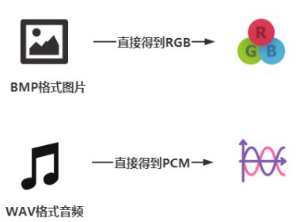


虽然BMP格式文件内部存储的就是RGB数据，无需任何解码，但毕竟RGB数据是纯数据，没有任何图片尺寸、色深等具体信息，因此我们需要了解BMP的格式头，在BMP格式头中获取图片的相关信息，然后才能正确处理内涵的RGB数据。

另外通过研究BMP格式会发现，其RGB的存储遵从一定的规则，比如上下颠倒、4字节行距等，这些都编写程序代码时都必须要弄清楚。

#### **1.1 BMP 格式头解析**

BMP文件开头部分是BMP格式头，里面存放了RGB数据的尺寸、分辨率、色深等重要信息。BMP格式头中包含了如下三个结构体：

- **bitmap_header**（必有）
- **bitmap_info**（必有）
- rgb_quad（可选，一般没有）

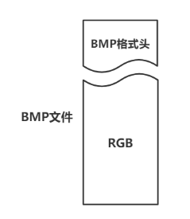


结构体具体定义如下：

```c
struct bitmap_header
{
	int16_t type;
	int32_t size; // 图像文件大小
	int16_t reserved1;
	int16_t reserved2;
	int32_t offbits; // bmp图像数据偏移量
}__attribute__((packed));

struct bitmap_info
{
	int32_t size;   // 本结构大小	
	int32_t width;  // 图像宽
	int32_t height; // 图像高
	int16_t planes;

	int16_t bit_count; // 色深
	int32_t compression;
	int32_t size_img; // BMP文件中的RGB数据大小，必须是4的整数倍
	int32_t X_pel;
	int32_t Y_pel;
	int32_t clrused;
	int32_t clrImportant;
}__attribute__((packed));

// 以下结构体不一定存在于BMP文件中，除非：
// bitmap_info.compression为真
struct rgb_quad
{
	int8_t blue;
	int8_t green;
	int8_t red;
	int8_t reserved;
}__attribute__((packed));
```


#### **1.2 示例代码**

以下代码显示了如何从一张给定的BMP图片文件中获取图片尺寸等信息。

```x
#include <stdio.h>
#include <dlfcn.h>  // 动态加载动态库的头文件：dlopen()、dlsym()
#include <stdlib.h>
#include <string.h>
#include <unistd.h>
#include <errno.h>
#include <fcntl.h>
#include <stdbool.h>

#include <sys/stat.h>
#include <sys/wait.h>
#include <sys/types.h>
#include <sys/mman.h>

// BMP格式头规范
struct bitmap_header
{
	int16_t type;
	int32_t size; // 图像文件大小
	int16_t reserved1;
	int16_t reserved2;
	int32_t offbits; // bmp图像数据偏移量
}__attribute__((packed));

struct bitmap_info
{
	int32_t size;   // 本结构大小	
	int32_t width;  // 图像宽
	int32_t height; // 图像高
	int16_t planes;

	int16_t bit_count; // 色深
	int32_t compression;
	int32_t size_img; // bmp数据大小，必须是4的整数倍
	int32_t X_pel;
	int32_t Y_pel;
	int32_t clrused;
	int32_t clrImportant;
}__attribute__((packed));

// 以下结构体不一定存在于BMP文件中，除非：
// bitmap_info.compression为真
struct rgb_quad
{
	int8_t blue;
	int8_t green;
	int8_t red;
	int8_t reserved;
}__attribute__((packed));

int main(void)
{
	int fd = open("a.bmp", O_RDONLY);

	// 读取BMP格式头，获取图片信息
	struct bitmap_header header;
	struct bitmap_info info;
	struct rgb_quad quad;

    // 第一、二个结构体是必有信息
	read(fd, &header, sizeof(header));
	read(fd, &info, sizeof(info));

    // 第三个结构体是可选的，需要判断是否存在
	if(info.compression != 0)
	{
		read(fd, &quad, sizeof(quad));
		fprintf(stderr, "read quad! \n");
	}

    // 输出图片相关信息
    printf("图片大小: %d\n", header.size);
    printf("图片尺寸: %d×%d\n", info.width, info.height);
    printf("色深: %dbpp\n", info.bit_count);
    
    close(fd);
    return 0;
}
```


#### **1.3 特殊规则**

**a. 4字节倍数行距**
BMP图片文件的一个重要规则是，每行数据字节数必须是4的倍数，假设某BMP图片的分辨率是 65 × 200，也就是说宽是 `65` 像素，假设每个字节色深是24bits（即3字节），那么这张图片一行的实际数据量是 `65×3=195`个字节，但195不是4的倍数，因此在每一行的末尾都会添加一个无效字节，将行距尺寸补到196个字节。

处理的原则很简单，首先根据具体图片的尺寸和色深等信息，计算出一行中会出现的无效字节的个数（0-3个字节），计算公式参考：

```c
int pad = ((4-( width * bpp/8 ) % 4)) % 4;
```


其中：

- pad是最终计算得出的每一行的无效字节数，范围是0-3之间
- width是图片的宽
- bpp是图片的色深

其次，在处理图像数据的时候，直接跳过这些无效字节就好了。

**b. 上下颠倒**
BMP图片中的RGB数据是上下颠倒的，因此文件数据中的最后一行是图像的最上面第一行。需要注意的是，上下是颠倒的，但是左右是正常的，因此在处理数据的时候不能从最后一个字节开始，而是从最末一行的首字节开始。

**c. 示例代码**
假设：

- 图片的尺寸是：width × height
- 图片的色深是：bpp
- 图片的RGB指针是：rgb
- 显存指针是：fbmem

```c
void show()
{
    // 计算无效字节数
    int pad = ((4-( width * bpp/8 ) % 4)) % 4;

	// 让rgb指向最末一行的首字节
	rgb += (width * bpp/8 + pad) * (height-1);	

	int x, y;
	for(x=0; x<lcd_h && x<height; x++)
	{
        // 显示一行
		for(y=0; y<lcd_w && y<width; y++)
		{
			int lcd_offset = (lcd_w*x + y)*4;

            // 将一个像素点从图片复制到显存
			memcpy(fbmem+lcd_offset, rgb, bpp/8);
			rgb += bpp/8;
		}

        // 显示完一行之后，跳过pad个无效字节
		rgb += pad;

        // 让rgb指向上一行行首
		rgb -= (width * bpp/8 + pad) * 2;
	}
}
```

 

## 输入子系统

```bash
/usr/include/linux/input.h
```

