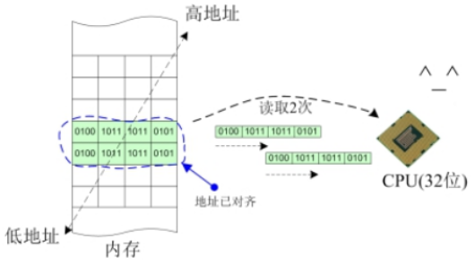

# 结构体

## 基础

### 概念

- 自定义的一种复合数据类型

可以使用结构体来将多种不同的数据类型组装起来，形成某种现实意义的自定义的变量类型。结构体本质上是一种自定义类型。

### 结构体类型定义

```c
struct 结构体名
{
    成员类型1  成员名1;
    成员类型2  成员名2;
    ...
    成员类型n  成员名n;
};
```

- 语法：
  - 结构体标签，用来区分各个不同的结构体。
  - 成员，是包含在结构体内部的数据，可以是任意的数据类型。

- 要注意区别创建一个结构体数据类型与定义一个结构体变量
- 变量名可以省略，但是分号; 一定不能漏掉


结构体就是我们自己发明的数据类型，因此使用结构体至少包含两个步骤：

- 创建一个自定义的结构体类型
- 用这个自己做出来的数据类型定义一个结构体变量


### 结构体初始化

结构体跟普通变量一样，涉及定义、初始化、赋值、取址、传值等等操作，这些操作绝大部分都跟普通变量别无二致，只有少数操作有些特殊性。这其实也是结构体这种组合类型的设计初衷，就是让开发者用起来比较顺手，不跟普通变量产生太多差异。


- 结构体的定义和初始化。

- - 由于结构体内部拥有多个不同类型的成员，因此初始化采用与数组类似的列表方式。

  - 结构体的初始化有两种方式：①普通初始化；②指定成员初始化。

  - 为了能适应结构体类型的升级迭代，一般建议采用指定成员初始化

    

1. 按定义时的顺序依次初始化，用逗号隔开

```c
struct date
{
    int year;
    int month;
    int day;        
};
struct student
{
    char name[32];
    int age;
    struct date birthday;
};

struct student stu1={"zhangsan",18,{2008,9,10}};
```


2. 不按定义时的顺序，指定成员初始化

```c
struct student stu2={
    .age=18,
    .name="lisi",
    .birthday={
        .day = 10,
        .month = 9,
        .year = 2008
    }
};
```

- 指定成员初始化的好处：

- - 成员初始化的次序可以改变。
  - 可以初始化一部分成员。
  - 结构体新增了成员之后初始化语句仍然可用。


### 结构体成员引用

结构体相当于一个集合，内部包含了众多成员，每个成员实际上都是独立的变量，都可以被独立地引用。引用结构体成员非常简单，只需要使用一个成员引用符即可：

```c
结构体.成员
```


示例：

```c
n.a = 200;
n.b = 'y';
n.c = 2.22;
printf("%d, %c, %lf\n", n.a, n.b, b.c);
```


### 结构体指针与结构体数组

跟普通变量别无二致，可以定义指向结构体的指针，也可以定义结构体数组。

- 结构体指针：

```c
struct node  n = {100, 'x', 3.14};
struct node *p = &n;

// 以下语句都是等价的
printf("%d\n",   n.a);
printf("%d\n", (*p).a);
printf("%d\n",  p->a);  // 箭头 -> 是结构体指针的成员引用符
```


- 结构体数组：

```c
struct node s[5];
s[0].a = 300;
s[0].b = 'z';
s[0].c = 3.45;
```


## 结构体尺寸

### 系统字长

系统字长也叫CPU字长，指的是处理器CPU在一条指令中的数据处理能力，当然这个能力还需要搭配操作系统的设定，比如常见的32位系统、64位系统，指的是在此系统环境下，处理器一次存储处理的数据可以达32位或64位。

<div align="center">
    
</div>

在Windows系统中，可以通过查看系统信息知道系统的CPU字长：

在Ubuntu系统中，可以通过以下命令查看系统的CPU字长：

```bash
uname -m
```


### 地址对齐

CPU字长确定之后，相当于明确了系统每次存取内存数据时的边界，以32位系统为例，32位意味着CPU每次存取都以4字节为边界，因此每4字节可以认为是CPU存取内存数据的一个单元。

如果存取的数据刚好落在所需单元数之内，那么我们就说这个数据的地址是对齐的，如果存取的数据跨越了边界，使用了超过所需单元的字节，那么我们就说这个数据的地址是未对齐的。

地址未对齐的情形：

<div align="center">
    
</div>

地址已对齐的情形：

<div align="center">
    
</div>

从图中可以明显看出，数据本身占据了8个字节，在地址未对齐的情况下，CPU需要分3次才能完整地存取完这个数据，但是在地址对齐的情况下，CPU可以分2次就能完整地存取这个数据。

> 总结：
> 如果一个数据满足以最小单元数存放在内存中，则称它地址是对齐的，否则是未对齐的。地址对齐的含义用大白话说就是1个单元能塞得下的就不用2个；2个单元能塞得下的就不用3个。
> 如果发生数据地址未对齐的情况，有些系统会直接罢工，有些系统则降低性能。


## 联合体（共用体）

> 概念

- 几个不同的变量共用同一段内存的结构，在C语言中，被称为"共用体"类型结构

<div align="center">
    
</div>

- 定义共用体类型

```c
union 共用体名
{
    成员类型1  成员名1;
    成员类型2  成员名2;
    ...
};
```

- 特点

所有成员共享一段内存

联合体中最大个数成员


## 大小端序列

- 概念

```
一个多字节存储单元的低地址存储数据的低有效位还是高有效位
```


- 大端序

​	高位存在低字节

- 小端序

​	低位存在低字节


## 枚举类型

- 一个多字节存储单元的低地址存储数据的低有效位还是高有效位

```c
//设计一个枚举类型
enum CAR_MOVE{
    CAR_MOVE_UP = 1, //如果没有进行赋值默认从0开始   此时 CAR_MOVE_UP 就是一个常量标识符 1
    CAR_MOVE_DOWN,
    CAR_MOVE_LEFT,
    CAR_MOVE_RIGHT
};
```

