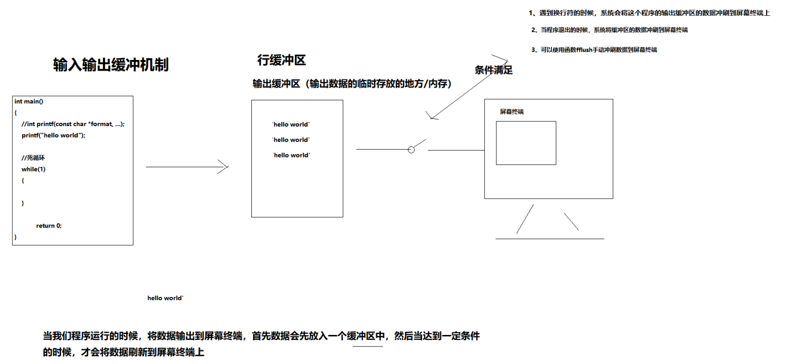

# 缓冲区

## 概述

缓冲区又称为缓存，它是内存空间的一部分。也就是说，在内存空间中预留了一定的存储空间，这些存储空间用来缓冲输入 或者输出的数据，这部分预留的空间叫做缓冲区。缓冲区根据其对应的是输入设备还是输出设备，分为输入缓冲区和输出缓冲区。


## 缓冲区

1）减少IO设备的操作

2）提高计算机的运行速度。

比如：我们从磁盘里读取信息，先把读出的数据放在缓冲区，计算机再直接从缓冲区中取数据，等缓冲区的数据取完后再去磁盘中读取，这样就减少磁盘的读写次数，再加上计算机对缓冲区的操作大大快于磁盘的操作，故应用缓冲区可大大提高计算机的运行速度。


## 缓冲区类型

全缓冲：当填满缓冲区之后，才会进行实际IO操作。 比如 对磁盘文件的读写。 ---window 全缓冲大小4096字节   linux 全缓冲大小 1024字节

行缓冲：当在输入和输出中遇到换行符时，执行真正的IO操作，也就是冲刷缓冲区的数据。比如键盘输入数据

不带缓冲：也就是不进行缓冲，标准出错情况stderr是典型代表，这使得出错信息可以直接尽快地显示出来。


## 缓冲区刷新

1、输出缓冲区是行缓冲，当遇到换行符的时候，系统会将缓冲区的数据冲刷到标准输出设备上

2、缓冲区满（溢出）

```c
测试程序：手动修改cnt的大小，发现1026的时候，会溢出
int cnt=1026;
while(--cnt){
    printf("h");
}
while(1);
```

3、执行fflush(stdout)，手动刷新缓冲区，将缓冲区的数据冲刷到屏幕终端上

fflush:强制刷新<span style="color:red;">输出</span>缓冲区



  printf()  ---> 输出字符串到终端下

  scanf()  ---> 从键盘获取字符   --> 需要变量的地址，根据地址，存放在变量中

返回值：

​	成功返回获取到的变量的个数

scanf("%\[^\n]", str)
除了\n换行符全部接受


## printf

----调试代码

研究一个函数：  1、百度    2、查看linux中文C手册       3、man手册（英文）

头文件：	#include 

函数原型：int printf(const char * format, ...);  变参  函数

函数作用：将指定格式的数据  输出   到 屏幕终端上（输出设备）

函数参数

​	format----》指定格式

​	 ...---->参数不固定

指定格式---》也就是将数据 以什么样的方式 打印到屏幕上

```c
%s     字符串格式
%d     整型  int
%c     字符型  char
%hd   短整型  short int
%hhd  字符型的ascii码   char 数据对应的ascii码 的值
%f      单精度浮点型（实型） float
%lf    双精度浮点型  double
%ld   long  int
%lld   long long int
%x     十六进制
%#x   十六进制 并且 十六进制 的前缀 0x也会打印出来
#o      八进制
%#o   八进制 并且  八进制的前缀0打印出来
%e      以科学计数法的方式将浮点数打印出来
%p     打印内存的地址
```


### 字符宽度

**字段宽度其实就是指输出的字符所占的终端的列数**，用户可以指定宽度，比如用户指定宽度为10，但是实际要输出的字符只有4个，那剩余的列数为6列，则这6列用空格补齐。注意：<span style="color:red;">**如果用户没有明确指定左对齐，则默认采用右对齐输出**</span>。如下：

```c
int a=10,b=30;  
float f = 3.141566;
printf("a:%#x\n",a);          //结果为0xa
printf("b:%10#x\n", x);       //结果为      0x14
printf("f=%f\n", f);          //结果为3.141566
printf("f=%.2f\n", f);        //结果为3.14

//输出多个数据
printf("a:%d, b:%d\n", a, b);
printf("a:%d, b:%d, f:%f\n", a, b, f);
```


## scanf

头文件:    #include 

函数原型: int scanf(const char * format, ...);

函数作用	

​	从屏幕终端上 获取 指定 格式的数据，存储 到 变量的内存空间上

函数参数

​	format----》指定格式

函数返回值

​	成功

​		返回 获取 到的变量的个数     2

​	失败    0


```c
int a1=0,a2=0;

//scanf("%d:%d",&a1,&a2); //输入的时候也必须按照这种格式输入，比如12:30
scanf("%d%d",&a1,&a2);
printf("a1:%d a2:%d\n",a1,a2);
//此时输入缓冲区中还存在换行符，而%c 不会自动跳过换行符或者空格，所以获取到的字符就是换行符
char ch;
scanf("%c",&ch);
printf("%hhd %c\n",ch,ch); //ch == '\n'   10
//%d会自动默认跳过换行符
int val=0;
scanf("%d",&val);
printf("%d\n",val);
```


# 运算符

## 算术运算符

- 单目运算符

 ++ -- + - *

++a与a++的区别

​	int x = a++;//++在后，先运算，后自加

​	int y = ++b;//++在前，先自加，后运算


```c
#include<stdio.h>

int main()
{
    int a = 5;
    int b = 5;

    int c = ++a; 

    int d = b++; 
    int e = ++a; 
    

    printf("a:%d\n",a);
    printf("b:%d\n",b);
    printf("c:%d\n",c);
    printf("d:%d\n",d);
    printf("e:%d\n",e);

    return 0;
}
```


- 双目运算符

\+ - * / %（取余运算符）

比如：

3/2 --->1        3*1.0/2 --->1.5

10%3 -->1      10.0%3--->error

char value = 'a';

printf("%hhd  %c\n",value +1);

注意：

1、两个整数相除的结果是整数，小数部分被舍弃。要想其结果是实数，可在分子*1.0(隐式类型转换)	

2、取余运算符左右两边的操作数都必须是整型

​	如果是3.0,那也是错误的

3、* 解引用运算符-----这个不讲，后面再讲


## 关系运算符

\>    <     >=    <=    !=        ==

1>2     2>3    3<10     100>=200     1==1

什么是表达式?

​	表达式就是表达某种意思的式子。

​	在C语言中，表达式指的是运算符连接操作数的式子。

注意：由关系运算符构成的表达式称为关系表达式，关系表达式的值为布尔值  1（关系成立）  0（关系不成立）


## 逻辑运算符

&&   ||   	!

! 	:逻辑反  （反过来）		非零为真

&&	:逻辑与 （而且）		两个操作数都必须为真，结果才为真

||	:逻辑或  （或者）		两个操作数只要一个为真，结果就为真

注意：什么叫做真？？ ---》只要不是0，都是真 

​           什么叫做假？？---》0就是假

比如：  !5    !0    !(a>b)     !(a = 10)   !false   !true

由逻辑运算符组成的式子称之为 逻辑表达式。逻辑表达式 的结果 为布尔值，也就是只能是 真（1）和 假（0）

注意：在C语言中，运算是"惰性运算"，如果事先知道了表达式的值，那么它就不会去运算后面的式子了。

比如：	1>2 && 3<4

-----------惰性运算-------------

```c
#include<stdio.h>

int main(int argc,char *argv[])
{
    int a = 1;
    int b = 2;
    
    //从左到右运算的时候,a>b 为假，由于惰性运算，所以后面的 (++a) 就不再运算了，整个式子直接返回结果 假
    int ret = a>b && (++a);

    printf("ret:%d a:%d\n",ret,a);

    return 0;
}
```


```c
#include<stdio.h>

int main(void)
{
    //逻辑运算符
    int a=10,b=20;
    printf("=========!=======\n");
    if(!(a>b))
    {
        printf("嗨\n");
    }
    else
    {
        printf("滚\n");
    }
    printf("%d\n",!(a>b));
    printf("=========&&=======\n");
    
    if((a>b) && (11>1))
    {
        printf("我来了\n");
    }
    else
    {
        printf("一边去\n");
    }
    printf("=========||=======\n");
    
    if((a>b) || (11>1))
    {
        printf("我来了\n");
    }
    else
    {
        printf("一边去\n");
    }
    return 0;
}
```


## 位运算

按bit位来进行运算操作的运算符

​	~	&	| 	^	<<	>>

~	：按位取反----单目运算符 ，数据的每一个bit位 取反，也就是1变成0, 0变成1

比如：

```c
unsigned char ret = ~0x05; //0000 0101 -->1111 1010    
printf("ret:%hhu\n",ret);
```

```c
printf("%d\n",~5); //结果为 -6
```

&	：按位与

​		1 & 1 == 1

​		1 & 0 == 0

​		0 & 0 == 0

​		0 & 1 == 0

|	：按位或

​		1 | 1 == 1

​		1 | 0 == 1

​		0 | 1 == 1

​		0 | 0 == 0

^	：按位异或 ------不同为真，相同为假

​		1 ^ 0 = 1

​		0 ^1  = 1

​		0 ^0  = 0

​		1 ^1  = 0

<<	：左移，按bit位往左边移

1)无符号左移：

```c
unsigned int a = 3 <<3;    
printf("%d\n",a); // 24
```


2)有符号左移：

```c
int a = -3 <<3;    
printf("%d\n",a); // -24
```

\>>	：右移，按bit位往右边移

1)无符号右移：

​	unsigned  char a = 151>>5;  printf("%d\n",a);   //4

​	

2)有符号右移：

​	char  a = -96 >>5;   printf("%d\n",a);   //-3

<span style="color:red;">注意：1、在进行移位运算的时候，凡是被移出去的位统统丢弃，凡是空出来的位统统补0。移位运算针对的是无符号整数。</span>

​           <span style="color:red;">2、如果非要进行有符号的位移运算，那么左移的时候，空出来的补0，右移的时候，空出来的补符号位（原码阶段）。</span>


位运算：

指的是将一个数进行bit位运算，也就是，要将这个数据转成二进制（补码），然后再进行运算


## 特殊运算符

1、赋值运算符，右->左，优先级排倒数第二

```c
    int a  =  3+5;
```

注意:赋值运算符的左边(左操作数)必须是可写的地址。

```c
5  =  3; //error
int a = 4;//right
```

2）复合赋值运算符，右->左，优先级排倒数第二

​	+= 	-=	/=	|=	>>=	<<=

3）三目运算符

格式：

​	表达式1 ? 表达式2 : 表达式3;

求值顺序:  如果表达式1的值为真，则整个条件运算表达式的值为表达式2的值；

​                 如果表达式1的值为假，则整个条件运算表达式的值为表达式3的值。

```c
int a = 10;
int b = 20;

int ret = a>b ? ++a : ++b;    
printf("ret:%d a:%d b:%d\n",ret,a,b);
```

练习1：使用三目运算符比较三个整形数的最大值


3）sizeof运算符

​	用来计算某种类型或者变量所占的字节数

比如：

sizeof(int)

4)逗号运算符（，）  优先级最低的，  左->右

由逗号运算符将多个不同的式子连接起来的表达式称之为逗号表达式

逗号表达式：

```c
(表达式1,表达式2,表达式3,.......表达式n)
```

求值顺序:先求表达式1，再求表达式2,再求表达式3,...最后求表达式n的值，

​	               整个逗号表达式的值为表达式n的值

注意：1、逗号表达式的优先级最低

​           2、 运算顺序是从左到右

​    3、整个逗号表达式的值取决于最右边的表达式的值

```c
int ret = (a>b,a++,b++,a);
printf("ret:%d\n",ret);
```


