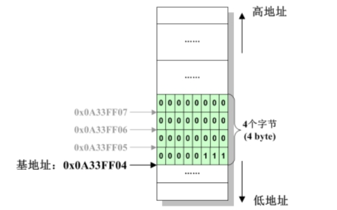
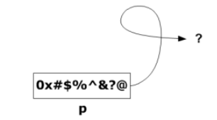
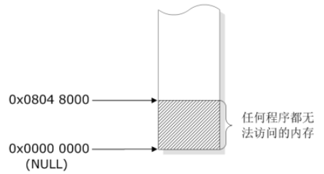

# 准备知识

## 内存地址

- 字节：字节是内存的容量单位，英文称为 byte，一个字节有8位，即 1byte = 8bits
- 地址：系统为了便于区分每一个字节而对它们逐一进行的编号，称为内存地址，简称地址。


## 基地址

- 单字节数据：对于单字节数据而言，其地址就是其字节编号。
- 多字节数据：对于多字节数据而言，期地址是其所有字节中编号最小的那个，称为基地址。




## 取地址

- 每个变量都是一块内存，都可以通过取址符 & 获取其地址
- 例如：

```c
int a = 100;
printf("整型变量 a 的地址是: %p\n", &a);

char c = 'x';
printf("字符变量 c 的地址是: %p\n", &c);

double f = 3.14;
printf("浮点变量 f 的地址是: %p\n", &f);
```


输出可能为：

```c
整型变量 a 的地址是: 0x7ffeedd6a8b4
字符变量 c 的地址是: 0x7ffeeda804b4
浮点变量 f 的地址是: 0x7ffeedd08b00
```


- 注意：
  - 虽然不同的变量的尺寸是不同的，但是他们的地址的尺寸确是一样的。
  - 不同的地址虽然形式上看起来是一样的，但由于他们代表的内存尺寸和类型都不同，因此它们在逻辑上是严格区分的。


# 指针

## 指针概念

由于翻译的问题，以及口语表达的习惯，在日常表述中，指针在不同的场合会代表以下几个含义：

- “指针” 就是地址
  - 比如变量`a`的地址 `&a`，这是一个地址当然也是一个指针
  - 我们可以说指针 &a 指向变量 a。
- “指针” 就是指针变量
  - 比如 `int *p;` 此处变量p是指针变量，又常被简称指针。


## 指针定义

```c
int    *p1; // 用于存储 int  型数据的地址，p1 被称为 int  型指针，或称整型指针
char   *p2; // 用于存储 char 型数据的地址，p2 被称为 char 型指针，或称字符指针
double *p3; // 用于存储double型数据的地址，p3 被称为 double 型指针
```


## 指针赋值

赋给指针的地址，类型需跟指针的类型相匹配。

```c
int a = 100;
p1 = &a; // 将一个整型地址，赋值给整型指针p1

char c = 'x';
p2 = &c; // 将一个字符地址，赋值给字符指针p2

double f = 3.14;
p3 = &f; // 将一个浮点地址，赋值给浮点指针p3
```


## 指针目标的索引

所谓索引，指的是通过指针，取得其指向的目标

```c
*p1 = 200; // 将 p1 指向的目标（即a）修改为200，等价于 a = 200;
*p2 = 'y'; // 将 p2 指向的目标（即c）修改为'y'，等价于 c = 'y';
*p3 = 6.6; // 将 p3 指向的目标（即f）修改为6.6，等价于 f = 6.6;
```


- 指针的尺寸
  - 指针尺寸指的是指针所占内存的字节数
  - 指针所占内存，取决于地址的长度，而地址的长度则取决于系统寻址范围，即字长
  - 结论：指针尺寸只跟系统的字长有关，跟具体的指针的类型无关


# 特殊指针

## 野指针

- 概念：指向一块未知区域的指针，被称为野指针。野指针是危险的。



- 危害：
  1. 引用野指针，相当于访问了非法的内存，常常会导致段错误（segmentation fault）
  2. 引用野指针，可能会破坏系统的关键数据，导致系统崩溃等严重后果
- 产生原因：
  1. 指针定义之后，未初始化
  2. 指针所指向的内存，被系统回收
  3. 指针越界
- 如何防止：
  1. 指针定义时，及时初始化
  2. 绝不引用已被系统回收的内存
  3. 确认所申请的内存边界，谨防越界


## 空指针

空指针指的是指向 `零地址` 处的指针，并不是说指针里面是空的什么也没有，而是指指针变量内存储了地址0，例如：

```c
char *p = NULL; // NULL就是0，定义是 (void*)0 表示通用地址类型
```


- 概念：空指针即保存了零地址的指针，亦即指向零地址的指针，如下图所示。
- 特点：零地址处的内存不可访问，不对应任何系统数据，指针指向这块内存就算误操作也不会对系统造成任何损害。因此空指针的最大特点是 `安全`。



- 示例：

```c
// 1，刚定义的指针，让其指向零地址以确保安全:
char *p1 = NULL;
int  *p2 = NULL;

// 2，被释放了内存的指针，让其指向零地址以确保安全：
char *p3 = malloc(100); // a. 让 p3 指向一块大小为100个字节的内存
free(p3);               // b. 释放这块内存，此时 p3 相当于指向了一块非法内存
p3 = NULL;              // c. 让 p3 指向零地址
```


很多情况下，我们不可避免地会遇到野指针，比如刚定义的指针无法立即为其分配一块恰当的内存，又或者指针所指向的内存被释放了等等。一般的做法就是将这些危险的野指针指向零地址，也就是将指针赋值NULL，使之成为空指针。

- 通用指针类型

可以指向任何类型的数据，不可以解引用，只有转换类型后可以解引用


# 语法

- 任意的指针，不管有多复杂，其定义都由两部分组成。
  - 指针主体部分：一个星号，和一个变量的名称，星号意味着该变量专用于存储地址，即指针变量
  - 模板类型部分：指针所指向的数据类型，可以是任意的类型


- 上述图例右侧代码说明：
  - ptr是指针变量，专用于存储`int`数据的地址，称为整型指针
  - Liz是指针变量，专用于存储`struct student`数据的地址，称为结构体指针
  - dlt是指针变量，专用于存储`char *`数据的地址，称为二级指针
  - ptz是指针变量，专用于存储`char [50]`数据的地址，称为数组指针
  - cbk是指针变量，专用于存储返回值为`void` 参数列表为 `(int)` 的函数，称为函数指针
- 目标类型如果由多个单词组成，C语言规定需要将其拆散写到指针变量主体的两边，如上述 `char[50]` 和 `void (int)`等。
- 注意，`ptz` 和 `cbk` 必须加括号，因为星号的优先级比方括号 `[50]` 和 圆括号`(int)` 都要低，如果不加括号，它们就会成为数组和函数，而不是指针。


# Q&A

【1】问：数组是不是就是地址？
【1】答：有时候是，有时候不是。在C语言中非常重要的一点是：同一个符号，在不同场合，有不同的含义。
比如数组 `int a[3];` 当出现在以下三种情形中的时候，它代表的是一块12字节的内存：

- 初始化语句时：`int a[3];`
- 与`sizeof`结合时：`sizeof(a)`
- 与取址符`&`结合时：`&a`

只有在上述三种情形下，数组`a`代表一片连续的内存，占据12个字节，而在其他任何时候，数组`a`均会被一律视为其首元素的地址。

因此，不能武断地说数组是不是地址，而要看它出现的场合。


【2】问：指针不是地址码？为什么还可以取地址？地址的地址是什么意思？
【2】答：你这个疑惑是典型的概念混淆。首先需要明确，指针通常指指针变量，是一块专用于装载地址的内存，因此指针跟别的普通变量没什么本质区别，别的变量可以取地址，那么指针变量当然也可以取地址。取指针变量的地址，并不是取地址的地址，而是取装载了一个地址的内存的地址。