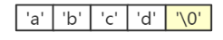
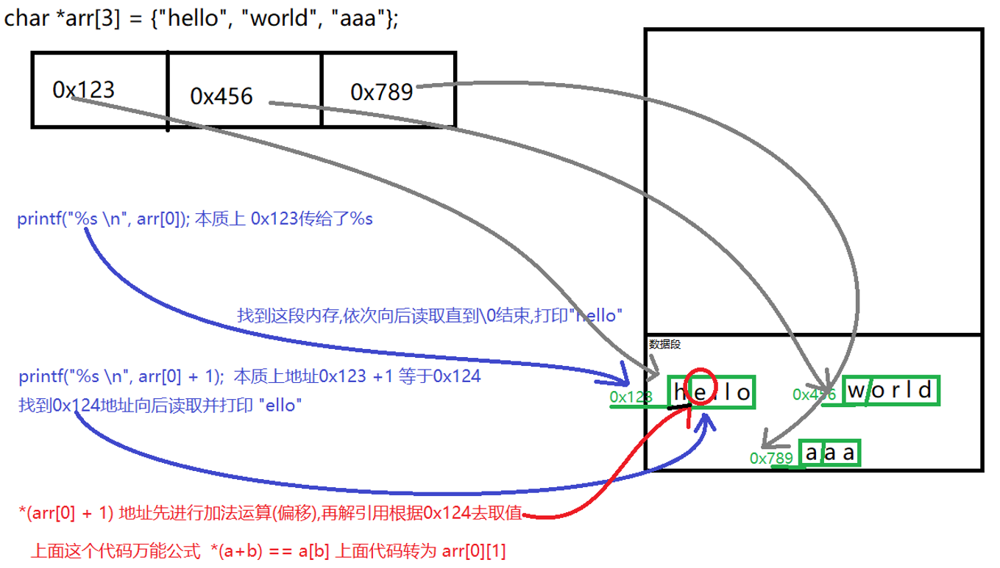

## 数组转为指针

首先明确，在C语言语法中，只有指针运算，没有数组运算。那么，当程序中出现数组参与的表达式时，该如何理解呢？比如：

```c
int a[3];
int *p;

p = a+1; // 数组a参与运算表达式
```


答案也很简单，任何出现数组的表达式，运算时一律遵守如下**重要规定**：

**除非有 `sizeof` 或取址符 `&`，否则数组将一律被转换成一个指向其首元素的指针**

示例：

```
int a[3];

int *p = a;       // 此处，a 是一个指针，指向 a[0] （即：此处a等价于 &a[0]）
p = a + 1;        // 此处，a 是一个指针，指向 a[0] （即：此处a等价于 &a[0]）
function(a);      // 此处，a 是一个指针，指向 a[0] （即：此处a等价于 &a[0]）
scanf("%d\n", a); // 此处，a 是一个指针，指向 a[0] （即：此处a等价于 &a[0]）

printf("%d\n", sizeof(a)); // 此处，a 不是指向 a[0] 的指针，a是整个数组
printf("%p\n", &a);        // 此处，a 不是指向 a[0] 的指着，a是整个数组，&a是整个数组的地址
```


注意，以上结论适用于任何类型的数组。可见，C语言中的数组，在不同场合下有不同的含义，大部分场合都表现为首元素的地址，此时实际上就是一个指向其首元素的指针，数组运算实际上就是指针运算。

以上数组转换成指针的语法规定，是绝大多数初学C语言同学做题和写代码翻车的重灾区，彻底搞懂以上结论，能至少解决80%以上关于数组和指针的语法问题。


## 数组下标运算符

- 数组下标实际上是编译系统的一种简写，其等价形式是：

```c
a[i] = 100;  等价于  *(a+i) = 100;
```


- 根据加法交换律，以下的所有的语句均是等价的：

```c
  a[i] = 100;
*(a+i) = 100;
*(i+a) = 100;
  i[a] = 100;
```


- 数组运算，等价于指针运算。


```c
	// a变量名表示一段4字节内存,存储一个整型数字
    int a = 4;
    // 指针就是一个存放其他变量地址的变量
    // 指针的类型就是它指向的那段内存空间的类型后加*号
    int *p1 = &a;

    char str[6] = "hello";
    // str 首元素地址, 存储str的指针就是 "首元素类型 *" 类型
    char *p2 = str; 

    // &str 整个数组,整个数组是 char [6] 类型,存储他的指针就应该是char (*)[6]
    // 因为优先级问题一定要打个小括号
    char (*p3)[6] = &str;
```


## 字符串常量

- 字符串常量在内存中的存储，实质是一个匿名数组
- 匿名数组，同样满足数组两种涵义的规定
- 示例：

```c
printf("%d\n", sizeof("abcd")); // 此处 "abcd" 代表整个数组
printf("%p\n", &"abcd");        // 此处 "abcd" 代表整个数组

printf("%c\n", "abcd"[1]); // 此处 "abcd" 代表匿名数组的首元素地址
char *p1 = "abcd";         // 此处 "abcd" 代表匿名数组的首元素地址
char *p2 = "abcd" + 1;     // 此处 "abcd" 代表匿名数组的首元素地址
```





## 特殊数组

### 零长数组

- 概念：长度为0的数组，比如 int data[0];
- 用途：放在结构体的末尾，作为可变长度数据的入口
- 示例：

```c
struct node
{
    /* 结构体的其他成员 */
    // 成员1
    // 成员2
    // ... ...
    
    int  len;
    char data[0];
};

// 给结构体额外分配 10 个字节的内存。
struct node *p = malloc(sizeof(struct node) + 10);
p->len = 10;

// 额外分配的内存可以通过 data 来使用
p->data[0] ~ p->data[9]
```


### 变长数组

- 概念：定义时，使用变量作为元素个数的数组。
- 要点：变长数组仅仅指元素个数在定义时是变量，而绝非指数组的长度可长可短。实际上，不管是普通数组还是所谓的变长数组，数组一旦定义完毕，其长度则不可改变。
- 变长数组支持初始化，只能声明再逐渐赋值，C99后才有，Linux不支持
- 运行时才确定，不能是全局变量/静态变量
- 更推荐使用malloc分配堆内存
- 示例：

```c
int len = 5;
int a[len];  // 数组元素个数 len 是变量，因此数组 a 是变长数组

int x = 2;
int y = 3;
int b[x][y]; // 数组元素个数 x、y 是变量，因此数组 b 是变长数组
int b[2][y]; // 数组元素个数 y 是变量，因此数组 b 是变长数组
int b[x][3]; // 数组元素个数 x 是变量，因此数组 b 是变长数组
```


## 指针运算

- 指针加法意味着地址向上移动若干个目标
- 指针减法意味着地址向下移动若干个目标
- 示例：

```c
int  a = 100;
int *p = &a; // 指针 p 指向整型变量 a

int *k1 = p + 2; // 向上移动 2 个目标（2个int型数据）
int *k2 = p - 3; // 向下移动 3 个目标（3个int型数据）
```


## 特殊指针

### char

char型指针实质上跟别的类型的指针并无本质区别，但由于C语言中的字符串以字符数组的方式存储，而数组在大多数场合又会表现为指针，因此字符串在绝大多数场合就表现为char型指针。

- 定义：

```c
char *p = "abcd";
```


### 多级指针

- 如果一个指针变量 p1 存储的地址，是另一个普通变量 a 的地址，那么称 p1 为一级指针
- 如果一个指针变量 p2 存储的地址，是指针变量 p1 的地址，那么称 p2 为二级指针
- 如果一个指针变量 p3 存储的地址，是指针变量 p2 的地址，那么称 p3 为三级指针
- 以此类推，p2、p3等指针被称为多级指针
- 示例：

```c
int a = 100;
int   *p1 = &a;  // 一级指针，指向普通变量
int  **p2 = &p1; // 二级指针，指向一级指针
int ***p3 = &p2; // 三级指针，指向二级指针
```


### void

- 概念：无法明确指针所指向的数据类型时，可以将指针定义为 void 型指针
- 要点：
  1. void 型指针无法直接索引目标，必须将其转换为一种具体类型的指针方可索引目标
  2. void 型指针无法进行加减法运算
- void关键字的三个作用：
  1. 修饰指针，表示指针指向一个类型未知的数据。
  2. 修饰函数参数列表，表示函数不接收任何参数。（预习）int main(void)
  3. 修饰函数返回类型，表示函数不返回任何数据。（预习）void func(int)
- 示例：

```c
// 指针 p 指向一块 4 字节的内存，且这4字节数据类型未确定
void *p = malloc(4);

// 1，将这 4 字节内存用来存储 int 型数据
*(int *)p = 100;
printf("%d\n", *(int *)p);

// 2，将这 4 字节内存用来存储 float 型数据
*(float *)p = 3.14;
printf("%f\n", *(float *)p);
```


### const

- const型指针有两种形式：①常指针 ②常目标指针

1. 常指针：const修饰指针本身，表示指针变量本身无法修改。


1. 常目标指针：const修饰指针的目标，表示无法通过该指针修改其目标。


- 常指针在实际应用中不常见。
- 常目标指针在实际应用中广泛可见，用来限制指针的读写权限

- 示例：

```C
int a = 100;
int b = 200;

// 第1中形式，const修饰p1本身，导致p1本身无法修改
int * const p1 = &a; 

// 第2中形式，const修饰p2的目标，导致无法通过p2修改a
int const *p2 = &a;
const int *p2 = &a;
```


### 函数指针

- 概念：指向函数的指针，称为函数指针。
- 特点：函数指针跟普通指针本质上并无区别，只是在取址和索引时，取址符和星号均可省略
- 示例：

```c
void   f (int); // 函数 f 的类型是： void (int)
void (*p)(int); // 指针 p 专门用于指向类型为 void (int) 的函数

p = &f; // p 指向 f（取址符&可以省略）
p =  f; // p 指向 f

// 以下三个式子是等价的：
  f (666); // 直接调用函数 f
(*p)(666); // 通过索引指针 p 的目标，间接调用函数 f
 p (666); // 函数指针在索引其目标时，星号可以省略
```


- 要点：
  1. 函数指针是一类专门用来指向某种类型函数的指针。
  2. 函数的类型不同，所需要的函数指针也不同。
  3. 函数的类型，与普通变量的类型判定一致，即去除声明语句中的标识符之后所剩的语句。


## 指针和数组

- 声明时意义不同
- sizeof时 指针和数组值不相同
- &地址时 指针与数组值不相同


- 其他情况意义一样，除了以上情况，指针完全等价数组；


- 数组指针，存储的是整个数组的地址
- 本身数组类型为`数据类型 []` 指向其类型的指针 `数据类型 int (*)[]`
- 注意：\[]优先级高于 \* 


# Q&A

【1】问：一维数组会被视为一级指针，那二维数组是不是等价于二级指针？
【1】答：这种说法是错误的，不能这么简单的类推，实际上，二维数组与二级指针没有任何必然关系。任何数组a，除了定义语句和sizeof表达式之外，都会被一律视为一个指向其首元素的指针，因此，除非该数组的元素类型本身恰好是指针，即一维指针数组在运算时会被视为二级指针，但题目中提到的二维数组，其元素显然应该是一维数组，因此二维数组在运算时会被视为指向数组的指针，即数组指针。

例如:

```c
int a[3];
// 此处的a等价于 &a[0]，而a[0]是一个int，因此此处a的类型是 int (*)
int *p = a+1;

int a[2][3];
// 此处的a等价于 &a[0]，而a[0]是一个int[3]，因此此处a的类型是 int (*)[3]
int (*p)[3] = a+1;

int *a[3];
// 此处的a等价于 &a[0]，而a[0]是一个int *，因此此处a的类型是 int (*)*
int **p = a+1;
```