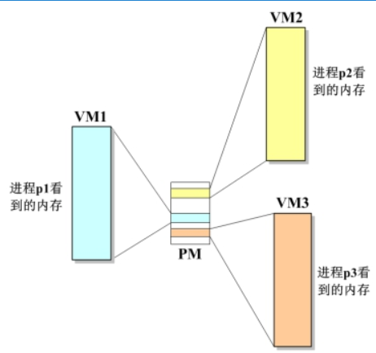
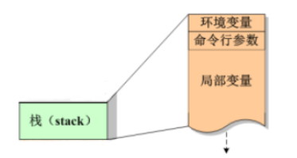
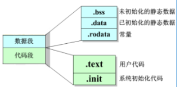
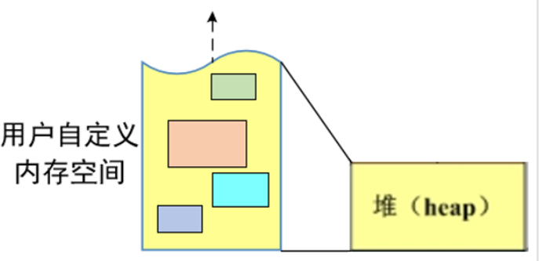

# **1.C进程内存布局**

任何一个程序，正常运行都需要内存资源，用来存放诸如变量、常量、函数代码等等。这些不同的内容，所存储的内存区域是不同的，且不同的区域有不同的特性。因此我们需要研究C语言进程的内存布局，逐个了解不同内存区域的特性。

每个C语言进程都拥有一片结构相同的虚拟内存，所谓的虚拟内存，就是从实际物理内存映射出来的地址规范范围，最重要的特征是所有的虚拟内存布局都是相同的，极大地方便内核管理不同的进程。例如三个完全不相干的进程p1、p2、p3，它们很显然会占据不同区段的物理内存，但经过系统的变换和映射，它们的虚拟内存的布局是完全一样的。

- PM：Physical Memory，物理内存。
- VM：Virtual Memory，虚拟内存



将其中一个C语言含如进程的虚拟内存放大来看，会发现其内部包下区域：

- 栈（stack）
- 堆（heap）
- 数据段
- 代码段


虚拟内存中，内核区段对于应用程序而言是禁闭的，它们用于存放操作系统的关键性代码，另外由于 Linux 系统的历史性原因，在虚拟内存的最底端 0x0 ~ 0x08048000 之间也有一段禁闭的区段，该区段也是不可访问的。

虚拟内存中各个区段的详细内容:


# **2.栈内存**

- 什么东西存储在栈内存中？

- - 环境变量
  - 命令行参数
  - 局部变量（包括形参）

- 栈内存有什么特点？

- - 空间有限，尤其在嵌入式环境下。因此不可以用来存储尺寸太大的变量。
  - 每当一个函数被调用，栈就会向下增长一段，用以存储该函数的局部变量。
  - 每当一个函数退出，栈就会向上缩减一段，将该函数的局部变量所占内存归还给系统。

- 注意：



示例代码

```c
示例代码
void func(int a, int *p) // 在函数 func 的栈内存中分配
{
    double f1, f2;        // 在函数 func 的栈内存中分配
    ...                   // 退出函数 func 时，系统的栈向上缩减，释放内存
}

int main(void)
{
    int m  = 100;  // 在函数 main 的栈内存中分配
    func(m, &m);  // 调用func时，系统的栈内存向下增长
}
```


练习：编写一个程序，测试栈空间的大小

```c
#include<stdio.h>

#define SIZE    1024*1024*7

void main (void)
{
    char buf[SIZE];
    
    buf[SIZE-1] = 100;
    
    printf("%d\n",buf[SIZE-1]);
}
```


如果SIZE 大小超过8M(1024*1024*8)，那么执行的时候直接段错误，因为栈溢出


# 3.静态数据

C语言中，静态数据有两种：

- 全局变量：定义在函数外部的变量。
- 静态局部变量：定义在函数内部，且被static修饰的变量。
- 示例：

```c
int a; // 全局变量，退出整个程序之前不会释放
void f(void)
{
    static int b; // 静态局部变量，退出整个程序之前不会释放
    printf("%d\n", b);
    b++;
}

int main(void)
{
    f();
    f(); // 重复调用函数 f()，会使静态局部变量 b 的值不断增大
}
```

- 为什么需要静态数据？

1. 全局变量在默认的情况下，对所有文件可见，为某些需要在各个不同文件和函数间访问的数据提供操作上的方便。
2. 当我们希望一个函数退出后依然能保留局部变量的值，以便于下次调用时还能用时，静态局部变量可帮助实现这样的功能。

- 注意1：

- - 若定义时未初始化，则系统会将所有的静态数据自动初始化为0
  - 静态数据初始化语句，只会执行一遍。
  - 静态数据从程序开始运行时便已存在，直到程序退出时才释放。

- 注意2：

- - static修饰局部变量：使之由栈内存临时数据，变成了静态数据。
  - static修饰全局变量：使之由各文件可见的静态数据，变成了本文件可见的静态数据。
  - static修饰函数：使之由各文件可见的函数，变成了本文件可见的静态函数。

- 

# **数据段与代码段**

- 数据段细分成如下几个区域：

- - .bss 段：存放未初始化的静态数据，它们将被系统自动初始化为0
  - .data段：存放已初始化的静态数据
  - .rodata段：存放常量数据

- 代码段细分成如下几个区域：

- - .text段：存放用户代码
  - .init段：存放系统初始化代码



```c
int a;       // 未初始化的全局变量，放置在.bss 中
int b = 100; // 已初始化的全局变量，放置在.data 中

int main(void)
{
    static int c;       // 未初始化的静态局部变量，放置在.bss 中
    static int d = 200; // 已初始化的静态局部变量，放置在.data 中
    
    // 以上代码中的常量100、200常量在.rodata 中
}
```


# **5.堆内存**

### **1.概念**

堆内存（heap）又被称为动态内存、自由内存，简称堆。堆是唯一可被开发者自定义的区段，开发者可以根据需要申请内存的大小、决定使用的时间长短等。但又由于这是一块系统“飞地”，所有的细节均由开发者自己把握，系统不对此做任何干预，给予开发者绝对的“自由”，但也正因如此，对开发者的内存管理提出了很高的要求。对堆内存的合理使用，几乎是软件开发中的一个永恒的话题。

- 堆内存基本特征：

- - 相比栈内存，堆的总大小仅受限于物理内存，在物理内存允许的范围内，系统对堆内存的申请不做限制。
  - 相比栈内存，堆内存从下往上增长。
  - 堆内存是匿名的，只能由指针来访问。
  - 自定义分配的堆内存，除非开发者主动释放，否则永不释放，直到程序退出。




### **2.堆内存的申请和释放**

##### **1.相关API**

- - 申请堆内存：malloc() / calloc()
  - 清零堆内存：bzero()
  - 释放堆内存：free()


##### 2**.示例**

```c
int *p = malloc(sizeof(int)); // 申请1块大小为 sizeof(int) 的堆内存
bzero(p, sizeof(int));        // 将刚申请的堆内存清零

*p = 100; // 将整型数据 100 放入堆内存中
free(p);  // 释放堆内存

// 申请3块连续的大小为 sizeof(double) 的堆内存
double *k = calloc(3, sizeof(double));

k[0] = 0.618;
k[1] = 2.718;
k[2] = 3.142;
free(k);  // 释放堆内存
```

- 注意：

- - malloc()申请的堆内存，默认情况下是随机值，一般需要用 bzero() 来清零。
  - calloc()申请的堆内存，默认情况下是已经清零了的，不需要再清零。
  - free()只能释放堆内存，并且只能释放整块堆内存，不能释放别的区段的内存或者释放一部分堆内存。

- 释放内存的含义：

- - 释放内存意味着将内存的使用权归还给系统。
  - 释放内存并不会改变指针的指向。
  - 释放内存并不会对内存做任何修改，更不会将内存清零。

所以，成功申请到堆空间之后，会一直存在，如果不用了，记得要手动释放


