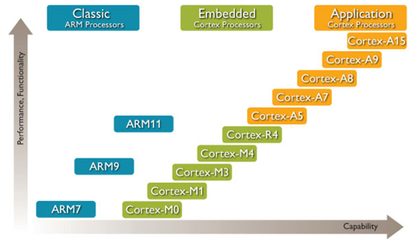
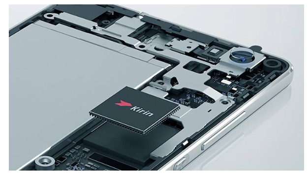
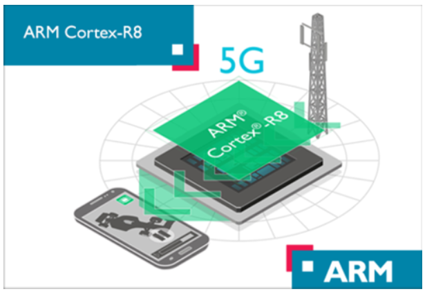
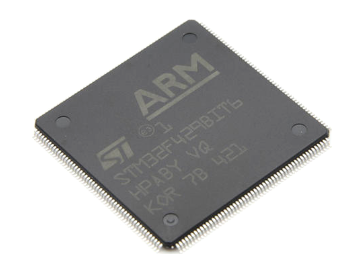

## 1 ARM概述

### 1.1 历史

  1978年，物理学家赫尔曼·豪泽（Hermann Hauser）和工程师Chris Curry，在英国剑桥创办了CPU公司（Cambridge Processing Unit），主要业务是为当地市场供应电子设备。1979年，CPU公司改名为Acorn公司。1985年，Roger Wilson和Steve Furber设计了他们自己的第一代32位、6MHz的处理器，用它做出了一台RISC指令集的计算机，简称ARM（Acorn RISC Machine）。这就是ARM这个名字的由来。

- 经典指令集
    - CISC
        复杂指令集计算机（Complex Instruction Set Computer）
        在CISC指令集的各种指令中，大约有20%的指令会被反复使用，占整个程序代码的80%。而余下的指令却不经常使用，在程序设计中只占20%，目前，桌面计算机流行的x86体系结构即使用CISC。
    - RISC
        精简指令集计算机（reduced instruction set computer）
        支持的指令比较简单，所以功耗小、价格便宜，特别适合移动设备。早期使用ARM芯片的典型设备，就是苹果公司的牛顿PDA。

特点区别各方面如下：

1. 指令系统
    CISC：计算机的指令系统比较丰富，有专用指令来完成特定的功能。因此，处理特殊任务效率较高。
        　　RISC：设计者把主要精力放在那些经常使用的指令上，尽量使它们具有简单高效的特色。对不常用的功能，常通过组合指令来完成。因此，在RISC 机器上实现特殊功能时，效率可能较低。但可以利用流水技术和超标量技术加以改进和弥补。

1. 存储器操作
    CISC：机器的存储器操作指令多，操作直接。
        　　RISC：对存储器操作有限制，使控制简单化。

1. 程序
    CISC：汇编语言程序编程相对简单，科学计算及复杂操作的程序社设计相对容易，效率较高。
        　　RISC：汇编语言程序一般需要较大的内存空间，实现特殊功能时程序复杂，不易设计。

1. 中断
    CISC：机器是在一条指令执行结束后响应中断。
        　　RISC：机器在一条指令执行的适当地方可以响应中断。

1. CPU
    CISC：CPU包含有丰富的电路单元，因而功能强、面积大、功耗大。
        　　RISC：CPU包含有较少的单元电路，因而面积小、功耗低。

1. 设计周期
    CISC：微处理器结构复杂，设计周期长。
        　　RISC：微处理器结构简单，布局紧凑，设计周期短，且易于采用最新技术。

1. 用户使用
    CISC：微处理器结构复杂，功能强大，实现特殊功能容易。
        　　RISC：微处理器结构简单，指令规整，性能容易把握，易学易用。

1. 应用范围
    CISC：机器则更适合于通用机。
        　　RISC：由于RISC指令系统的确定与特定的应用领域有关，故RISC 机器更适合于专用机。

### 1.2 ARM的应用

  20世纪90年代开始，ARM 32位嵌入式RISC处理器扩展到世界范围，占据了低功耗、低成本和高性能的嵌入式系统应用领域的领先地位。ARM公司既不生产芯片也不销售芯片，它只出售芯片技术授权。

  搭载ARM芯片架构的设备数量是英特尔的25倍。全世界99%的智能手机和平板电脑都采用ARM架构。约有43亿人每天都会触摸一台搭载ARM芯片的设备，占全球总人口的60%。

## 2 ARM处理器

### 2.1 ARM的处理器类型

目前ARM架构常见类型：

- Cortex-A：针对高性能计算。如我们目前手机SoC中常出现的Cortex-A76等。
- Cortex-R：针对实时操作处理。主要是面向嵌入式实时处理器。在汽车的电子制动系统，工业控制领域等领域比较常见。
- Cortex-M：专为低功耗、低成本系统设计。目前火热的IoT领域常常见到采用Cortex-M架构的处理器。

 
    

ARM：经典系列、Cortex-M系列、Cortex-R系列、Cortex-A系列。

**经典系列（ARM7、ARM9、ARM11）**

**Cortex-A系列**

    

  Application Processors（应用处理器）–面向移动计算、智能手机、服务器等市场的的高端处理器。这类处理器运行在很高的时钟频率（超过1GHz），支持像Linux，Android，MS Windows和移动操作系统等完整操作系统需要的内存管理单元（MMU）。

  如果规划开发的产品需要运行上述其中的一个操作系统，你需要选择ARM应用处理器(Cortex-A53、Cortex-A73、Cortex-A76、Cortex-A77)。

**Cortex-R系列**

    

  Real-time Processors（实时处理器）–面向实时应用的高性能处理器系列，例如硬盘控制器，汽车传动系统和无线通讯的基带控制。

  多数实时处理器不支持MMU，不过通常具有MPU、Cache和其他针对工业应用设计的存储器功能。实时处理器运行在比较高的时钟频率（例如200MHz 到 >1GHz ），响应延迟非常低。

  然实时处理器不能运行完整版本的Linux和Windows操作系统，但是支持大量的实时操作系统（RTOS）。

  其相比Cortex-A系列，少了对页表的支持，也就是说软件看到的地址都是物理地址，相对来说软件运行时间和中断响应速度都更加快速稳定，容易预测。

**Cortex-M系列**

    

  Microcontroller Processors（微控制器处理器）–微控制器处理器通常设计成面积很小和能效比很高。

  通常这些处理器的流水线很短，最高时钟频率很低（虽然市场上有此类的处理器可以运行在200Mhz之上）。 并且，新的Cortex-M处理器家族设计的非常容易使用。因此，ARM微控制器处理器在单片机和深度嵌入式系统市场非常成功和受欢迎。

  其相比Cortex-R就更加精简了，更短的流水线，更简单的指令集，更少的运算单元，调试单元，总线性能要求不高，以低功耗为主。

### 2.2 ARM RISC的特点

  ARM处理器则是ARM架构下的RISC（精简指令集）处理器。ARM处理器广泛的使用在许多嵌入式系统。ARM处理器的特点有指令长度固定，执行效率高，低成本等，主要特点如下：

- 指令集——RISC减少了指令集的种类，通常一个周期一条指令，采用固定长度的指令格式，编译器或程序员通过几条指令完成一个复杂的操作。而CISC指令集的指令长度通常不固定；
- 流水线——RISC采用单周期指令，且指令长度固定，便于流水线操作执行；
- 寄存器——RISC的处理器拥有更多的通用寄存器，寄存器操作较多。例如ARM处理器具有37个寄存器；
- Load/Store结构——使用加载/存储指令批量从内存中读写数据，提高数据的传输效率；
- 寻址方式简化，指令长度固定，指令格式和寻址方式种类减少。

