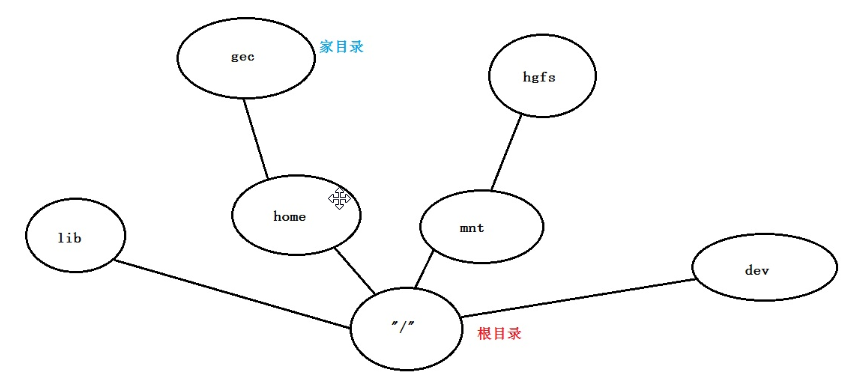

## 终端

Terminal:终端其实是系统内核提供给用户的命令解释器，也称为控制台，系统早期都是使用字符界面进行开发，后来为了提供用户体验性，简化系统的系统难度，所以才提供图形界面，window系统和Linux系统都具有字符界面。

## 目录框架

Linux和Windows目录框架的区别

windows系统的文件夹本身就是一个容器，所有文件夹之间存在大小包含关系。

Linux系统的目录是一棵树，所有的目录之间不存在大小包含关系，只有索引关系



- 字符界面/终端介绍

```bash
gec@ubuntu:~$    命令行提示符

gec ---》用户名
@   ---》分隔符，用于区分主机名和用户名
ubuntu---》主机名
:   ---》分隔符，用于区分主机名和工作路径
~   ---》当前的工作路径，此处代表用户目录/家目录 （/home/gec 的简称）
$   ---》代表当前身份为普通用户
#   ---》root用户
```


## LInux常用命令

linux命令基本形式

```bash
command [Option] [Argument]
命令		 选项       参数
```


### cd切换路径

- cd path

```bash
path:
相对路径
却对路径
```


- 绝对路径：

从根目录开始写，逐层往下写

- 相对路径

相对与当前路径而言，目标路径在哪

> 有空格的需要加 ' '


- specific

```bash
cd    ---》 切换到用户的用户目录/家目录，可以更改
cd .  ---》 切换到当前路径
cd .. ---》 切换到上一级目录下
cd -  ---》 切换到上次访问过的目录
cd /  ---》 切换到跟目录
```


### list

ls: 列举当前目录下的内容

```bash
ls [o] [p]
```

- 无option
- -l ：以详细的方式列举
  - -l path：列举path目录下的文件
- -a：显示所有文件，包括隐藏文件


ps: 一般的bash，支持ls -l的简写: ll


### 创建文件

- 创建普通文件： touch [name]
- 创建目录：make directory
  - mkdir [n]


### remove

- 普通文件
  - rm [file]
- 目录
  - rm -rf [f]
  - -r：recursive 递归删除用于删除目录
  - -f：force 强制删除，不提示警告忽略不存在的文件


### copy

```bash
cp [o] [a]
o: -r  ---》 复制目录需要递归
a：path路径
```


### clear

ctrl + l


### pwd

print working directory


### 共享目录

配置VMware的虚拟机到windows的目录访问

1. 在windows中创建一个需要共享的文件夹

2. 在VMware对应的Linux中设置

   ps：高版本的Linux一般使用的工具不同需要自己去Linux内安装对应的工具，但是对于VMware的设置是一样的。


3. Linux终端中切换到共享目录：

```bash
cd /mnt/hgfs/
```

ps:这个路径不是绝对，可以查看自己Linux内部虚拟器使用的工具挂载在哪个路基；一般是这个路径。

