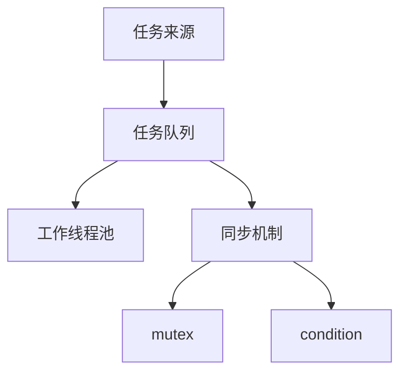

# Typora 语法速查

[toc]

## 基础语法

### 文本格式

**粗体**　*斜体*　***粗斜体***　~~删除线~~　`行内代码`

<center>居中文本</center>

### 链接

- 内联链接：`[Google](https://www.google.com "悬停标题")`
- 引用链接：正文 `[Google][1]`，文末 `[1]: https://www.google.com "标题"`
- 脚注：`这是脚注引用[^1]`，文末 `[^1]: 脚注内容`

### 引用块

> 基本引用
> > 嵌套引用（第二层）

- 列表中的引用：列表项下缩进 `>` 块
- 引用中的列表：`> - 列表项`

### 列表

```markdown
1. 有序列表
   1. 子项
- 无序列表
  - 子项
- [x] 已完成任务
- [ ] 未完成任务
```

### 表格

```markdown
| 姓名 | 年龄 | 成绩 |
| :--- | :--: | ---: |
| 左对齐 | 居中 | 右对齐 |
```

### 高亮与强调文本

==高亮文本==

`<span alt="solid">下划线</span>`　`<span alt="dashed">虚线</span>`　`<span alt="dotted">点线</span>`　`<span alt="wavy">波浪线</span>`　`<span alt="shadow">阴影</span>`

`<font title="red">红色</font>`（yellow / green / blue / gray 同理）

### KBD 与折叠

`<kbd>Ctrl</kbd> + <kbd>C</kbd>`

```html
<details>
<summary>点击展开</summary>
折叠内容
</details>
```

## Callout

> [!note]
> 提醒

> [!tip]
> 建议

> [!IMPORTANT]
> 重要

> [!WARNING]
> 警告

> [!CAUTION]
> 注意

## 数学公式

- 行内公式：`$y = ax + b$`
- 块级公式：`$$\sum_{i=1}^{n} i = \frac{n(n+1)}{2}$$`

公式语法详见 [KaTeX公式](./KaTeX公式.md)。

块级示例（PWM 占空比）：

$$D=\frac{T_{on}}{T_{on}+T_{off}}$$

## Mermaid



## 图片

| 效果       | 代码                                                      |
| :--------- | :-------------------------------------------------------- |
| 固定宽度   | ``                           |
| 百分比宽度 | ``                           |
| 等比缩放   | ``                 |
| 居中显示   | `<div align="center"></div>` |
| 红色字体   | `<p style="color: red;">红色文字</p>`                     |

## 主题定制（happysimple）

> 主题来源：github 开源 happysimple

```css
--code-top-background-color:#f5f5f7;   /* 代码块头部背景颜色 */
--code-body-background-color:#fafafa;  /* 代码块主体背景颜色 */
```
