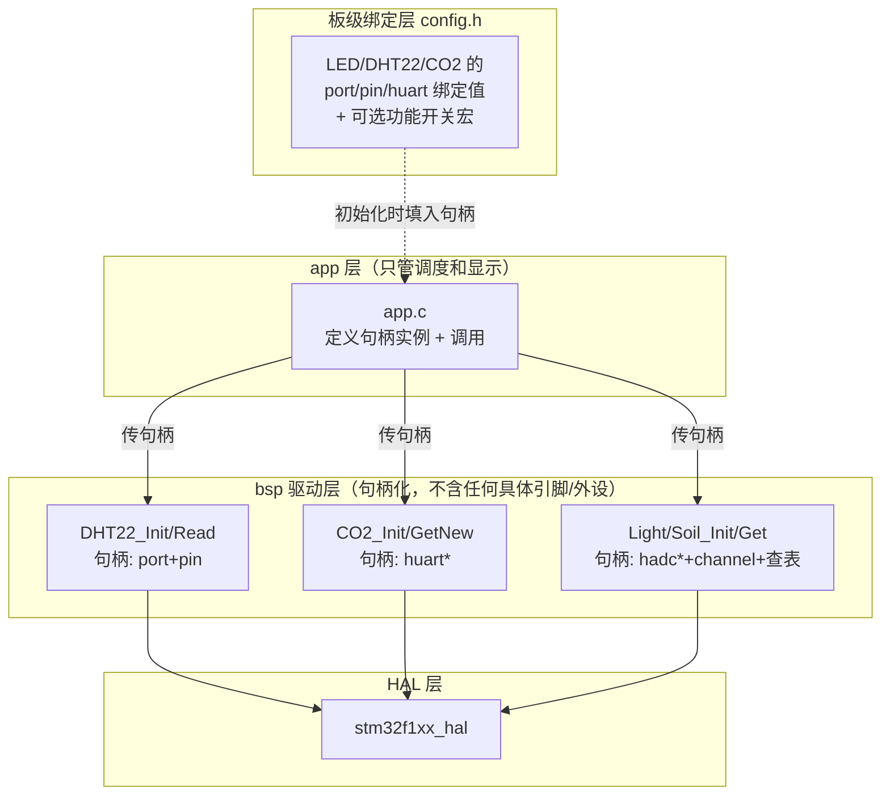

# code


[toc]


|          |              宏开关              |                         句柄化                         |
| :------: | :------------------------------: | :----------------------------------------------------: |
| 解决什么 | **要不要这个功能**（编译期裁剪） |            **驱动和硬件资源解耦**（实例化）            |
|   类比   |  lwipopts.h / FreeRTOSConfig.h   | HAL 的 `UART_HandleTypeDef` / Linux 的 `struct device` |
|   代价   |   改一个宏全量重编译；配置爆炸   |                      样板代码变多                      |


#### 句柄化为主，config.h 做板级绑定层





分层职责（Linux 思想的对应关系）：

- **驱动层 = driver**：只认句柄，不知道具体板子。`CO2_Init(hco2, huart)` 就像 `probe(device)` —— 资源由外部注入
- **config.h = device tree**：板级资源的唯一真相源。你 LED 已经这么做了（`led_config[]` 表），扩展它即可
- **app.c = 用户进程**：只组合、调度、显示，不直接碰 `hadc1`/`huart2` 的寄存器级操作


#### 目标接口长什么样（以 CO2 为例，它最有代表性）

```c
/* co2.h —— 驱动不含任何具体串口 */
typedef struct {
    UART_HandleTypeDef *huart;      /* 绑定哪个串口，外部注入 */
    uint16_t value;                 /* 最近解析的CO2值 */
    volatile uint8_t ready;         /* 就绪标志，私有于驱动 */
    uint8_t rx_buf[6];              /* 接收缓冲，从全局变量收进句柄 */
} CO2_HandleTypeDef;

int  CO2_Init(CO2_HandleTypeDef *h, UART_HandleTypeDef *huart);
uint8_t CO2_GetNewValue(CO2_HandleTypeDef *h, uint16_t *val);
```


```c
/* app.c —— 实例定义 + 回答"这块板子用什么资源" */
static CO2_HandleTypeDef hco2 = { .huart = &huart2 };   /* 绑定就在这一行 */

/* 中断回调：HAL 只给你 huart 指针，你要自己分发到句柄 —— 这正是 HAL 内部的做法 */
void HAL_UART_RxCpltCallback(UART_HandleTypeDef *huart)
{
    if (huart == hco2.huart) { CO2_IRQHandler(&hco2); }
}
```

这里有个关键教学点：**HAL 的回调分发就是靠比对 Instance 指针**（[stm32f1xx_hal_uart.c:3093](file:///D:/code/stm32P/f103terminal/terminal/Drivers/STM32F1xx_HAL_Driver/Src/stm32f1xx_hal_uart.c#L3093) 处 `HAL_UART_RxCpltCallback(huart)` 拿到的就是句柄指针）。你做的是同一件事的下一层——句柄化的驱动天然支持两个 CO2 传感器挂两个串口。

DHT22 更简单，句柄里就 `port + pin + 两个 float 结果`，半小时能搞定。

#### 关于宏开关的建议

单板项目现在做全套 `#define USE_CO2 1` 意义不大（没有裁剪需求时它只是噪声），**但**有两个位置值得保留宏思想：

1. `config.h` 做资源绑定表（你已有雏形，统一格式即可）
2. 等以后驱动多了、Flash 紧张了，或要换板子了，再引入功能开关——那是真实需求出现的时候


