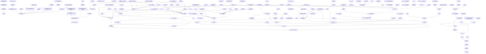

# 依赖关系

> 由 `prereq` 生成；箭头 `A --> B` 表示 A 依赖 B。

```mermaid
graph TD
    n0["基础电路知识"] --> n2["概述"]
    n1["数字电路基础知识"] --> n3["模拟电路基础知识"]
    n3["模拟电路基础知识"] --> n0["基础电路知识"]
    n5["PCB走线技巧"] --> n4["PCB布局技巧"]
    n6["了解PCB定稿至PCBA完整量产生产流程"] --> n4["PCB布局技巧"]
    n7["嘉立创教程"] --> n6["了解PCB定稿至PCBA完整量产生产流程"]
    n8["四层板入门案例"] --> n6["了解PCB定稿至PCBA完整量产生产流程"]
    n9["差分信号线与等长布线"] --> n5["PCB走线技巧"]
    n10["挖槽区域"] --> n4["PCB布局技巧"]
    n11["排针制作丝印和铺铜注意事项"] --> n4["PCB布局技巧"]
    n12["线与过孔的载流能力"] --> n14["设置线宽"]
    n13["自动布线"] --> n4["PCB布局技巧"]
    n14["设置线宽"] --> n5["PCB走线技巧"]
    n15["光敏传感器模块PCB案例"] --> n4["PCB布局技巧"]
    n16["自定义IC芯片元件"] --> n17["自定义器件"]
    n17["自定义器件"] --> n15["光敏传感器模块PCB案例"]
    n19["总结"] --> n23["物料清单"]
    n20["无线模块"] --> n22["核心板与模块化设计"]
    n21["智慧物联中控核心板与其它电路模块"] --> n22["核心板与模块化设计"]
    n21["智慧物联中控核心板与其它电路模块"] --> n20["无线模块"]
    n22["核心板与模块化设计"] --> n18["STM32单片机介绍"]
    n23["物料清单"] --> n21["智慧物联中控核心板与其它电路模块"]
    n24["电源模块原理图之TypeC接口"] --> n22["核心板与模块化设计"]
    n25["电源模块原理图之线性稳压器和电源开关"] --> n24["电源模块原理图之TypeC接口"]
    n27["启动过程"] --> n26["ESP32项目介绍"]
    n28["程序下载"] --> n26["ESP32项目介绍"]
    n28["程序下载"] --> n27["启动过程"]
    n30["ADC"] --> n41["时钟体系"]
    n30["ADC"] --> n38["中断体系"]
    n32["DMA"] --> n38["中断体系"]
    n33["GPIO"] --> n43["软硬件平台"]
    n34["I2C"] --> n33["GPIO"]
    n34["I2C"] --> n38["中断体系"]
    n35["RTC"] --> n41["时钟体系"]
    n35["RTC"] --> n38["中断体系"]
    n36["SPI"] --> n33["GPIO"]
    n36["SPI"] --> n38["中断体系"]
    n37["STM32启动"] --> n31["ARM、STM32与HAL库"]
    n37["STM32启动"] --> n43["软硬件平台"]
    n38["中断体系"] --> n33["GPIO"]
    n38["中断体系"] --> n41["时钟体系"]
    n39["串口通信"] --> n33["GPIO"]
    n39["串口通信"] --> n38["中断体系"]
    n40["定时器"] --> n38["中断体系"]
    n40["定时器"] --> n41["时钟体系"]
    n41["时钟体系"] --> n37["STM32启动"]
    n42["看门狗"] --> n41["时钟体系"]
    n43["软硬件平台"] --> n31["ARM、STM32与HAL库"]
    n45["CO2传感器"] --> n39["串口通信"]
    n46["esp8266"] --> n39["串口通信"]
    n47["按键"] --> n33["GPIO"]
    n48["GPIO&LED"] --> n184["ESP-IDF 新建工程"]
    n49["KEY 按键"] --> n48["GPIO&LED"]
    n50["系统延时"] --> n48["GPIO&LED"]
    n51["外部中断"] --> n48["GPIO&LED"]
    n51["外部中断"] --> n38["中断体系"]
    n52["I2C-总线通信协议"] --> n48["GPIO&LED"]
    n52["I2C-总线通信协议"] --> n34["I2C"]
    n53["PWM 脉冲宽带调制"] --> n48["GPIO&LED"]
    n54["SPI协议"] --> n48["GPIO&LED"]
    n54["SPI协议"] --> n36["SPI"]
    n55["SPI液晶显示"] --> n54["SPI协议"]
    n56["常见错误处理宏"] --> n57["库函数"]
    n57["库函数"] --> n184["ESP-IDF 新建工程"]
    n59["音频输出"] --> n58["I2S协议"]
    n61["STM32驱动分层设计"] --> n62["封装个人代码"]
    n62["封装个人代码"] --> n33["GPIO"]
    n62["封装个人代码"] --> n39["串口通信"]
    n62["封装个人代码"] --> n34["I2C"]
    n62["封装个人代码"] --> n36["SPI"]
    n63["调度器"] --> n38["中断体系"]
    n63["调度器"] --> n40["定时器"]
    n64["阶段实验01-温湿度模块"] --> n33["GPIO"]
    n64["阶段实验01-温湿度模块"] --> n40["定时器"]
    n64["阶段实验01-温湿度模块"] --> n62["封装个人代码"]
    n65["阶段实验02-蓝牙通信"] --> n39["串口通信"]
    n65["阶段实验02-蓝牙通信"] --> n62["封装个人代码"]
    n66["阶段实验03-RS485通信"] --> n39["串口通信"]
    n66["阶段实验03-RS485通信"] --> n62["封装个人代码"]
    n67["FreeRTOS_常用函数接口"] --> n68["FreeRTOS介绍"]
    n68["FreeRTOS介绍"] --> n71["RTOS概述"]
    n68["FreeRTOS介绍"] --> n70["RTOS基础知识"]
    n69["FromISR后缀API函数"] --> n74["任务管理"]
    n70["RTOS基础知识"] --> n71["RTOS概述"]
    n72["事件标志组"] --> n75["信号量"]
    n73["互斥信号量（互斥锁）"] --> n75["信号量"]
    n74["任务管理"] --> n68["FreeRTOS介绍"]
    n75["信号量"] --> n76["共享资源保护"]
    n76["共享资源保护"] --> n74["任务管理"]
    n77["延时"] --> n74["任务管理"]
    n78["消息队列"] --> n74["任务管理"]
    n79["队列集（等待多个内核对象）"] --> n78["消息队列"]
    n80["内核"] --> n191["Ubuntu"]
    n80["内核"] --> n198["虚拟机"]
    n81["IPC之信号"] --> n90["进程基本API"]
    n82["IPC之管道"] --> n90["进程基本API"]
    n83["systemV的IPC对象"] --> n81["IPC之信号"]
    n84["同步互斥机制"] --> n88["线程基本API"]
    n85["守护进程"] --> n90["进程基本API"]
    n86["总结"] --> n90["进程基本API"]
    n86["总结"] --> n88["线程基本API"]
    n86["总结"] --> n84["同步互斥机制"]
    n87["知识图谱"] --> n90["进程基本API"]
    n87["知识图谱"] --> n88["线程基本API"]
    n87["知识图谱"] --> n84["同步互斥机制"]
    n88["线程基本API"] --> n90["进程基本API"]
    n89["线程调度与信号处理"] --> n88["线程基本API"]
    n90["进程基本API"] --> n191["Ubuntu"]
    n91["阶段项目-线程池"] --> n88["线程基本API"]
    n91["阶段项目-线程池"] --> n84["同步互斥机制"]
    n92["文件属性与目录操作"] --> n95["系统IO"]
    n93["标准IO"] --> n95["系统IO"]
    n94["液晶屏操作"] --> n95["系统IO"]
    n95["系统IO"] --> n191["Ubuntu"]
    n96["要点速查"] --> n95["系统IO"]
    n96["要点速查"] --> n93["标准IO"]
    n96["要点速查"] --> n92["文件属性与目录操作"]
    n97["触摸屏"] --> n94["液晶屏操作"]
    n98["C函数"] --> n107["函数"]
    n99["IO运算符"] --> n110["数据类型"]
    n100["作用域与变量"] --> n104["作用域与存储期"]
    n101["字符串函数"] --> n98["C函数"]
    n102["笔试题"] --> n115["要点速查"]
    n103["质数"] --> n113["程序结构"]
    n104["作用域与存储期"] --> n107["函数"]
    n104["作用域与存储期"] --> n106["内存"]
    n105["关键字"] --> n108["多文件开发"]
    n106["内存"] --> n109["指针"]
    n106["内存"] --> n107["函数"]
    n107["函数"] --> n112["数组指针"]
    n108["多文件开发"] --> n114["组合类型与预处理"]
    n109["指针"] --> n111["数组"]
    n110["数据类型"] --> n182["开发环境"]
    n111["数组"] --> n113["程序结构"]
    n112["数组指针"] --> n109["指针"]
    n113["程序结构"] --> n99["IO运算符"]
    n114["组合类型与预处理"] --> n104["作用域与存储期"]
    n115["要点速查"] --> n108["多文件开发"]
    n116["Linux内核链表"] --> n129["顺序表和单链表"]
    n117["Linux内核链表实践"] --> n116["Linux内核链表"]
    n118["二叉树与BST"] --> n123["栈和队列"]
    n119["单链表练习"] --> n129["顺序表和单链表"]
    n120["双向链表"] --> n129["顺序表和单链表"]
    n121["图及其存储方式"] --> n118["二叉树与BST"]
    n122["平衡树与霍夫曼树"] --> n118["二叉树与BST"]
    n123["栈和队列"] --> n129["顺序表和单链表"]
    n124["栈和队列实践"] --> n123["栈和队列"]
    n126["算法练习"] --> n127["经典排序算法"]
    n127["经典排序算法"] --> n129["顺序表和单链表"]
    n128["经典查找算法及哈希表"] --> n127["经典排序算法"]
    n130["gcc编译流程"] --> n108["多文件开发"]
    n131["Makefile与cmake"] --> n132["make基础语法"]
    n131["Makefile与cmake"] --> n133["静态库与动态库"]
    n132["make基础语法"] --> n133["静态库与动态库"]
    n134["MQTT"] --> n139["常见应用协议"]
    n135["IO模型"] --> n136["TCP编程基础"]
    n136["TCP编程基础"] --> n138["准备知识"]
    n136["TCP编程基础"] --> n137["UDP编程基础"]
    n137["UDP编程基础"] --> n138["准备知识"]
    n138["准备知识"] --> n191["Ubuntu"]
    n139["常见应用协议"] --> n136["TCP编程基础"]
    n139["常见应用协议"] --> n135["IO模型"]
    n140["事件"] --> n141["基础入门"]
    n141["基础入门"] --> n146["环境搭建"]
    n142["基础控件"] --> n140["事件"]
    n143["基础控件与中文输入法"] --> n142["基础控件"]
    n144["样式"] --> n141["基础入门"]
    n145["样式与界面设计"] --> n147["界面布局"]
    n147["界面布局"] --> n142["基础控件"]
    n152["cc-connect"] --> n153["Claude Code"]
    n156["bash"] --> n158["基础命令速查"]
    n157["bash快捷键"] --> n158["基础命令速查"]
    n160["软件安装部署"] --> n158["基础命令速查"]
    n163["GitHub项目获取与常用知识"] --> n162["git"]
    n164["git克隆精简"] --> n162["git"]
    n166["Keil-microlib与GCC-newlib的printf重定向接口差异"] --> n98["C函数"]
    n177["从零上手"] --> n179["服务器基础与选型"]
    n178["免费低价方案对比"] --> n179["服务器基础与选型"]
    n180["配置记录"] --> n177["从零上手"]
    n184["ESP-IDF 新建工程"] --> n185["ESP-IDF+VSCODE环境搭建"]
    n186["ESP-IDF指令集"] --> n185["ESP-IDF+VSCODE环境搭建"]
    n187["Espressif-IDE 使用指南"] --> n188["Espressif-IDE环境搭建"]
    n189["ssh"] --> n196["端口与进程"]
    n190["STM32 VS Code调试踩坑"] --> n193["vscodeCC++"]
    n192["VMware共享目录"] --> n198["虚拟机"]
    n195["wsl"] --> n198["虚拟机"]
    n198["虚拟机"] --> n191["Ubuntu"]
```
